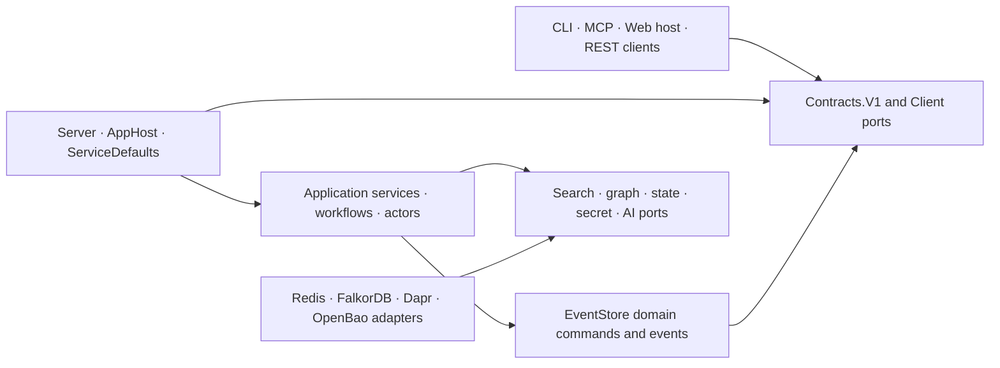
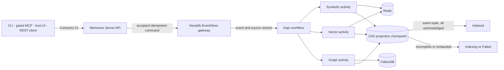

# Architecture Spine — Hexalith.Memories

## Design Paradigm

Hexalith.Memories is a **technical platform module**, not a domain module. It uses event-sourced CQRS with ports-and-adapters: Hexalith.EventStore accepts domain mutations, Dapr workflows coordinate durable projection work, Redis and FalkorDB hold rebuildable query models, and public surfaces depend on versioned contracts and client packages. AppHost, ServiceDefaults, deployment manifests, and reusable hosting integrations are therefore intentional platform responsibilities.

Logical dependencies point inward to contracts and ports. The current physical EventStore integration assembly is mixed; only its `Domain/` namespace is the dependency-pure domain center.



Rules below are the adopted target architecture. Where current code differs, the rule remains binding and the difference is implementation work, not a competing decision. Where a rule is not yet mechanically enforced, the rule or its ledger row says so; an unenforced rule is still binding but is a weaker guarantee. The Current Alignment Gaps ledger carries the enforcement obligations recorded so far; it is not yet complete, and the reviewer gate has repeatedly found obligations introduced by an amendment without a matching row.

## Invariants & Rules

### AD-1 — Treat Memories as a reusable technical platform [ADOPTED]

- **Binds:** All projects, packages, hosts, deployment assets, and consuming products.
- **Prevents:** Domain consumers depending on orchestration hosts or copying platform composition into product code.
- **Rule:** Consumers use published contracts, clients, and Aspire integration packages and never reference AppHost or Server; dependency-pure domain namespaces contain no orchestration, host, or provider-SDK concerns even when a brownfield assembly also contains integration code.

### AD-2 — Keep EventStore as domain mutation truth [ADOPTED]

- **Binds:** FR75, case, MemoryUnit, annotation, deletion, tenant lifecycle, rebuild, restore, and release evidence flows.
- **Prevents:** Redis, FalkorDB, workflow state, or package topology becoming an accidental second system of record, and an availability restore being mistaken for an authoritative rebuild.
- **Rule:** Accept domain mutations through Hexalith.EventStore before reporting success, then rebuild derived stores from authoritative events; keep domain truth, Phase 1.5 CloudEvent indexing/causal integration, and source-versus-package evidence as three distinct contracts. Three recovery operations remain distinct: authoritative EventStore replay is the only rebuild that may set projection truth; derived-store restore is an availability optimization that must invalidate the affected AD-3 checkpoints and re-verify through AD-3's protocol; application export restore is an import subject to normal ingestion rules. AD-16's erasure constraints override all three.

### AD-3 — Complete source-versioned projections as one logical outcome [ADOPTED]

- **Binds:** FR6, FR13, FR75, ingestion status, retries, reconciliation, syntactic indexes, vectors, graph projections, and query degradation.
- **Prevents:** Partial fan-out being exposed as complete, stale acknowledgements completing a newer revision, a legitimate new-epoch reprojection being suppressed as stale, a late write overwriting newer projected content, or ingestion completeness being confused with query availability.
- **Rule:** Identify projection work by `(tenantId, caseId, memoryUnitId, authoritative EventStore sourceVersion, schemaGeneration, embeddingConfigurationEpoch)`; one Dapr-state projection coordinator advances per-axis checkpoints monotonically with ETag/CAS and rejects stale acknowledgements. Order that tuple explicitly: `(embeddingConfigurationEpoch, schemaGeneration)` is the identity discriminator and `sourceVersion` the only monotonic dimension, so exactly one checkpoint record exists per `(tenantId, caseId, memoryUnitId, schemaGeneration, embeddingConfigurationEpoch)`, an acknowledgement is stale only when its `sourceVersion` is lower than the recorded value for its own generation and epoch, and an acknowledgement for a different generation or epoch is never stale. Mark `Indexed` only after syntactic, vector, and graph projections acknowledge that tuple; otherwise retain `Indexing`/product-semantic `projecting` or enter actionable `Failed`. The reported public ingestion state is always that of the tenant's active `(schemaGeneration, embeddingConfigurationEpoch)`, while a staging tuple's completion is reported only as migration-backfill progress. Fence the write as well as the acknowledgement: derived stores hold exactly one current document per `(tenantId, caseId, MemoryUnitId)` carrying the tuple it was projected from, every projection write is conditional on that stored tuple and is a no-op when the incoming tuple is older **within the same `(schemaGeneration, embeddingConfigurationEpoch)`**; a write whose generation or epoch differs from the stored document's is never merely older — it replaces the document when it carries the tenant's active generation and epoch, and otherwise targets AD-14's disjoint staging resources rather than the active document, so an active and a staging write can never alternate in one document. A Phase 1 / MVP degraded rebuild under AD-14 has one active epoch and writes under it. Deletion writes a fenced tombstone under the same rule. Persist the status rather than inferring it from artifact presence. Repair and replay use the same protocol, and AD-14's retire step deletes the retired generation's and epoch's checkpoint records as part of its verified completion.

### AD-4 — Give workflows, activities, actors, and idempotency distinct roles [ADOPTED]

- **Binds:** FR75, Dapr orchestration, retries, actor state, concurrency, replay, external I/O, duplicate suppression, and durable state content.
- **Prevents:** Nondeterministic replay, actors used as queues, duplicate side effects, secrets or tenant content in workflow history, and transient Redis reservations becoming durable truth.
- **Rule:** Workflows are deterministic process managers, activities are bounded idempotent I/O operations, and non-reentrant actors serialize only tenant or global stateful concerns. Capture immutable non-secret configuration plus its epoch at start and retain secret references only. Workflow history and activity payloads carry identifiers, references, and non-secret configuration only: tenant content and content-derived material — extracted text, embeddings, snippets — are read at execution time from an **erasure-scoped store** — one whose tenant content is covered by AD-16's enumerated purge targets and by the tenant key, so shredding reaches it — and are never persisted into workflow history or actor state. Scope V1 `IdempotencyToken` by tenant, case, and command/operation; scope CloudEvent identity by tenant, case, exact validated `source`, and `id` with ordinal comparison and no post-validation normalization. Use that identity for durable EventStore/workflow duplicate suppression and make every projection an idempotent upsert for AD-3's tuple; a legitimate reprojection under a new schema generation or embedding-configuration epoch is not a duplicate and is never suppressed. Redis preflight reservation is fail-open admission optimization only, is released after scheduling failure, and otherwise expires by configured TTL.

### AD-5 — Derive tenant, case, and caller authority server-side [ADOPTED]

- **Binds:** NFR8-NFR11, identifier issuance, external APIs, MCP, Dapr ingress and pub/sub delivery, tenant/case access, Redis, FalkorDB, background and resumed durable work, and system principals.
- **Prevents:** Request fields, envelope fields, case membership, key prefixes, graph labels, channel tokens, or a caller-selected app identity from serving as authorization; an identifier whose characters defeat the isolation mechanism that carries it; and two writers of one authorization decision.
- **Rule:** Treat issued tenant and case IDs as validated opaque tokens and compare them with `StringComparison.Ordinal`, without case folding or Unicode normalization after issuance. **Issuance is what makes ordinal comparison sufficient:** restrict tenant, case, and `MemoryUnitId` issuance to one documented bounded ASCII grammar that is **single-case** — so no downstream system that folds case can collapse two distinct identifiers into one — and that excludes every character significant as a metacharacter, delimiter, or wildcard in Redis ACL key patterns, Redis/RediSearch/FalkorDB key and index names, Dapr key and component names, URL path segments, Kubernetes object names, OpenBao secret paths, SQL identifiers, and object-storage paths. Compose every derived key, ACL pattern, index name, and state key unambiguously using a single delimiter declared with the grammar and reserved out of it. REST/CLI and MCP preserve validated bearer tenant and subject authority. Trusted internal calls additionally require deny-by-default Dapr mTLS/access-control policy and app-token channel protection, then satisfy three independent checks — an app ID present in the allowlist, an explicit grant for the requested tenant, and that tenant being currently active and verified — any one of which failing closed. The app-ID-to-`system:*` allowlist is a deployment-time artifact with exactly one writer, the operator, held in AD-15's operator secret scope rather than ordinary configuration, versioned, and changed only through a reviewed and observable procedure; it grants principal identity and never tenant scope, an absent app ID fails closed with no default principal, and grants are enumerated with any wildcard requiring its own architecture decision. The per-tenant grant that pairs with it is a tenant resource whose sole writer is AD-6's lifecycle workflow, created only by verified provisioning and revoked as a completion condition of AD-16 erasure. Dapr pub/sub ingress derives tenant authority from the delivery channel and never from the envelope: the receiving component or topic is bound to one tenant, or the publishing app ID's grant must contain the envelope's tenant, and an unauthorized envelope tenant is rejected rather than ingested. Work with no human caller — workflows, activities, actors, reminders, repair, replay, and migration — carries an explicit tenant authority captured at initiation, revalidates it against active tenant state on every resume and at each activity boundary, and fails closed when the tenant is inactive, erased, or absent from the initiating principal's grant; captured configuration is not authority. AD-6 lifecycle workflows and AD-16 erasure are the stated exception: they act on tenants that are being created, deactivated, or erased, are authorized by the operator principal below rather than by a tenant grant, and revalidate against the tenant lifecycle state machine rather than against tenant-active — so erasure and lifecycle repair are never deadlocked by their own subject's state. Tenant creation, deletion, and lifecycle repair are authorized by an operator principal, never by a tenant claim. Dapr channel authentication never replaces tenant authorization.

### AD-6 — Make tenant lifecycle the sole resource owner [ADOPTED]

- **Binds:** Tenant provisioning, verification, repair, deletion, indexes, graphs, backend identities and credentials, per-tenant grants, the access-telemetry partition, and cleanup.
- **Prevents:** Startup or ingestion hot paths implicitly creating tenant resources and leaving unowned partial resources behind.
- **Rule:** Perform tenant resource changes only in explicit, idempotent, observable, bounded lifecycle workflows with verification, compensation, and resumable cleanup. Redis uses a per-tenant ACL principal resolved server-side; FalkorDB selects a separate tenant database/graph; the access-telemetry store is a tenant-isolated resource with a stated per-tenant principal or partition. Other paths require an active verified tenant and never create infrastructure implicitly.

### AD-7 — Enforce case ownership across case and tenant query scopes [ADOPTED]

- **Binds:** FR32-FR34, MemoryUnit ownership, case-scoped and tenant-wide search, graph seeds/paths, annotations, mutations, deletion, Evidence Packets, and G4.
- **Prevents:** Case-local graph traversal leaking across cases, tenant-wide discovery being incorrectly rejected, deferred cross-case references becoming accidental, or case being silently treated as a confidentiality boundary the architecture does not implement.
- **Rule:** Resolve authoritative case ownership server-side and assign every MemoryUnit to exactly one case. A case-scoped query filters every candidate, result, node, and edge to that case. A tenant-wide query may return independently ranked units from multiple cases with mandatory case attribution, but partitions graph seeding/traversal by each seed's authoritative case and never crosses case boundaries. Mutations, annotations, and deletion verify the unit's owner case; cross-case references and paths remain forbidden. **Case is a data-partition and attribution boundary, not an authorization boundary:** a principal with tenant authority may read every case in that tenant, and case-scoped queries constrain results rather than access. Per-case authorization is deferred, and until it is adopted no product documentation may present cases as an access-control mechanism.

### AD-8 — Enforce infrastructure boundaries at named adapters [ADOPTED]

- **Binds:** Dapr state/pub-sub/actors/workflows/secrets/conversation, Redis data-plane operations, FalkorDB graph operations, and architecture guards.
- **Prevents:** Provider clients and connection details leaking into endpoints, workflows, actors, domain code, public services, or contracts.
- **Rule:** Server and EventStore integration are the physical adapter assemblies. Provider SDK references **must be** confined to composition roots and to named internal `Adapters.Redis` or `Adapters.FalkorDb` namespaces, enforced by an architecture test **still to be added**: neither namespace exists today and no guard enforces the boundary, so this rule is binding but currently unenforced and its convergence is ledgered. Direct search/vector/graph data-plane work stays behind those adapters; portable coordination state uses Dapr. Only the finite Direct Redis Exception Registry below may bypass Dapr state, and any addition requires a new architecture decision. `Hexalith.Memories.Redis` remains a compatibility facade, not the adapter owner.

### AD-9 — Fuse independent retrieval axes deterministically [ADOPTED]

- **Binds:** G1, syntactic, semantic, graph, natural-language ranking, candidate depth, pagination, result ordering, degradation, and explainability.
- **Prevents:** Backend magnitudes being blended, missing graph starts silently disabling required hybrid retrieval, an unbounded candidate set or a pushed-down page offset changing ranks, a silently truncated axis reporting healthy, backend loss causing avoidable total failure, or ranking implementations diverging.
- **Rule:** In provider order, drop blank IDs and non-finite raw scores, retain the first occurrence of each exact `MemoryUnitId`, and treat scores as tied only when finite `Double.Equals` returns true—no epsilon—then assign competition ranks (`1,1,3`); contribution is `1 / (10 + rank)`. Each axis contributes a fixed, server-owned, configuration-validated candidate depth identical across every surface, and fusion is defined over each axis's complete server-limited candidate list. For tenant-wide graph search, partition seeds by ascending ordinal case ID, retain each unit's maximum finite graph score across seeds within its case, and merge by descending graph score, ascending ordinal case ID, then ascending ordinal `MemoryUnitId` before rank allocation. Normalize the weighted sum by top-rank contribution times weights of axes that returned results, then sort by descending composite score and ascending `StringComparer.Ordinal` ID. An axis is `unavailable` (null, no denominator weight), `available` (may be empty, no denominator weight when empty), or `truncated` — available, carrying its hits, contributing denominator weight, and named in the Evidence Packet as degraded with the count of uncompleted case partitions; the Evidence Packet distinguishes all three under AD-12's encoding rules. Reaching the configured per-axis candidate depth is **not** truncation: the depth-limited list is the complete candidate list for that axis. `truncated` applies to **any** axis that did not complete its selected work within its configured depth, result, or time limits while tenant and case scope stayed verified on the work that did complete — a graph fan-out with uncompleted case partitions, a syntactic or vector axis that hit a time limit mid-scan, or any future axis in the same position. Where scope itself could not be verified the axis is unsafe under AD-10 and is nulled instead. Every axis reports one of the three states, and the Evidence Packet names which. Default weights are `0.30/0.35/0.35`. `nl` is a fourth ranked axis and not a rerank: when requested and configured for Phase 1.5 event units it is canonicalized, competition-ranked, and contributes at weight `0.20` inside the same weighted sum, default-off, entering the denominator only when it returned results, appearing in Evidence Packet axis health and in explain output under the wire name `nl`, and selectable through the axis-control parameter; where NL is inactive it is reported as an excluded axis rather than omitted. Without an explicit graph start, traverse to depth at most two from the union of the first five entries of the canonicalized syntactic list and the first five of the canonicalized semantic list — five entries, not five ranks. Apply AD-11's result limit once to the merged graph list after the per-case merge and before rank allocation, never per case partition, and apply AD-11's time limit once to the whole tenant-wide fan-out. The caller's result limit and offset apply only to the fused output after rank allocation, normalization, and final ordering and are never pushed into an axis provider, so a unit's rank, per-axis contributions, and composite score are identical whatever page returns it and consecutive pages concatenate to exactly the head of the single fused ordering.

### AD-10 — Serve safe available axes during query degradation [ADOPTED]

- **Binds:** FR66, NFR18, search/traversal responses, Evidence Packet degradation, readiness, and recovery.
- **Prevents:** The all-three ingestion gate being misapplied to already-admitted reads, a partial outage returning deceptively complete results, or each adapter applying a private safety doctrine that silently moves every composite score.
- **Rule:** An axis can respond **safely** when its adapter applied the request's authoritative tenant and case scope to every result it returns and read only resources belonging to the tenant's active `(schemaGeneration, embeddingConfigurationEpoch)`. Completing within configured limits is not a condition of safety: an axis that hit a limit while keeping scope verified is safe and `truncated`, and only unverified scope or a generation/epoch mismatch makes it unsafe. Staleness, low recall, empty results, and reaching a configured candidate depth are safe and are disclosed as freshness, emptiness, or depth; unverified scope and a generation or epoch mismatch are unsafe and null the axis. A limit exhausted such that the applied scope cannot be verified is unsafe; a graph fan-out that completed some but not all case partitions with scope verified on each is AD-9's `truncated` state, which is safe, disclosed, and contributes denominator weight. Safety is decided once per query by the server's axis-selection step against this definition, never independently by each adapter, and the resulting availability vector is the single input to both AD-9's denominator and the Evidence Packet's axis health. Query every selected usable axis and return a partial result when at least one can respond safely; list unavailable/excluded/truncated axes, degradation, freshness impact, and recovery guidance in the Evidence Packet. Fail the query only when no selected axis can produce a safe response. This never promotes an incompletely acknowledged revision to `Indexed`.

### AD-11 — Bound and phase graph behavior [ADOPTED]

- **Binds:** G1, graph population, traversal, case/tenant isolation, relationship semantics, kill switch, and backend portability.
- **Prevents:** Query injection, cross-scope paths, unbounded traversal, arbitrary labels, and premature claims of automatic EventStore causal coverage.
- **Rule:** Parameterize values, restrict labels to the contract enum, enforce tenant and case scope over every node and edge, and apply server-owned depth/result/time limits plus a graph kill switch; AD-9 fixes where those limits are applied. Phase 1 creates `contains`, `annotates`, `references` from explicit links or AI-inferred content similarity, and `caused_by`/`correlated_with` only from supplied ingestion metadata, never collapsing `caused_by` into `correlated_with` and never auto-promoting inferred edge confidence. Phase 1.5 adds automatic EventStore-stream causal population and dual event embeddings.

### AD-12 — Share one semantic contract across surfaces [ADOPTED]

- **Binds:** NFR37, Contracts.V1 ownership, Evidence Packet, routes, statuses, errors, exit codes, REST, Dapr invocation, CLI, MCP, and future Web hosting.
- **Prevents:** Interface-specific identifiers, ranking semantics, trust envelopes, or persistence models escaping through public types; two additive changes colliding on one wire name; and one packet meaning being carried by two mutually unreadable encodings.
- **Rule:** Evolve Contracts.V1 additively and preserve deliberate wire names until a versioned break. `Hexalith.Memories.Contracts` is the single owning component for `Contracts.V1` and its maintainers hold change-approval authority over that wire surface, and an additive change is admissible only once its new wire name, JSON shape, and nullability are reserved in the contract's versioned name register in the same change; a reserved name may not be reused with a different shape, and a collision is resolved before merge rather than by a later rename. Capability subsets may vary operations, never Evidence Packet semantics: every evidence-bearing result carries tenant/case scope, source/origin, confidence and per-axis contribution, degradation/excluded axes, omitted-detail handles, freshness, and recovery. **Equivalence is equivalence of the serialized document:** every element is always present on every surface, an unavailable axis or absent value is an explicit JSON `null` and never an omitted property, an available-with-no-hits axis is an empty collection, no surface enables null-omitting serialization for evidence-bearing types, the packet state is a single value drawn from the versioned vocabulary (`complete`, `partial`, `weak`, `empty`, `stale`, `degraded`, `unauthorized`, `pendingExpansion`) with an accompanying set-valued reason list, and one golden-vector document per case is byte-comparable across REST, Dapr invocation, CLI JSON, and MCP. A handle is emitted only for detail the caller is authorized to retrieve; detail withheld for authorization reasons is omitted with no handle and is indistinguishable from absence, and handles are opaque, non-enumerable, scoped to the issuing caller and request, and carry no score, count, or scope information about unauthorized content. Each active surface additionally publishes an operator-observable output contract: a stable presentation order, a text label for every state, axis, score meaning, omission, progress stage and recovery, a machine-readable envelope and exit-code map, and identical semantics across every emitted form, with colour, glyph, motion, and screen position supplementary only. MCP and EventStore CloudEvent product capabilities remain inactive until Phase 1.5 L1-L3 gates pass, even if deployment assets exist.

### AD-13 — Preserve provenance and opaque identity end to end [ADOPTED]

- **Binds:** Origin, actor, confidence, source, freshness, explanations, correlation and causation identifiers, and `MemoryUnitId`.
- **Prevents:** Forged actor identity, one principal splitting into several across surfaces, provenance lost during projection, unauthorized explanations, and parsing identifiers for undocumented GUID, ULID, or time meaning.
- **Rule:** Bind external actor provenance to the authenticated issuer plus subject claim, normalized exactly once at the authentication boundary in a stated form and compared ordinally thereafter, so the same human yields the same recorded actor on every surface. Permit system origins only through AD-5's allowlist, carry provenance into every projection and Evidence Packet, and authorize before explaining evidence. Supplied correlation and causation identifiers are opaque provenance preserved through projection and distinct from W3C trace context. Otherwise compare `MemoryUnitId` only as an opaque stable string.

### AD-14 — Evolve schemas and providers with phase-qualified tenant migrations [ADOPTED · ratified 2026-09-12]

- **Binds:** Embedding provider/model/dimension, index and key families, graph/search replacement, reindexing, provider strategies, and the MVP/Phase 2/Phase 3 migration boundary.
- **Prevents:** Destructive in-place changes, mixed embedding dimensions, partial tenant activation, provider SDK leakage, and an unphased rule silently rebaselining MVP onto a contract the product has not funded.
- **Rule:** Migration obligations are phase-qualified and no phase's evidence satisfies another's. In **Phase 1 / MVP**, FR43 permits only a tenant-scoped, explicitly acknowledged degraded rebuild of rebuildable projections; the command discloses impact and progress, fails closed on incomplete verification, preserves authoritative EventStore truth, carries the AD-3 configuration epoch, and never claims zero downtime. In **Phase 2**, embedding provider/model/dimension and index-schema changes use versioned create-backfill-verify-switch-retire migrations with disjoint active and staging resources and a full-tenant reindex before atomic activation, with no availability break. In **Phase 3**, backend replacement uses the same staged cutover at the adapter boundary. Across all phases, keep embedding and LLM implementations behind strategy ports; projection evidence carries the active configuration epoch and activities resolve secret references at execution time so rotation can retry safely. The active schema generation and embedding-configuration epoch are tenant-lifecycle domain facts committed through AD-2 before any projection may cite them; the tenant configuration actor caches and serializes access to them and is never their source of truth. No MVP implementation or completed historical migration is retroactively claimed to meet the Phase 2/3 contract.

### AD-15 — Keep secrets behind OpenBao and Dapr [ADOPTED]

- **Binds:** Application secrets, tenant/provider credentials, the AD-5 allowlist artifact, bootstrap material, rotation and revocation, logging, and deployment scopes.
- **Prevents:** Secrets in source, ordinary settings, public contracts, workflow history, logs, or direct OpenBao client usage in application code; an unbounded temporary exception standing in for the isolation mechanism a hard gate names; and a rotated credential remaining valid.
- **Rule:** Applications request named secrets through Dapr secret stores, deployments provide only minimum bootstrap material, and bootstrap, application, data-plane, and operator scopes remain separate and least-privileged. Rotation supersedes: a rotated credential is revoked at the provider within a stated bound, no connection or client established under a superseded credential outlives that bound, and rotation of a tenant data-plane credential is an AD-6 lifecycle operation verified by confirming the prior credential no longer authenticates. Direct Kubernetes-secret injection of Redis/FalkorDB credentials is a temporary alignment gap, not a second approved application secret path; its named owner and dated expiry are recorded in the ledger and Production qualification is blocked until that expiry is met or extended by an approved exception; **Production qualification is blocked** until per-tenant backend principals replace it or a dated, time-bounded security exception is approved, on the same footing as the OpenBao version exception.

### AD-16 — Complete tenant erasure through crypto-shredding [ADOPTED]

- **Binds:** Tenant deletion, EventStore payloads, all projections, durable workflow history and actor state, caches and derived artifacts, application export bundles, access telemetry, backups/restores, replay, per-tenant grants, tombstones, and tenant-ID reuse.
- **Prevents:** Projection-only deletion claiming erasure, replay resurrecting deleted content, restored backups or re-imported export bundles making shredded tenant payloads readable, or a non-reuse tombstone expiring under a retention policy.
- **Rule:** Tenant deletion completes only after **every store that can hold tenant content or content-derived material** is purged — product projections, durable workflow history and activity payloads, actor state, caches, and derived artifacts including embeddings and index terms — a durable access-telemetry erasure mapping/handoff is acknowledged, and the Hexalith.EventStore tenant-key crypto-shredding workflow irreversibly invalidates or deletes content access with verification. A single **durable erased-tenant register** is the sole authority for replay rejection, tenant-ID non-reuse, and restore admission. It lives in Dapr state under AD-8, in a platform-scoped component outside any tenant-scoped keyspace and never encrypted under a destroyed tenant key; that component carries a stated durability and restore posture, and any restore that would return the register to a state older than the data being admitted fails closed. It exists from platform provisioning rather than from the first erasure, carries the content-free non-reuse tombstone with no TTL and no purge path, is retained indefinitely, and is written and owned by the erasure workflow — any telemetry-side copy is derived and can never satisfy, delay, or revoke completion. When the register is unavailable, deletion and every restore path fail closed and remain resumable rather than proceeding. AD-6 tenant provisioning consults it before issuing a tenant ID, so an erased ID cannot be re-provisioned. Every restore path — EventStore restore, projection-store restore, and application export re-import — consults that register before admission and refuses to rehydrate any record whose tenant appears there, **regardless of whether the payload is readable**; export bundles are erasure-scoped artifacts by one of two mechanisms — each bundle is registered at creation with its tenant and issuance time so tenant erasure invalidates every registered bundle, or bundles are wrapped under the tenant key so shredding covers them. Verification means a recorded, reproducible check per enumerated target, and completion evidence is a content-free record in the register carrying the target list, per-target outcome, and completion time; it is domain evidence under AD-2, not access telemetry. Deletion does not wait for or force early deletion of retained opaque access telemetry: those records follow AD-17's bounded TTL/purge contract, and accelerated purge requires a separately adopted operation. Cross-tenant references to a deleted tenant's data held in other tenants' units remain an application responsibility documented as a limitation. Retain only content-free deletion evidence/tombstones, reject replay and reuse of the tenant ID, and quarantine unreadable payloads during restore rather than rehydrating them.

### AD-17 — Separate access telemetry from product truth [ADOPTED]

- **Binds:** Access telemetry authorization and isolation, trace continuity, sanitization, activation, TTL, purge progress, erasure mapping, recovery debt, and operational claims.
- **Prevents:** Telemetry acting as a product audit trail, telemetry failure corrupting domain outcomes, sensitive payload capture, a second per-tenant datastore answering outside AD-5, or unverified production claims.
- **Rule:** Platform Operations owns the configured TTL, observable purge progress, its derived copy of the tenant-erasure mapping, bounded recovery, and dated accepted debt. **Sanitized means content-free:** records carry tenant, case, principal, operation, outcome, and timing as opaque or enumerated values and never carry query text, snippets, extracted content, memory-unit content fields, or any value derived from them, and a record that cannot be written content-free is not written. Access-telemetry reads and writes derive tenant authority under AD-5 like any other surface, authorized independently of the calling workload's channel identity, and the telemetry store is a tenant-isolated resource under AD-6. Retention accounting for an erased tenant — TTL expiry, purge progress, and the derived erasure mapping — continues under Platform Operations' own authority and is explicitly not blocked by AD-5's erased-tenant fail-closed, so an erased tenant's retained telemetry stays purgeable and observable. Qualification/configuration fails closed before Production activation; once admitted, sanitized product writes remain non-blocking within the approved delivery bound, surface degradation when exceeded, and never certify a tamper-evident audit trail.

### AD-18 — Partition capacity, fairness, and backpressure by tenant [ADOPTED]

- **Binds:** NFR1-NFR7, NFR12-NFR14, NFR36, ingestion, batch work, embedding, query, repair, migration, and provider throttling.
- **Prevents:** One tenant, recovery herd, batch, or migration starving interactive work; unbounded in-memory retries defeating durable orchestration; or an operator being unable to size infrastructure before provisioning.
- **Rule:** Give tenant and global quotas separate owners, use tenant-partitioned admission/concurrency and bounded durable queues, honor provider `Retry-After` through workflow timers, and keep repair/migration below interactive priority. Queue caps reject rather than drop: the first item beyond a cap is rejected within the stated bound with retry guidance, and accepted work is never discarded. Numeric budgets live in the PRD and validated configuration; production evidence includes capacity, noisy-neighbor behavior, and a documented per-memory-unit footprint model by vector dimension and metadata size.

### AD-19 — Require pinned dependencies and two release evidence lanes [ADOPTED]

- **Binds:** Dependency versions, source-mode builds, package-mode builds, container defaults, publish inventory, CI, and protected releases.
- **Prevents:** Local version drift, floating integration images, unlisted projects being packed, one successful topology standing in for another, or two lanes being evidenced at different source revisions.
- **Rule:** Resolve versions from the selected Hexalith.Builds catalog, package only entries declared in `tools/release-packages.json`, pin qualified container defaults, and require isolated pristine restore, build, contract, and integration evidence for every supported source and package lane. The source-lane gitlink is re-derived from the superproject at every spine revision and must correspond to the package-lane version; that correspondence is part of lane evidence. `Hexalith.Memories.Aspire` is the single owner of qualified container image digests and AppHost consumes those same defaults rather than declaring its own.

### AD-20 — Treat release gates as evidence contracts [ADOPTED]

- **Binds:** G1-G6, L1-L3, the alignment-gap ledger, phase exceptions, and every claim of current qualification.
- **Prevents:** Historical `done` tracking state, phase-inactive surfaces, or an unowned alignment gap being read as current gate evidence.
- **Rule:** A gap is **active-foundation critical** when it violates a rule binding an MVP-active surface and its violation can produce incorrect product behaviour, cross-tenant exposure, irreversible data loss, or an unverifiable gate claim; release and operational debt on phase-inactive surfaces is not. Every governed requirement and every gap so classified **must carry**, before it may be cited as qualification evidence, exactly one of a current evidence path or a dated phase exception approved by product and architecture, each with a named owner and a tracker entry; a row lacking both is an open gate blocker, not a satisfied one, and the ledger states which rows are currently in that state. Phase-inactive surfaces earn no gate credit even when their assets exist. A row leaves the ledger only on a `confirmed resolved` verdict backed by re-runnable evidence.

## Consistency Conventions

| Concern | Convention |
| --- | --- |
| Names and dependencies | Public APIs live in `Contracts/V1`; ports are interfaces; provider adapters **will use** the AD-8 namespaces (`Adapters.Redis` / `Adapters.FalkorDb`), which do not exist today; projects use `Hexalith.Memories.*`; references point inward toward contracts/domain abstractions. |
| Identifiers and time | Tenant, case, and `MemoryUnitId` values are issued under AD-5's grammar and are opaque stable strings compared with `StringComparison.Ordinal`. Ordinal ordering is imposed at AD-9's specified merge and tie-break points and nowhere else. Timestamps are UTC `DateTimeOffset` values serialized as ISO 8601. |
| Routes | `MemoriesRoutes` owns the **product** surface, under `/api/v1`. Three exception families sit outside it: the Dapr subscription adapter `/events/ingest`; ServiceDefaults health probes `/health`, `/alive`, `/ready`; and the AD-17 access-telemetry and clock plane `/v1/access-telemetry/*`, `/v1/time/attest`. No other surface may add one. |
| V1 status wire contract | JSON remains `queued`, `extracting`, `embedding`, `indexing`, `indexed`, `failed`. Product semantics map `pending` to `queued` and `projecting` to `indexing`; displays may use product terms, but V1 wire values change only in a versioned breaking window. |
| Errors and evidence | The error-code catalogue is declared in `Contracts/V1`, is append-only under AD-12, and every surface maps from it rather than defining codes; a code's meaning changes only in a versioned break. Errors carry stable code, human message, and actionable suggestion without implementation detail. Authorization and existence failures on scoped resources return one indistinguishable response — same code, message, and timing class — and never name a scope, case, tenant, or resource the caller may not see. Evidence-bearing results use AD-12's complete trust envelope. |
| Active CLI output contract | Reading order is scope → result → sources → reasoning/state → recovery. Human output is bounded and wrappable and every wide table has a complete linear alternative; redirected output is deterministic and free of terminal-control sequences. Progress emits durable stage/failure lines with last update and delay reason; cancellation and timeout are explicit; duplicate delivery never emits a second created-unit line. Prompts, confirmations, help, and error recovery are operable by keyboard alone. Secrets and restricted identifiers never enter emitted output, accessible names, diagnostics, or suggestions. Human, table, JSON, stderr, and exit-code forms preserve the same semantics; `CliExitCodes` and the JSON envelope are versioned contract surface under AD-12. |
| Configuration | CLI precedence is flags → environment → config file. Options validate at startup. Secret references never fall back through ordinary configuration, and secret values never enter workflow history. |
| Mutation and state | EventStore acceptance precedes domain success; AD-3 owns projection completion and write fencing; AD-4 owns duplicate suppression and forbids content in durable history; actor/workflow state is durable coordination, not domain truth. |
| Health | Liveness reports process viability. Readiness requires authentication configuration, the Dapr control boundary, and EventStore command availability; an individual query backend reports capability degradation rather than removing a server that can still produce an AD-10 safe available-axis response. |
| Logging and traces | Async boundaries accept `CancellationToken`; high-volume logs use structured source-generated messages without content/secrets; W3C trace context crosses API, workflow, activity, and adapter boundaries. The approved tenant representation in metrics and logs is a documented, stable, injective mapping recorded at issuance; a collision is a provisioning error, not an accepted cardinality trade-off. |
| Environments and parity | The platform recognizes local AppHost composition, CI, integration, and Production. Every environment uses the same Dapr component contracts and the same pinned image digests, differing only in scale and in documented Production-only dependencies (external EventStore gateway, OpenBao topology). AD-14's "staging resources" are migration resources inside a tenant, not an environment. |
| Testing and evidence | Tiers are **unit** (mocked `DaprClient`, no sidecar and no container, so contributors run them without Docker), **contract** (serialization, route and error-envelope round-trips, cross-surface golden vectors), **integration** (Aspire/testcontainers proving observable end states, authorization before data access, replay, failure recovery, degradation, erasure, and noisy-neighbor limits), and **E2E**. Tests state their tier and boundary. Architecture guards enforce dependency and literal ownership only where a guard actually exists; six of the invariants this spine relies on have no guard today, and the ledger carries each missing guard as an obligation. |
| Packaging | Central package management owns versions; the solution uses `.slnx`; `tools/release-packages.json` decides what is packaged across `src/`, including intentional executable/host packages. `tools/` utilities are non-packable and currently sit outside the inventory gate. |

## Direct Redis Exception Registry

Direct Redis search/vector/index operations are ordinary provider data-plane adapter work. The only coordination-state exception to Dapr is:

| Port and operations | Required primitive | Failure posture | Scope and evidence |
| --- | --- | --- | --- |
| `IPreflightDedupStore.TryReserveAsync` / `ReleaseAsync` | `SET NX` with finite TTL plus owner release | Reservation fails open to AD-4 durable suppression; release is best-effort and TTL is the final cleanup | Reserved key prefix owed — the shipped key family is `dedup:<tenant>:<case>:<sha256>` (`EventStoreDedupKey.cs:16`), which the reservation currently shares with durable dedup; the key includes tenant/case and canonical request identity; race, duplicate, timeout, outage, and expiry tests are mandatory |

Registries, leases, fences, mappings, and migration coordination use Dapr state. A later `AD-n` may add a row only when it also names the **single** coordination store for the protected resource — no resource may be guarded by primitives in two stores, and a new row guarding an already-guarded resource must migrate the existing guard in the same decision — and states its primitive, failure posture, tenant/key scope, and test evidence. Mutual-exclusion primitives (leases, fences, locks) **fail closed**; only admission optimizations with a durable fallback may fail open. Every row declares its reserved Redis key prefix, which no other row may claim.

## Stack

| Name | Version |
| --- | --- |
| .NET SDK / target / language | `10.0.400` / `net10.0` / C# 14 |
| Aspire AppHost SDK | `13.5.3` |
| CommunityToolkit Aspire Dapr hosting | `13.5.0-preview.1.260825-0345` |
| Dapr .NET SDK / CI runtime | `1.18.5` / `1.18.2` |
| Hexalith.EventStore package lane | `3.103.0` |
| Hexalith.EventStore source lane gitlink | `6b0247acc0b3ef60eb00c0f9ac9cbd367f85da20` — `v3.103.0-40-g6b0247ac`, i.e. 40 commits past the `3.103.0` package-lane tag, so AD-19's lane correspondence is not met |
| Redis Stack Server / NRedisStack / StackExchange.Redis | `7.4.0-v8` / `1.7.4` / `3.1.31` |
| FalkorDB / NFalkorDB | `4.12.0` / `1.2.0` |
| PostgreSQL (access-telemetry store) | `18.4-trixie`, digest-pinned — behind the 18.6 security release |
| OpenBao image / production Helm chart | `2.6.0` / `0.28.5` |
| Embedding provider / model / dimension | Google / `gemini-embedding-001` / `768` (a per-tenant AD-14 fact, recorded here because AD-14 binds it) |
| Model Context Protocol SDK | `2.2.0` |
| Kreuzberg extraction | `4.10.2` |
| Hexalith.FrontComposer / Fluent UI Blazor | `4.4.0` / `5.0.0-rc.5-26219.1` |
| OpenTelemetry | `1.18.0` |

These are exact repository pins read from the **committed** `references/Hexalith.Builds` gitlink `a32cb422`, not claims that every pin is the newest safe release; the source-lane gitlink above is re-derived from `git ls-tree HEAD references/Hexalith.EventStore` at each revision. Four items block Production qualification, not one. **.NET** `10.0.400` carries runtime `10.0.11`, which predates the 2026-09-08 security release `10.0.12` / SDK `10.0.401` fixing six CVEs; `rollForward: latestFeature` floats the resolved SDK across feature bands rather than within one, and the pinned `Microsoft.AspNetCore.*` packages do not roll forward, so the package-side exposure is real until the bump lands or a dated exception names the CVEs; the container base image is a separate matter — `Directory.Build.targets:3` uses the floating tag `mcr.microsoft.com/dotnet/aspnet:10.0-alpine` for all four production images, which contradicts the digest discipline below and is ledgered as its own AD-19 violation; the remediation already sits in the checked-out Builds worktree, making this a one-bump fix rather than an upstream wait. **OpenBao** must be upgraded and requalified to at least the security-fixed `2.6.2` line, with the current chart line (`0.29.x`, presently `0.29.4`) assessed rather than the superseded `0.28.6`, or a time-bounded security exception approved. **PostgreSQL** `18.4-trixie` precedes the 18.6 release (2026-08-13; 18.5 was skipped), which fixes 28 CVEs, fourteen of them at CVSS 8.8 and seventeen at 8.0 or above, including RCE and SQL-injection classes. **Per-tenant backend principals** do not exist at all, which AD-15 makes the fourth blocker. Redis Stack `7.4.0-v8` is the terminal tag of its ended-maintenance line: Redis Stack maintenance ended December 2025 and the image has not been rebuilt since 2025-11-03, so it is already carrying roughly ten months of unpatched base-OS CVEs. (The 2026-11-30 date sometimes cited is Redis Software 7.4's EOL, a different product, and must not be read as headroom here.) FalkorDB `4.12.0` is four released minor lines behind `v4.20.4` — FalkorDB ships even-numbered minors, so the version-number distance overstates the gap — but it remains a migration with data-format and query-behavior risk, not a minor lag. Two prerelease dependencies are accepted because no stable release exists **in the pinned line**: the CommunityToolkit Aspire Dapr hosting preview (no stable 13.5.x is published, though 13.0.0 is stable and 13.5.1-beta is newer than the pin) and Fluent UI Blazor `5.0.0-rc.5` (no 5.0.0 GA is published, though 4.x is stable), the latter bounded by the Web project's specimen-only scope. Image digests remain mandatory in production; floating AppHost/Aspire Redis and Falkor defaults are alignment gaps.

## Structural Seed

```text
src/
  Hexalith.Memories.Contracts/       # Stable V1 messages, evidence, statuses, errors, exit codes
  Hexalith.Memories.EventStore/      # Mixed EventStore/CloudEvent integration; pure Domain/ subtree
  Hexalith.Memories.Server/          # API/application plus target internal Adapters.Redis/FalkorDb
  Hexalith.Memories.Client*/         # Transport adapter (REST); no port interface today
  Hexalith.Memories.Redis/           # Compatibility facade only; not the provider-adapter owner
  Hexalith.Memories.Telemetry/       # Shared telemetry contracts/helpers
  Hexalith.Memories.AccessTelemetry*/
                                      # Independent contracts, service, and clock authority
  Hexalith.Memories.Cli/             # Operator surface; incomplete commands fail explicitly
  Hexalith.Memories.Mcp/             # Phase 1.5 agent subset; asset presence is not activation
  Hexalith.Memories.Web/             # Non-packable RCL; runnable specimen hosted from tests/, not product UI
  Hexalith.Memories.Aspire/           # Reusable consumer hosting integration; owns qualified image digests
  Hexalith.Memories.AppHost/          # Local composition only; never a consumer dependency
  Hexalith.Memories.ServiceDefaults/ # Telemetry, health, resilience, named infrastructure
deploy/
  kubernetes/                         # Server plus gated MCP, telemetry, PostgreSQL, Redis, FalkorDB, Dapr
  openbao/                            # Separately operated secret service
tests/                                # Unit, architecture, contract, integration, E2E evidence; Web specimen host
tools/                                # Non-packable operator utilities (MigrateEmbeddingVectors,
                                      # GenerateBenchmarkVectors); an AD-8 surface outside the inventory gate
samples/                              # L1/L2 launch-prerequisite samples
docs/                                 # Operations and walkthrough evidence
tools/release-packages.json           # Package publication inventory across src/
```



Local AppHost composes OpenBao, Redis, FalkorDB, Dapr components, the EventStore gateway, Server, gated MCP, access telemetry, and clock resources. Kubernetes contains Server, gated MCP, access telemetry with its PostgreSQL store, Redis, FalkorDB, and Dapr; Production must provide a compatible external EventStore gateway or add an owned deployment before qualification. Product traffic requires user/delegated authority; internal traffic additionally uses Dapr deny-by-default workload policy and service-to-service channel tokens.

## Operational Boundaries

| Dimension | Binding boundary |
| --- | --- |
| Consistency | EventStore is authoritative; projections are eventually consistent and replayable by target design; ingestion completion uses AD-3 while query degradation uses AD-10. |
| Security | OIDC/JWT owns user/tenant identity, Dapr mTLS/access-control owns workload authorization, app tokens protect service-to-service channels, and none substitutes for tenant/case checks; identifier issuance and secrets use AD-5 and AD-15. |
| Reliability | Workflows resume, activities tolerate replay, lifecycle work compensates, and poisoned work reaches an actionable terminal state rather than reporting success. AD-2 separates authoritative replay, derived-store restore, and export import. |
| Capacity | AD-18 separates tenant and global admission, concurrency, priority, durable delay, sizing, and evidence; numeric latency/throughput/freshness gates remain in the PRD. |
| Observability | W3C trace context crosses durable boundaries; health is capability-aware; sanitized metrics/logs use the injective low-cardinality tenant representation and state the exercised evidence tier. |
| Erasure | AD-16 joins projection purge, durable-state purge, the erased-tenant register, EventStore crypto-shredding, restore admission, non-reuse, and completion evidence into one outcome owned by the erasure workflow. |
| Deployment | AppHost is local composition. Production independently scales Server and gate-approved MCP. OpenBao currently provides three-voter pod/process failover on one Kubernetes node and makes no node/site HA claim. |
| Gate evidence | AD-20 governs what may be cited as current qualification; ledger rows carry disposition and criticality. |
| Evolvability | Contracts evolve additively under a name register, provider details stay behind ports, schema/model changes use AD-14's phase-qualified migrations, and replacement preserves contract/evidence behavior. |

## Capability → Architecture Map

| Capability / Area | Lives in | Governed by |
| --- | --- | --- |
| Tenant and case lifecycle | Server services, EventStore domain, Dapr lifecycle workflows | AD-2, AD-5, AD-6, AD-7, AD-16 |
| Ingest, annotate, and delete memory | Contracts.V1, Server, EventStore, projection workflows | AD-2, AD-3, AD-4, AD-7, AD-13 |
| Durable command and event idempotency | Contracts.V1 idempotency token, EventStore acceptance boundary, workflow suppression, projection upserts | AD-2, AD-3, AD-4, AD-14 |
| Hybrid search and fusion | Server search/fusion ports, Redis/FalkorDB adapters | AD-3, AD-7, AD-9, AD-10, AD-11 |
| Evidence and explanations | Contracts.V1 Evidence Packet, projection metadata, surface presenters | AD-10, AD-12, AD-13 |
| Active CLI surface semantics and accessibility | CLI command tree, shared output formatters, progress/error paths, exit-code map | AD-12, AD-13, AD-15 |
| Provider and schema evolution | Tenant configuration actor, provider strategies, migration workflows | AD-2, AD-4, AD-8, AD-14 |
| Secrets and tenant credentials | Dapr secret/configuration ports, OpenBao, tenant lifecycle | AD-5, AD-6, AD-15 |
| REST, CLI, MCP, and Web integration | Contracts, Client, Client.Rest, CLI, MCP, Web specimen | AD-1, AD-5, AD-12 |
| Telemetry and operations | ServiceDefaults, AppHost, access telemetry, deployment manifests | AD-5, AD-6, AD-15, AD-17, AD-18 |
| Packaging and release | Central build props, solution, release manifest, CI workflows | AD-1, AD-19 |
| Release-gate evidence closure | Gap ledger, exception register, evidence artifacts, tracker entries | AD-19, AD-20 |

## Current Alignment Gaps

These are implementation obligations against adopted decisions, not open architecture choices. Under AD-20, a row classified **active-foundation critical** must carry an owner and evidence path or an approved dated exception; a row leaves the ledger only on a `confirmed resolved` verdict.

| Gap | Violated rule | Required convergence | Disposition | Active-foundation critical |
| --- | --- | --- | --- | --- |
| Ordinary file, URL, and MCP ingestion schedules work before EventStore acceptance. | AD-2, AD-4 | Introduce the authoritative idempotent ingestion command/event boundary before projection scheduling. | Owner: Jérôme Piquot; evidence path owed by 2026-10-31 | Yes |
| Missing projection axes can still produce `Indexed`; no canonical all-axis checkpoint implements AD-3; and the read path defaults an unpersisted status to `Indexed`, so `Indexed` is inferred from syntactic-hash presence alone. | AD-3 | Add the ordered tuple, monotonic CAS acknowledgements, stale-ack rejection, write-side fencing, the all-axis completion gate, and persistence of the status field. | Owner: Jérôme Piquot; evidence path owed by 2026-10-31 | Yes |
| General repair reads Redis syntactic artifacts and no EventStore replay-to-all-projections path exists. | AD-2, AD-3 | Implement authoritative replay/rebuild and distinguish it from export restore and Redis-input repair. | Owner: Jérôme Piquot; evidence path owed by 2026-10-31 | Yes |
| External ingestion accepts caller-controlled `IngestedBy`. | AD-5, AD-13 | Bind actor provenance to the normalized authenticated issuer and subject. | Owner: Jérôme Piquot; evidence path owed by 2026-10-31 | Yes |
| Shared Redis/FalkorDB credentials are injected through Kubernetes Secrets and no per-tenant backend principal exists, so tenant isolation rests entirely on application-layer scoping — including the unregistered direct-Redis coordination paths below — and G2/NFR8 cannot be evidenced at the boundary the requirement names. | AD-6, AD-15 | Provision and resolve per-tenant Redis ACL principals and per-tenant FalkorDB credentials, and route their secrets through the adopted boundary. Graph-per-tenant selection already exists; the residual risk is credential sharing. | Owner: Jérôme Piquot; expiry 2026-10-31; blocks Production per AD-15 | Yes |
| Tenant deletion purges projections but does not complete EventStore tenant-key crypto-shredding, purge durable workflow/actor state, maintain the erased-tenant register, or enforce non-reuse and restore admission. | AD-16 | Integrate and verify the full erasure contract, including the register and per-target verification, before claiming deletion complete. | Owner: Jérôme Piquot; evidence path owed by 2026-10-31 | Yes |
| Provider SDK use is spread through Server endpoints/services/activities — 105 files under `Hexalith.Memories.Server` — the `Adapters.Redis` and `Adapters.FalkorDb` namespaces do not exist, no architecture test enforces the boundary, and direct Redis coordination implements permanent dedup, failed-unit registries, import leases, derived-store fences, and migration state outside the finite exception registry. | AD-8 | Create the named adapter namespaces, move data-plane code behind them, move coordination to Dapr state or adopt an explicit `AD-n` exception, and add the architecture tests that enforce both boundaries. | Owner: Jérôme Piquot; evidence path owed by 2026-10-31 | Yes |
| Fusion allocates competition ranks correctly but skips AD-9's blank-ID and non-finite drops and lets duplicate IDs consume rank slots; `FusionEngine.ScoresTie` additionally treats `NaN == NaN` as a tie, a behavior currently locked by passing tests. | AD-9 | Canonicalize each axis before ranking, retire or invert the `Fuse_Bm25NaN_*` / `Fuse_Bm25Infinity_*` tests as part of the change, and add cross-surface golden-vector tests for scores, order, and Evidence Packet axis health. | Owner: Jérôme Piquot; evidence path owed by 2026-10-31 | Yes |
| Hybrid search skips graph without a start node; tenant-wide case-partition merge semantics, the `truncated` axis state, candidate-depth and pagination binding, the graph kill switch, and the complete G1 BM25+semantic control/harness are absent. | AD-9, AD-11 | Implement depth-two entry-based auto-seeding, the canonical per-case graph merge, the third axis state, fused-output paging, the kill switch, and the representative G1 protocol; the current N=8 diagnostic cannot pass G1. | Owner: Jérôme Piquot; evidence path owed by 2026-10-31 | Yes |
| Kubernetes has no EventStore gateway workload. | AD-2 | Declare and qualify the external dependency or add an owned Production workload. | Owner: Jérôme Piquot; evidence path owed by 2026-10-31 | Yes |
| Source and package modes have separate restore/build but not independent contract/integration lanes. | AD-19 | Add isolated source-mode contract/integration evidence and gitlink/package-version correspondence. | Owner: Jérôme Piquot; evidence path owed by 2026-10-31 | No |
| AppHost and Aspire defaults use floating Redis/Falkor images, which also leaves the FalkorDB AGPL pin duty unmet. | AD-19 | Pin qualified defaults owned by `Hexalith.Memories.Aspire`, with explicit consumer overrides. | Owner: Jérôme Piquot; evidence path owed by 2026-10-31 | Yes |
| .NET `10.0.400` / runtime `10.0.11` precedes the 2026-09-08 six-CVE security release. | AD-19 | Bump to SDK `10.0.401` / runtime `10.0.12`, or record a dated exception naming the CVEs. | Owner: Jérôme Piquot; bump or dated exception by 2026-10-31; blocks Production | Yes |
| OpenBao `2.6.0` / chart `0.28.5` precede available security patches. | AD-15, AD-19 | Upgrade to at least `2.6.2`, assess the current `0.29.x` chart line, sweep GO-2026-5970, or obtain a documented time-bounded exception. | Owner: Jérôme Piquot; upgrade or dated exception by 2026-10-31; blocks Production | Yes |
| The Web conformance evidence is hosted from `tests/Hexalith.Memories.Web.SpecimenHost` while `src/Hexalith.Memories.Web` remains a non-packable RCL, and that project's "no runnable host yet" comment is stale. | AD-12 | Resolved for host existence (2026-07-06, CI job `web-e2e-specimen`). Re-run the browser/AT specimen evidence before recording `confirmed resolved`; correct the stale comment; product Web stays future and specimen evidence never transfers to a product route. | Owner: Jérôme Piquot; resolved for existence, evidence re-run owed by 2026-10-31 | No |
| Kubernetes base runs the MCP deployment at `replicas: 2` with no launch-gate flag, though no ingress or public route exists and Dapr access control is deny-by-default. | AD-12 | Gate the workload or zero its replicas until L1-L3 pass, and keep publication and announcement disabled. | Owner: Jérôme Piquot; evidence path owed by 2026-10-31 | No |
| `tools/` utilities sit outside the release-inventory gate, and `MigrateEmbeddingVectors` takes a direct provider-SDK dependency. | AD-8, AD-19 | Extend the inventory gate beyond `src/`, and bring the utility inside the adapter boundary. | Owner: Jérôme Piquot; evidence path owed by 2026-10-31 | No |
| PostgreSQL `18.4-trixie` precedes the 18.6 security release fixing 28 CVEs, four at CVSS 8.8. | AD-19 | Upgrade and requalify the access-telemetry store, or record a dated exception naming the CVEs. | Owner: Jérôme Piquot; upgrade or dated exception by 2026-10-31; blocks Production | Yes |
| No enforcement point exists for AD-4's prohibition on tenant content in durable workflow history and actor state, and content written before the rule landed is still there. | AD-4, AD-16 | Add an activity-payload guard and a one-off purge of pre-rule workflow history; without both, AD-16 completion cannot be evidenced. | Owner: Jérôme Piquot; evidence path owed by 2026-10-31 | Yes |
| Identifiers issued before AD-5's grammar existed are unvalidated, and the grammar binds issuance only — there is no validation-on-read, no migration, and no rule for identifiers arriving through export re-import. | AD-5 | Enumerate and remediate pre-grammar identifiers, validate on read at every trust boundary including import, and re-run G2 against legacy fixtures rather than fresh ones. | Owner: Jérôme Piquot; evidence path owed by 2026-10-31 | Yes |
| The access-telemetry per-tenant principal or partition AD-6 now requires is not provisioned by the tenant lifecycle. | AD-6, AD-17 | Provision and erase the telemetry partition as a tenant resource. | Owner: Jérôme Piquot; evidence path owed by 2026-10-31 | Yes |
| The erased-tenant register has no implementation, and the Dapr state component that must hold it is the one whose production durability is unqualified. | AD-16 | Implement the register and qualify its component before any erasure claim; this shares the Deferred state-store qualification. | Owner: Jérôme Piquot; evidence path owed by 2026-10-31 | Yes |
| `Contracts.V1` has an owning component but no wire-name register and no build-failing guard for unregistered names. | AD-12 | Add the versioned name register and the architecture test that fails the build on an unregistered evidence-bearing wire name. | Owner: Jérôme Piquot; evidence path owed by 2026-10-31 | No |
| AD-1's two dependency invariants — domain-namespace purity and consumers never referencing AppHost or Server — are true today but unguarded. | AD-1 | Add architecture tests for both so they cannot silently regress. | Owner: Jérôme Piquot; evidence path owed by 2026-10-31 | No |
| All four production container images inherit the floating base tag `mcr.microsoft.com/dotnet/aspnet:10.0-alpine` (`Directory.Build.targets:3`), contradicting the mandatory-digest discipline. | AD-19 | Pin the base image by digest and add it to the digest guard, which currently covers Kubernetes manifests only. | Owner: Jérôme Piquot; evidence path owed by 2026-10-31 | Yes |
| AD-5's issuance grammar and its reserved delimiter are mandated but have never been written down, so no surface can validate against them and the CloudEvent `source` composed into dedup keys sits outside both. | AD-5, AD-4 | Author the grammar and delimiter as a versioned artifact, state how externally supplied CloudEvent `source` values are canonicalized before key composition, and validate at every trust boundary. | Owner: Jérôme Piquot; evidence path owed by 2026-10-31 | Yes |
| The tenant lifecycle state machine that AD-5's exemption revalidates against is named once and never defined, placed, or owned. | AD-5, AD-6, AD-16 | Define the states and transitions, name their store, and state how they survive AD-16 crypto-shredding so erasure stays resumable past its point of no return. | Owner: Jérôme Piquot; evidence path owed by 2026-10-31 | Yes |
| The erasure-scoped store AD-4 relocates content to is defined only by a property, never named or provisioned. | AD-4, AD-16 | Name the store, provision it as a tenant resource under AD-6, and state its authorization and quota posture. | Owner: Jérôme Piquot; evidence path owed by 2026-10-31 | Yes |
| Nothing authorizes reads or writes of the erased-tenant register, and no AD owns the platform provisioning that must create it before the first tenant exists. | AD-16, AD-5 | Assign register ownership, an authorization rule, and a creation point; distinguish an unavailable register from an empty one; extend the fail-closed clause to tenant provisioning and replay, which it currently omits. | Owner: Jérôme Piquot; evidence path owed by 2026-10-31 | Yes |

**No row above currently satisfies AD-20, and the owner and date columns must not be read as though one did.** AD-20 admits exactly two states — a current evidence path, or a dated phase exception approved by product and architecture — and every row is in neither: each says its evidence path is *owed*, and none carries an approved exception or an exception id. The recorded owner and date are the two lesser attributes AD-20 attaches to whichever state a row reaches; recording them establishes accountability, not qualification.

Three further cautions against reading this ledger as a managed programme. The dates are **derived** from the PRD's `[DERIVED]` 2026-10-31 G1-prerequisite checkpoint (`prd.md:1234`), whose owning decision — sprint-change D1 — is itself recorded OPEN with a recommendation to reset it, so the deadline has no determinate value yet. Tracker entries are separately required by PRD G6 in `sprint-status.yaml`, which the 2026-09-12 sprint-change correction freezes. And AD-20's exception route presumes two-party approval by product and architecture; where one person holds both roles, that route collapses into self-approval and only the evidence-path route remains meaningful.

Architecture alignment does not imply that G1-G6 or L1-L3 product gates have passed.

## Deferred

| Topic | Revisit condition |
| --- | --- |
| Production Dapr actor/workflow state store | Before Production launch or SLO approval, qualify or replace the current Redis component against durability and recovery requirements. |
| Per-case authorization | A product decision makes case a confidentiality boundary; until then AD-7 fixes case as partition and attribution only. |
| Python or Dapr Agents sidecar | A selected feature requires a non-.NET agent runtime and defines ownership, deployment, security, and versioned contracts. |
| Cross-case references | A versioned Phase 2 decision supplies authorization, evidence, and graph semantics; until then AD-7 forbids them. |
| Hosted product Web surface | Phase 2 selects a host; it owns authentication and session integration, navigation, global state, render mode, and activation of the conformance components. Server-derived authority remains AD-5's. |
| Generated OpenAPI | A consumer or compatibility gate requires a generated document and assigns versioning ownership. |
| Redis 8 and FalkorDB upgrades | Before the next Production support/security window, the Redis Stack line being already out of maintenance since December 2025, qualification proves protocol, index/vector/graph behavior, migrations, backup/restore, and performance. |
| Alternate search or graph backend | Capacity, licensing, portability, or SLO evidence triggers replacement; adapter, isolation, migration, and Evidence Packet rules remain binding. |
| Multi-region, backend HA, and OpenBao node/site resilience | Approved availability, RPO, and RTO targets justify a concrete topology and failure-domain evidence. |
| Managed-service and redistribution license posture | Before any hosted offering or backend/license change, operator/legal review approves the deployment and distribution model. |
