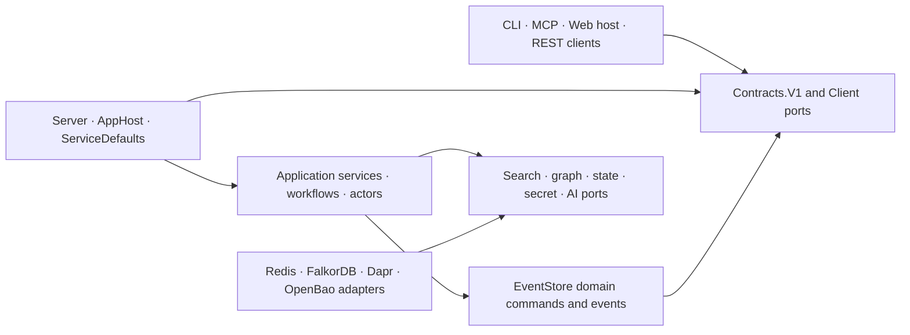
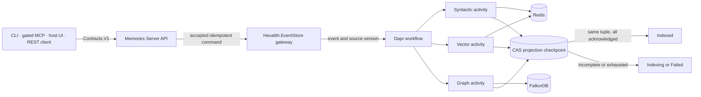

# Architecture Spine — Hexalith.Memories

## Design Paradigm

Hexalith.Memories is a **technical platform module**, not a domain module. It uses event-sourced CQRS with ports-and-adapters: Hexalith.EventStore accepts domain mutations, Dapr workflows coordinate durable projection work, Redis and FalkorDB hold rebuildable query models, and public surfaces depend on versioned contracts and client packages. AppHost, ServiceDefaults, deployment manifests, and reusable hosting integrations are therefore intentional platform responsibilities.

Logical dependencies point inward to contracts and ports. The current physical EventStore integration assembly is mixed; only its `Domain/` namespace is the dependency-pure domain center.



Rules below are the adopted target architecture. Where current code differs, the rule remains binding and the difference is implementation work, not a competing decision.

## Invariants & Rules

### AD-1 — Treat Memories as a reusable technical platform [ADOPTED]

- **Binds:** All projects, packages, hosts, deployment assets, and consuming products.
- **Prevents:** Domain consumers depending on orchestration hosts or copying platform composition into product code.
- **Rule:** Consumers use published contracts, clients, and Aspire integration packages and never reference AppHost or Server; dependency-pure domain namespaces contain no orchestration, host, or provider-SDK concerns even when a brownfield assembly also contains integration code.

### AD-2 — Keep EventStore as domain mutation truth [ADOPTED]

- **Binds:** Case, MemoryUnit, annotation, deletion, tenant lifecycle, rebuild, and release evidence flows.
- **Prevents:** Redis, FalkorDB, workflow state, or package topology becoming an accidental second system of record.
- **Rule:** Accept domain mutations through Hexalith.EventStore before reporting success, then rebuild derived stores from authoritative events; keep domain truth, Phase 1.5 CloudEvent indexing/causal integration, and source-versus-package evidence as three distinct contracts.

### AD-3 — Complete source-versioned projections as one logical outcome [ADOPTED]

- **Binds:** FR6, FR13, ingestion status, retries, reconciliation, syntactic indexes, vectors, graph projections, and query degradation.
- **Prevents:** Partial fan-out being exposed as complete, stale acknowledgements completing a newer revision, or ingestion completeness being confused with query availability.
- **Rule:** Identify projection work by `(tenantId, caseId, memoryUnitId, authoritative EventStore sourceVersion, schemaGeneration, embeddingConfigurationEpoch)`; one Dapr-state projection coordinator advances per-axis checkpoints monotonically with ETag/CAS and rejects stale acknowledgements. Mark `Indexed` only after syntactic, vector, and graph projections acknowledge that tuple; otherwise retain `Indexing`/product-semantic `projecting` or enter actionable `Failed`. Repair and replay use the same protocol.

### AD-4 — Give workflows, activities, actors, and idempotency distinct roles [ADOPTED]

- **Binds:** Dapr orchestration, retries, actor state, concurrency, replay, external I/O, and duplicate suppression.
- **Prevents:** Nondeterministic replay, actors used as queues, duplicate side effects, secrets in workflow history, and transient Redis reservations becoming durable truth.
- **Rule:** Workflows are deterministic process managers, activities are bounded idempotent I/O operations, and non-reentrant actors serialize only tenant or global stateful concerns. Capture immutable non-secret configuration plus its epoch at start and retain secret references only. Scope V1 `IdempotencyToken` by tenant, case, and command/operation; scope CloudEvent identity by tenant, case, exact validated `source`, and `id` with ordinal comparison and no post-validation normalization. Use that identity for durable EventStore/workflow duplicate suppression and make every projection an idempotent upsert for AD-3's tuple. Redis preflight reservation is fail-open admission optimization only, is released after scheduling failure, and otherwise expires by configured TTL.

### AD-5 — Derive tenant, case, and caller authority server-side [ADOPTED]

- **Binds:** NFR8-NFR11, external APIs, MCP, Dapr ingress, tenant/case access, Redis, FalkorDB, background work, and system principals.
- **Prevents:** Request fields, case membership, key prefixes, graph labels, channel tokens, or a caller-selected app identity from serving as authorization.
- **Rule:** Treat issued tenant and case IDs as validated opaque tokens and compare them with `StringComparison.Ordinal`, without case folding or Unicode normalization after issuance. REST/CLI and MCP preserve validated bearer tenant and subject authority; trusted internal calls additionally require deny-by-default Dapr mTLS/access-control policy and app-token channel protection, then map authenticated app ID through one operator-owned finite allowlist to a canonical `system:*` principal and explicit tenant grant. Dapr channel authentication never replaces tenant authorization.

### AD-6 — Make tenant lifecycle the sole resource owner [ADOPTED]

- **Binds:** Tenant provisioning, verification, repair, deletion, indexes, graphs, backend identities, and cleanup.
- **Prevents:** Startup or ingestion hot paths implicitly creating tenant resources and leaving unowned partial resources behind.
- **Rule:** Perform tenant resource changes only in explicit, idempotent, observable, bounded lifecycle workflows with verification, compensation, and resumable cleanup. Redis uses a per-tenant ACL principal resolved server-side; FalkorDB selects a separate tenant database/graph. Other paths require an active verified tenant and never create infrastructure implicitly.

### AD-7 — Enforce case ownership across case and tenant query scopes [ADOPTED]

- **Binds:** FR32-FR34, MemoryUnit ownership, case-scoped and tenant-wide search, graph seeds/paths, annotations, mutations, deletion, Evidence Packets, and G4.
- **Prevents:** Case-local graph traversal leaking across cases, tenant-wide discovery being incorrectly rejected, or deferred cross-case references becoming accidental.
- **Rule:** Resolve authoritative case ownership server-side and assign every MemoryUnit to exactly one case. A case-scoped query filters every candidate, result, node, and edge to that case. A tenant-wide query may return independently ranked units from multiple cases with mandatory case attribution, but partitions graph seeding/traversal by each seed's authoritative case and never crosses case boundaries. Mutations, annotations, and deletion verify the unit's owner case; cross-case references and paths remain forbidden.

### AD-8 — Enforce infrastructure boundaries at named adapters [ADOPTED]

- **Binds:** Dapr state/pub-sub/actors/workflows/secrets/conversation, Redis data-plane operations, FalkorDB graph operations, and architecture guards.
- **Prevents:** Provider clients and connection details leaking into endpoints, workflows, actors, domain code, public services, or contracts.
- **Rule:** Server and EventStore integration are the physical adapter assemblies, but provider SDK references are confined to composition roots and named internal `Adapters.Redis` or `Adapters.FalkorDb` namespaces and enforced by architecture tests. Direct search/vector/graph data-plane work stays behind those adapters; portable coordination state uses Dapr. Only the finite Direct Redis Exception Registry below may bypass Dapr state, and any addition requires a new architecture decision. `Hexalith.Memories.Redis` remains a compatibility facade, not the adapter owner.

### AD-9 — Fuse independent retrieval axes deterministically [ADOPTED]

- **Binds:** G1, syntactic, semantic, graph, natural-language reranking, result ordering, degradation, and explainability.
- **Prevents:** Backend magnitudes being blended, missing graph starts silently disabling required hybrid retrieval, backend loss causing avoidable total failure, or ranking implementations diverging.
- **Rule:** In provider order, drop blank IDs and non-finite raw scores, retain the first occurrence of each exact `MemoryUnitId`, and treat scores as tied only when finite `Double.Equals` returns true—no epsilon—then assign competition ranks (`1,1,3`); contribution is `1 / (10 + rank)`. For tenant-wide graph search, partition seeds by ascending ordinal case ID, retain each unit's maximum finite graph score across seeds within its case, and merge by descending graph score, ascending ordinal case ID, then ascending ordinal `MemoryUnitId` before rank allocation. Normalize the weighted sum by top-rank contribution times weights of axes that returned results, then sort by descending composite score and ascending `StringComparer.Ordinal` ID. A null axis is unavailable and an empty axis is available with no hits; neither adds denominator weight, but the Evidence Packet distinguishes them. Default weights are `0.30/0.35/0.35`; NL weight is `0.20`, default-off, and limited to requested/configured Phase 1.5 event units. Without an explicit graph start, traverse to depth at most two from the union of the top five syntactic and top five semantic hits.

### AD-10 — Serve safe available axes during query degradation [ADOPTED]

- **Binds:** FR66, NFR18, search/traversal responses, Evidence Packet degradation, readiness, and recovery.
- **Prevents:** The all-three ingestion gate being misapplied to already-admitted reads or a partial outage returning deceptively complete results.
- **Rule:** Query every selected usable axis and return a partial result when at least one can respond safely; list unavailable/excluded axes, degradation, freshness impact, and recovery guidance in the Evidence Packet. Fail the query only when no selected axis can produce a safe response. This never promotes an incompletely acknowledged revision to `Indexed`.

### AD-11 — Bound and phase graph behavior [ADOPTED]

- **Binds:** G1, graph population, traversal, case/tenant isolation, relationship semantics, kill switch, and backend portability.
- **Prevents:** Query injection, cross-scope paths, unbounded traversal, arbitrary labels, and premature claims of automatic EventStore causal coverage.
- **Rule:** Parameterize values, restrict labels to the contract enum, enforce tenant and case scope over every node and edge, and apply server-owned depth/result/time limits plus a graph kill switch. Phase 1 creates `contains`, `annotates`, `references` from explicit links or AI-inferred content similarity, and `caused_by`/`correlated_with` only from supplied ingestion metadata. Phase 1.5 adds automatic EventStore-stream causal population and dual event embeddings.

### AD-12 — Share one semantic contract across surfaces [ADOPTED]

- **Binds:** Contracts.V1, Evidence Packet, routes, statuses, errors, REST, Dapr invocation, CLI, MCP, and future Web hosting.
- **Prevents:** Interface-specific identifiers, ranking semantics, trust envelopes, or persistence models escaping through public types.
- **Rule:** Evolve Contracts.V1 additively and preserve deliberate wire names until a versioned break. Capability subsets may vary operations, never Evidence Packet semantics: every evidence-bearing result carries tenant/case scope, source/origin, confidence and per-axis contribution, degradation/excluded axes, omitted-detail handles, freshness, and recovery with equivalent null/omission meaning. MCP and EventStore CloudEvent product capabilities remain inactive until Phase 1.5 L1-L3 gates pass, even if deployment assets exist.

### AD-13 — Preserve provenance and opaque identity end to end [ADOPTED]

- **Binds:** Origin, actor, confidence, source, freshness, explanations, correlation, and `MemoryUnitId`.
- **Prevents:** Forged actor identity, provenance lost during projection, unauthorized explanations, and parsing identifiers for undocumented GUID, ULID, or time meaning.
- **Rule:** Bind external actor provenance to normalized subject claims, permit system origins only through AD-5's allowlist, carry provenance into every projection and Evidence Packet, authorize before explaining evidence, and otherwise compare `MemoryUnitId` only as an opaque stable string.

### AD-14 — Evolve schemas and providers with staged tenant migrations [ADOPTED]

- **Binds:** Embedding provider/model/dimension, index and key families, graph/search replacement, reindexing, and provider strategies.
- **Prevents:** Destructive in-place changes, mixed embedding dimensions, partial tenant activation, and provider SDK leakage.
- **Rule:** Use versioned create-backfill-verify-switch-retire migrations with disjoint active and staging resources, reindex the full tenant corpus before atomic activation, and keep embedding and LLM implementations behind strategy ports; projection evidence carries the active configuration epoch and activities resolve secret references at execution time so rotation can retry safely.

### AD-15 — Keep secrets behind OpenBao and Dapr [ADOPTED]

- **Binds:** Application secrets, tenant/provider credentials, bootstrap material, rotation, logging, and deployment scopes.
- **Prevents:** Secrets in source, ordinary settings, public contracts, workflow history, logs, or direct OpenBao client usage in application code.
- **Rule:** Applications request named secrets through Dapr secret stores, deployments provide only minimum bootstrap material, and bootstrap, application, data-plane, and operator scopes remain separate and least-privileged. Direct Kubernetes-secret injection of Redis/FalkorDB credentials is a temporary alignment gap, not a second approved application secret path.

### AD-16 — Complete tenant erasure through crypto-shredding [ADOPTED]

- **Binds:** Tenant deletion, EventStore payloads, all projections, access telemetry, backups/restores, replay, tombstones, and tenant-ID reuse.
- **Prevents:** Projection-only deletion claiming erasure, replay resurrecting deleted content, or restored backups making shredded tenant payloads readable.
- **Rule:** Tenant deletion completes after product projections are purged, a durable access-telemetry erasure mapping/handoff is recorded, and the Hexalith.EventStore tenant-key crypto-shredding workflow irreversibly invalidates or deletes content access with verification. It does not wait for or force early deletion of retained opaque access telemetry: those records follow AD-17's bounded TTL/purge contract, and accelerated purge requires a separately adopted operation. Retain only content-free deletion evidence/tombstones, reject replay and reuse of the tenant ID, and quarantine unreadable payloads during restore rather than rehydrating them.

### AD-17 — Separate access telemetry from product truth [ADOPTED]

- **Binds:** Access telemetry, trace continuity, sanitization, activation, TTL, purge progress, erasure mapping, recovery debt, and operational claims.
- **Prevents:** Telemetry acting as a product audit trail, telemetry failure corrupting domain outcomes, sensitive payload capture, or unverified production claims.
- **Rule:** Platform Operations owns the configured TTL, observable purge progress, tenant-erasure mapping, bounded recovery, and dated accepted debt. Qualification/configuration fails closed before Production activation; once admitted, sanitized product writes remain non-blocking within the approved delivery bound, surface degradation when exceeded, and never certify a tamper-evident audit trail.

### AD-18 — Partition capacity, fairness, and backpressure by tenant [ADOPTED]

- **Binds:** NFR1-NFR7, NFR12-NFR14, NFR36, ingestion, batch work, embedding, query, repair, migration, and provider throttling.
- **Prevents:** One tenant, recovery herd, batch, or migration starving interactive work or unbounded in-memory retries defeating durable orchestration.
- **Rule:** Give tenant and global quotas separate owners, use tenant-partitioned admission/concurrency and bounded durable queues, honor provider `Retry-After` through workflow timers, and keep repair/migration below interactive priority. Numeric budgets live in the PRD and validated configuration; production evidence includes capacity and noisy-neighbor behavior.

### AD-19 — Require pinned dependencies and two release evidence lanes [ADOPTED]

- **Binds:** Dependency versions, source-mode builds, package-mode builds, container defaults, publish inventory, CI, and protected releases.
- **Prevents:** Local version drift, floating integration images, unlisted projects being packed, or one successful topology standing in for another.
- **Rule:** Resolve versions from the selected Hexalith.Builds catalog, package only entries declared in `tools/release-packages.json`, pin qualified container defaults, and require isolated pristine restore, build, contract, and integration evidence for every supported source and package lane.

## Consistency Conventions

| Concern | Convention |
| --- | --- |
| Names and dependencies | Public APIs live in `Contracts/V1`; ports are interfaces; provider adapters use the AD-8 namespaces; projects use `Hexalith.Memories.*`; references point inward toward contracts/domain abstractions. |
| Identifiers and time | Tenant, case, and `MemoryUnitId` values are opaque stable strings compared with `StringComparison.Ordinal`; only the final fusion tie-break imposes ascending ordinal order. Timestamps are UTC `DateTimeOffset` values serialized as ISO 8601. |
| Routes | Product HTTP routes are under `/api/v1`; the Dapr subscription adapter `/events/ingest` is the named infrastructure exception and is not a public product route. Route constants live in `MemoriesRoutes`. |
| V1 status wire contract | JSON remains `queued`, `extracting`, `embedding`, `indexing`, `indexed`, `failed`. Product semantics map `pending` to `queued` and `projecting` to `indexing`; displays may use product terms, but V1 wire values change only in a versioned breaking window. |
| Errors and evidence | Errors carry stable code, human message, and actionable suggestion without implementation detail. Evidence-bearing results use AD-12's complete trust envelope with explicit null/omission and degradation semantics. |
| Configuration | CLI precedence is flags → environment → config file. Options validate at startup. Secret references never fall back through ordinary configuration, and secret values never enter workflow history. |
| Mutation and state | EventStore acceptance precedes domain success; AD-3 owns projection completion; AD-4 owns duplicate suppression; actor/workflow state is durable coordination, not domain truth. |
| Health | Liveness reports process viability. Readiness requires authentication configuration, the Dapr control boundary, and EventStore command availability; an individual query backend reports capability degradation rather than removing a server that can still produce a safe available-axis response. |
| Logging and traces | Async boundaries accept `CancellationToken`; high-volume logs use structured source-generated messages without content/secrets; W3C trace context crosses API, workflow, activity, and adapter boundaries. |
| Testing and evidence | Tests state tier and boundary; architecture guards enforce dependency and literal ownership; integration evidence proves observable end states, authorization before data access, replay, failure recovery, degradation, erasure, and noisy-neighbor limits. |
| Packaging | Central package management owns versions; the solution uses `.slnx`; `tools/release-packages.json` alone decides what is packaged, including intentional executable/host packages. |

## Direct Redis Exception Registry

Direct Redis search/vector/index operations are ordinary provider data-plane adapter work. The only coordination-state exception to Dapr is:

| Port and operations | Required primitive | Failure posture | Scope and evidence |
| --- | --- | --- | --- |
| `IPreflightDedupStore.TryReserveAsync` / `ReleaseAsync` | `SET NX` with finite TTL plus owner release | Reservation fails open to AD-4 durable suppression; release is best-effort and TTL is the final cleanup | Key includes tenant/case and canonical request identity; race, duplicate, timeout, outage, and expiry tests are mandatory |

Registries, leases, fences, mappings, and migration coordination use Dapr state unless a later `AD-n` adds a row with its primitive, failure posture, tenant/key scope, and test evidence.

## Stack

| Name | Version |
| --- | --- |
| .NET SDK / target / language | `10.0.400` / `net10.0` / C# 14 |
| Aspire AppHost SDK | `13.5.3` |
| CommunityToolkit Aspire Dapr hosting | `13.5.0-preview.1.260825-0345` |
| Dapr .NET SDK / CI runtime | `1.18.5` / `1.18.2` |
| Hexalith.EventStore package lane | `3.103.0` |
| Hexalith.EventStore source lane gitlink | `b1c00a79d1d34aa7ba3f58046a7844e8b3d57fd6` |
| Redis Stack Server / NRedisStack / StackExchange.Redis | `7.4.0-v8` / `1.7.4` / `3.1.31` |
| FalkorDB / NFalkorDB | `4.12.0` / `1.2.0` |
| OpenBao image / production Helm chart | `2.6.0` / `0.28.5` |
| Model Context Protocol SDK | `2.2.0` |
| Kreuzberg extraction | `4.10.2` |
| Hexalith.FrontComposer / Fluent UI Blazor | `4.4.0` / `5.0.0-rc.5-26219.1` |
| OpenTelemetry | `1.18.0` |

These are exact repository pins, not claims that every pin is the newest safe release. Production qualification is blocked until OpenBao is upgraded and requalified to at least the security-fixed `2.6.2` line and the `0.28.6` chart is assessed, or a time-bounded security exception is approved. Redis Stack `7.4.0-v8` is its ended-maintenance line and requires a Redis 8 migration/qualification plan. FalkorDB `4.12.0` remains qualified-but-behind and needs a scheduled compatibility/security review. Image digests remain mandatory in production; floating AppHost/Aspire Redis and Falkor defaults are alignment gaps.

## Structural Seed

```text
src/
  Hexalith.Memories.Contracts/       # Stable V1 messages, evidence, statuses, errors
  Hexalith.Memories.EventStore/      # Mixed EventStore/CloudEvent integration; pure Domain/ subtree
  Hexalith.Memories.Server/          # API/application plus target internal Adapters.Redis/FalkorDb
  Hexalith.Memories.Client*/         # Consumer ports and transport adapters
  Hexalith.Memories.Redis/           # Compatibility facade only; not the provider-adapter owner
  Hexalith.Memories.Telemetry/       # Shared telemetry contracts/helpers
  Hexalith.Memories.AccessTelemetry*/
                                      # Independent contracts, service, and clock authority
  Hexalith.Memories.Cli/             # Operator surface; incomplete commands fail explicitly
  Hexalith.Memories.Mcp/             # Phase 1.5 agent subset; asset presence is not activation
  Hexalith.Memories.Web/             # Current RCL; target runnable conformance specimen, not product UI
  Hexalith.Memories.Aspire/           # Reusable consumer hosting integration
  Hexalith.Memories.AppHost/          # Local composition only; never a consumer dependency
  Hexalith.Memories.ServiceDefaults/ # Telemetry, health, resilience, named infrastructure
deploy/
  kubernetes/                         # Server plus gated MCP, telemetry, Redis, FalkorDB, Dapr
  openbao/                            # Separately operated secret service
tests/                                # Unit, architecture, contract, integration, E2E evidence
tools/release-packages.json           # Sole package publication inventory
```



Local AppHost composes OpenBao, Redis, FalkorDB, Dapr components, the EventStore gateway, Server, gated MCP, access telemetry, and clock resources. Kubernetes contains Server, gated MCP, access telemetry, Redis, FalkorDB, and Dapr; Production must provide a compatible external EventStore gateway or add an owned deployment before qualification. Product traffic requires user/delegated authority; internal traffic additionally uses Dapr deny-by-default workload policy and channel tokens.

## Operational Boundaries

| Dimension | Binding boundary |
| --- | --- |
| Consistency | EventStore is authoritative; projections are eventually consistent and replayable by target design; ingestion completion uses AD-3 while query degradation uses AD-10. |
| Security | OIDC/JWT owns user/tenant identity, Dapr mTLS/access-control owns workload authorization, app tokens protect local channels, and none substitutes for tenant/case checks; secrets use AD-15. |
| Reliability | Workflows resume, activities tolerate replay, lifecycle work compensates, and poisoned work reaches an actionable terminal state rather than reporting success. |
| Capacity | AD-18 separates tenant and global admission, concurrency, priority, durable delay, and evidence; numeric latency/throughput/freshness gates remain in the PRD. |
| Observability | W3C trace context crosses durable boundaries; health is capability-aware; sanitized metrics/logs use approved low-cardinality tenant representations and state the exercised evidence tier. |
| Erasure | AD-16 joins projection purge, access-telemetry mapping, EventStore crypto-shredding, backup admission, non-reuse, and completion evidence into one outcome. |
| Deployment | AppHost is local composition. Production independently scales Server and gate-approved MCP. OpenBao currently provides three-voter pod/process failover on one Kubernetes node and makes no node/site HA claim. |
| Evolvability | Contracts evolve additively, provider details stay behind ports, schema/model changes use staged tenant migrations, and replacement preserves contract/evidence behavior. |

## Capability → Architecture Map

| Capability / Area | Lives in | Governed by |
| --- | --- | --- |
| Tenant and case lifecycle | Server services, EventStore domain, Dapr lifecycle workflows | AD-2, AD-5, AD-6, AD-7, AD-16 |
| Ingest, annotate, and delete memory | Contracts.V1, Server, EventStore, projection workflows | AD-2, AD-3, AD-4, AD-7, AD-13 |
| Hybrid search and fusion | Server search/fusion ports, Redis/FalkorDB adapters | AD-3, AD-7, AD-9, AD-10, AD-11 |
| Evidence and explanations | Contracts.V1 Evidence Packet, projection metadata, surface presenters | AD-10, AD-12, AD-13 |
| Provider and schema evolution | Tenant configuration actor, provider strategies, migration workflows | AD-4, AD-8, AD-14 |
| Secrets and tenant credentials | Dapr secret/configuration ports, OpenBao, tenant lifecycle | AD-5, AD-6, AD-15 |
| REST, CLI, MCP, and Web integration | Contracts, Client, Client.Rest, CLI, MCP, Web specimen | AD-1, AD-5, AD-12 |
| Telemetry and operations | ServiceDefaults, AppHost, access telemetry, deployment manifests | AD-15, AD-17, AD-18 |
| Packaging and release | Central build props, solution, release manifest, CI workflows | AD-1, AD-19 |

## Current Alignment Gaps

These are implementation obligations against adopted decisions, not open architecture choices:

| Gap | Violated rule | Required convergence |
| --- | --- | --- |
| Ordinary file, URL, and MCP ingestion schedules work before EventStore acceptance. | AD-2, AD-4 | Introduce the authoritative idempotent ingestion command/event boundary before projection scheduling. |
| Missing projection axes can still produce `Indexed`; no canonical all-axis checkpoint implements AD-3. | AD-3 | Add the tuple, monotonic CAS acknowledgements, stale-ack rejection, and all-axis completion gate. |
| General repair reads Redis syntactic artifacts and no EventStore replay-to-all-projections path exists. | AD-2, AD-3 | Implement authoritative replay/rebuild and distinguish it from export restore and Redis-input repair. |
| External ingestion accepts caller-controlled `IngestedBy`. | AD-5, AD-13 | Bind actor provenance to the normalized authenticated subject. |
| Shared Redis/FalkorDB credentials are injected through Kubernetes Secrets; no tenant backend principals exist. | AD-6, AD-15 | Provision and resolve per-tenant Redis ACL identities/separate Falkor graphs and route their secrets through the adopted boundary. |
| Tenant deletion purges projections but does not complete EventStore tenant-key crypto-shredding or enforce non-reuse/restore quarantine. | AD-16 | Integrate and verify the full erasure contract before claiming deletion complete. |
| Provider SDK use is spread through Server endpoints/services/activities, and direct Redis coordination also implements permanent dedup, failed-unit registries, import leases, derived-store fences, and migration state outside the finite exception registry. | AD-8 | Move data-plane code behind named adapters; move coordination to Dapr state or adopt an explicit `AD-n` exception; enforce both boundaries with architecture tests. |
| Fusion does not perform AD-9's canonical blank/non-finite/duplicate preprocessing before competition-rank allocation. | AD-9 | Canonicalize each axis before ranking and add cross-surface golden-vector tests for scores, order, and Evidence Packet axis health. |
| Hybrid search skips graph without a start node; tenant-wide case-partition merge semantics, the graph kill switch, and the complete G1 BM25+semantic control/harness are absent. | AD-9, AD-11 | Implement depth-two union auto-seeding, the canonical per-case graph merge, the kill switch, and the representative G1 protocol; the current N=8 diagnostic cannot pass G1. |
| Kubernetes has no EventStore gateway workload. | AD-2 | Declare and qualify the external dependency or add an owned Production workload. |
| Source and package modes have separate restore/build but not independent contract/integration lanes. | AD-19 | Add isolated source-mode contract/integration evidence. |
| AppHost and Aspire defaults use floating Redis/Falkor images. | AD-19 | Pin qualified defaults with explicit consumer overrides. |
| OpenBao `2.6.0`/chart `0.28.5` precede available security patches. | AD-15, AD-19 | Upgrade/requalify before Production or obtain a documented time-bounded exception. |
| Web is currently a non-runnable RCL while the PRD requires a runnable conformance specimen; product Web remains future. | AD-12 | Add the conformance host without activating a product UI; keep future host ownership explicit. |
| Kubernetes assets include MCP before Phase 1.5 launch gates. | AD-12 | Keep public ingress/publication/announcement disabled until L1-L3 pass. |

Architecture alignment does not imply that G1-G5 or L1-L3 product gates have passed.

## Deferred

| Topic | Revisit condition |
| --- | --- |
| Production Dapr actor/workflow state store | Before Production launch or SLO approval, qualify or replace the current Redis component against durability and recovery requirements. |
| Python or Dapr Agents sidecar | A selected feature requires a non-.NET agent runtime and defines ownership, deployment, security, and versioned contracts. |
| Cross-case references | A versioned Phase 2 decision supplies authorization, evidence, and graph semantics; until then AD-7 forbids them. |
| Hosted product Web surface | Phase 2 selects a host; it owns navigation, authentication, authorization, global state, render mode, and activation of the conformance components. |
| Generated OpenAPI | A consumer or compatibility gate requires a generated document and assigns versioning ownership. |
| Redis 8 and FalkorDB upgrades | Before the next Production support/security window, qualification proves protocol, index/vector/graph behavior, migrations, backup/restore, and performance. |
| Alternate search or graph backend | Capacity, licensing, portability, or SLO evidence triggers replacement; adapter, isolation, migration, and Evidence Packet rules remain binding. |
| Multi-region, backend HA, and OpenBao node/site resilience | Approved availability, RPO, and RTO targets justify a concrete topology and failure-domain evidence. |
| Managed-service and redistribution license posture | Before any hosted offering or backend/license change, operator/legal review approves the deployment and distribution model. |
