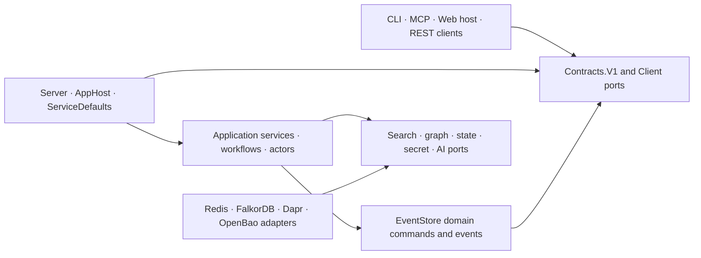
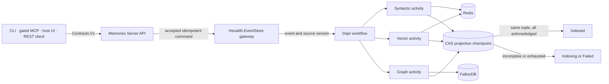

# Architecture Spine — Hexalith.Memories

## Design Paradigm

Hexalith.Memories is a **technical platform module**, not a domain module. It uses event-sourced CQRS with ports-and-adapters: Hexalith.EventStore accepts domain mutations, Dapr workflows coordinate durable projection work, Redis and FalkorDB hold rebuildable query models, and public surfaces depend on versioned contracts and client packages. AppHost, ServiceDefaults, deployment manifests, and reusable hosting integrations are therefore intentional platform responsibilities.

Logical dependencies point inward to contracts and ports. The current physical EventStore integration assembly is mixed; only its `Domain/` namespace is the dependency-pure domain center.



Rules below are the adopted target architecture. Where current code differs, the rule remains binding and the difference is implementation work, not a competing decision. Where a rule is not yet mechanically enforced, the rule or its ledger row says so; an unenforced rule is still binding but is a weaker guarantee. The Current Alignment Gaps ledger is the index of outstanding enforcement obligations, and the index is itself a rule: **a rule that names an owner, a store, a state vocabulary, a principal, or any other mechanism the architecture has not yet defined carries a ledger row naming that mechanism**, and a reader may treat an obligation absent from both the rule text and the ledger as not yet governed. A spine revision that adds such a rule without its row is incomplete; the reviewer gate found that omission in each of the three preceding passes, which is why the obligation is stated here rather than left to review.

## Invariants & Rules

### AD-1 — Treat Memories as a reusable technical platform [ADOPTED]

- **Binds:** All projects, packages, hosts, deployment assets, and consuming products.
- **Prevents:** Domain consumers depending on orchestration hosts or copying platform composition into product code.
- **Rule:** Consumers use published contracts, clients, and Aspire integration packages and never reference AppHost or Server; dependency-pure domain namespaces contain no orchestration, host, or provider-SDK concerns even when a brownfield assembly also contains integration code.

### AD-2 — Keep EventStore as domain mutation truth [ADOPTED]

- **Binds:** FR75, case, MemoryUnit, annotation, deletion, tenant lifecycle, rebuild, restore, and release evidence flows.
- **Prevents:** Redis, FalkorDB, workflow state, or package topology becoming an accidental second system of record, and an availability restore being mistaken for an authoritative rebuild.
- **Rule:** Accept domain mutations through Hexalith.EventStore before reporting success, then rebuild derived stores from authoritative events; keep domain truth, Phase 1.5 CloudEvent indexing/causal integration, and source-versus-package evidence as three distinct contracts. Recovery keeps three inputs distinct: authoritative EventStore replay is the only rebuild that may set projection truth; shared Redis/FalkorDB projections and tenant-keyed coordination state have no operational backup-restore path and recover through that replay; application export restore is an import subject to normal ingestion rules. A historical or future derived-store snapshot that lacks AD-16 tenant-key protection is a purge target, never an availability shortcut. AD-16's erasure constraints override every recovery input, and authoritative replay, any admitted tenant-key-protected restore, and application import each consult AD-21's erased-tenant register before admitting a record and fail closed when it is unavailable.

### AD-3 — Complete source-versioned projections as one logical outcome [ADOPTED]

- **Binds:** FR6, FR13, FR75, ingestion status, retries, reconciliation, syntactic indexes, vectors, graph projections, checkpoint invalidation, concurrent tenant erasure, and query degradation.
- **Prevents:** Partial fan-out being exposed as complete, stale acknowledgements completing a newer revision, a legitimate new-epoch reprojection being suppressed as stale, a late write overwriting newer projected content or recreating tenant data after erasure has fenced it, a deliberately invalidated checkpoint being read as work never attempted, a write carrying a non-active tuple being dropped into a resource its phase never defined, or ingestion completeness being confused with query availability.
- **Rule:** Identify projection work by `(tenantId, caseId, memoryUnitId, authoritative EventStore sourceVersion, schemaGeneration, embeddingConfigurationEpoch)`; one Dapr-state projection coordinator advances per-axis checkpoints monotonically with ETag/CAS and rejects stale acknowledgements. Order that tuple explicitly: `(embeddingConfigurationEpoch, schemaGeneration)` is the identity discriminator and `sourceVersion` the only monotonic dimension, so exactly one checkpoint record exists per `(tenantId, caseId, memoryUnitId, schemaGeneration, embeddingConfigurationEpoch)`, an acknowledgement is stale only when its `sourceVersion` is lower than the recorded value for its own generation and epoch, and an acknowledgement for a different generation or epoch is never stale. Mark `Indexed` only after syntactic, vector, and graph projections acknowledge that tuple; otherwise retain `Indexing`/product-semantic `projecting` or enter actionable `Failed`. The reported public ingestion state is always that of the tenant's active `(schemaGeneration, embeddingConfigurationEpoch)`, while a staging tuple's completion is reported only as migration-backfill progress. Fence the write as well as the acknowledgement: derived stores hold exactly one current document per `(tenantId, caseId, MemoryUnitId, schemaGeneration, embeddingConfigurationEpoch)` — **the generation and epoch are part of the document's identity, which is what makes a non-active-epoch write disjoint from the active document without needing a separate resource** — exactly one such pair is the tenant's active pair at any instant, queries read only the active pair's documents, every projection write is conditional on the stored document for its own pair and is a no-op when the incoming `sourceVersion` is older **within that same pair**; a write carrying the tenant's active pair maintains the active documents; a write carrying a pair the tenant has **declared** — AD-14's Phase 1 rebuild epoch, or a Phase 2/3 staging pair — maintains that pair's documents and never touches the active ones, so an active and a non-active write can never alternate in one document. Only a write carrying a pair that is neither active nor declared is **rejected as out-of-generation and surfaced as an actionable `Failed` reprojection** — never silently dropped, and never redirected to a resource no phase has defined. AD-14 governs what a Phase 1 / MVP degraded rebuild does to the epoch; AD-3 only fences the writes it produces. Deletion writes a fenced tombstone under the same rule. Persist the status rather than inferring it from artifact presence, and take the public status vocabulary from the Consistency Conventions' V1 status row rather than restating it here. AD-2's derived-store restore invalidates a checkpoint by **writing an explicit `reprojectionRequired` checkpoint record for the affected tuple, never by deleting it**: that record reports the public ingestion state as `indexing` with a stated reprojection reason, does not violate `sourceVersion` monotonicity, and is cleared only by a complete all-axis acknowledgement of the same tuple — so an absent checkpoint record continues to mean that no projection work has ever been recorded, and the two are never confused. Repair and replay use the same protocol, and AD-14's retire step deletes the retired generation's and epoch's checkpoint records as part of its verified completion.

- **Concurrent-erasure fence:** Every projection activity captures AD-16's tenant lifecycle write generation when its work is admitted. Every syntactic, vector, graph, derived-document-tombstone, and checkpoint write presents that generation and compares it atomically with the target's writable generation in the same backend operation that would make the write visible; a separate lifecycle read followed by a write does not satisfy this rule. A stale or closed generation rejects the write without mutating projected state. Where a target cannot provide that atomic comparison, its adapter must instead prove that the tenant-scoped write authority has been revoked before AD-16 begins purge.

### AD-4 — Give workflows, activities, actors, and idempotency distinct roles [ADOPTED]

- **Binds:** FR75, Dapr orchestration, retries, actor state, concurrency, replay, external I/O, duplicate suppression, and durable state content.
- **Prevents:** Nondeterministic replay, actors used as queues, duplicate side effects, secrets or tenant content in workflow history, and transient Redis reservations becoming durable truth.
- **Rule:** Workflows are deterministic process managers, activities are bounded idempotent I/O operations, and non-reentrant actors serialize only tenant or global stateful concerns. Capture immutable non-secret configuration plus its epoch at start and retain secret references only. Workflow history and activity payloads carry identifiers, references, and non-secret configuration only: tenant content and content-derived material — extracted text, embeddings, snippets — are read at execution time from the **tenant content store** and are never persisted into workflow history or actor state. That store is a named tenant resource, not a property: AD-6 provisions and erases it with the tenant's other resources, its contents are written under the tenant key so AD-16 crypto-shredding reaches them, AD-16 names it in its enumerated purge targets, access to it derives tenant authority under AD-5 like any other tenant resource, and its capacity is an AD-18 tenant quota. An activity that cannot resolve it fails closed rather than falling back to a payload. Scope V1 `IdempotencyToken` by tenant, case, and command/operation; scope CloudEvent identity by tenant, case, validated `source`, and `id`. `source` and `id` are externally supplied and are therefore validated at the ingress trust boundary against a declared bounded character set, length-bounded, and canonicalized there exactly once in a stated form (scheme and host lowercased, no other change); thereafter they are compared ordinally with no further normalization. Because neither is issued under AD-23's grammar, neither is composed into a key in raw form — AD-23's injective-composition rule governs how they enter one. The shipped reservation key hashes `id` and omits `source`, so it does **not** implement this identity and remains an alignment gap. Use the adopted identity for durable EventStore/workflow duplicate suppression and make every projection an idempotent upsert for AD-3's tuple; a legitimate reprojection under a new schema generation or embedding-configuration epoch is not a duplicate and is never suppressed. Redis preflight reservation is fail-open admission optimization only, is released after scheduling failure, and otherwise expires by configured TTL.

### AD-5 — Derive tenant, case, and caller authority server-side [ADOPTED]

- **Binds:** NFR8-NFR11, external APIs, MCP, Dapr ingress and pub/sub delivery, tenant/case access, Redis, FalkorDB, background and resumed durable work, system and operator principals, and the operator artifact. Identifier issuance and key composition are AD-23's.
- **Prevents:** Request fields, envelope fields, case membership, key prefixes, graph labels, channel tokens, or a caller-selected app identity from serving as authorization; two writers of one authorization decision; a privileged principal that authorizes work while being derivable from nothing; and an exempt class of work that no mechanism binds to a tenant.
- **Rule:** Treat issued tenant and case IDs as validated opaque tokens and compare them with `StringComparison.Ordinal`, without case folding or Unicode normalization after issuance; AD-23 owns what makes them safe to compare that way. REST/CLI and MCP preserve validated bearer tenant and subject authority. Trusted internal calls additionally require deny-by-default Dapr mTLS/access-control policy and app-token channel protection, then satisfy three independent checks — an app ID present in the allowlist, an explicit grant for the requested tenant, and that tenant being currently `Active` in AD-6's lifecycle state machine — any one of which failing closed. **One deployment-time artifact, the operator artifact, carries three operator-controlled identity, privilege, and routing facts** — the app-ID-to-`system:*` allowlist, the per-operator-scoped-app-ID list of lifecycle operations each may invoke, and the exact authenticated pub/sub channel-identity tuple `(subscribing component, topic, authenticated publisher)` to candidate-tenant routing map — with exactly one writer, the operator, held in AD-15's operator secret scope rather than in ordinary configuration or component YAML, versioned, and changed only through a reviewed and observable procedure. The allowlist and operation list grant principal identity and privilege; the routing map selects a candidate tenant but never grants tenant authority. An absent app ID fails closed with no default principal; grants are enumerated and any wildcard requires its own architecture decision. **An operator principal is an ordinary authenticated identity marked operator-scoped in that artifact** — a human operator's OIDC issuer-plus-subject or an allowlisted workload app ID, authenticated by the same mechanisms as every other principal, carrying no tenant claim by construction. Because it carries none, NFR8's principal-driven verification is extended to cover it: the isolation suite authenticates as an operator principal and asserts that every non-exempt operation it attempts against a tenant is refused. The per-tenant grant that pairs with the allowlist is a tenant resource whose sole writer is AD-6's lifecycle workflow. Its **membership at provisioning is an explicit app-ID set in the tenant's AD-6 lifecycle evidence, authorized by the initiating operator principal and limited to app IDs already present in the operator artifact's allowlist**, then materialized by verified provisioning; adding or removing an app ID on a live tenant is an AD-6 grant-amendment lifecycle operation and not an edit to the operator artifact; and every grant is revoked as a completion condition of AD-16 erasure. **Revocation propagates within a stated bound:** a revoked grant, a removed allowlist entry, and a withdrawn operator authority stop authorizing within that bound, and no cached authorization decision, session, or in-flight durable work established under a superseded authority outlives it — the same bound AD-15 imposes on a rotated credential, for the same reason. Dapr pub/sub ingress derives tenant authority from the delivery channel and never from the envelope: **the receiving component or topic is bound to one candidate tenant, or the operator artifact maps the delivery's authenticated channel identity — the subscribing component and topic, and the publisher identity Dapr authenticated — to one candidate tenant. Admission then applies the same allowlist, explicit per-tenant grant, and `Active` lifecycle checks as any trusted internal call. No field the publisher sets may select or authorize the tenant, and `source` is a publisher-set envelope field:** a routing map keyed on `source` lets a publisher choose the tenant it writes into and is forbidden by this decision's own *Prevents*, whatever its matching rule. The shipped `TenantEventRoutingOptions.SourceToTenantMap` is exactly such a map and is an alignment gap, not an implementation of this rule. Channel-identity tuple lookups are exact and ordinal; an envelope tenant that differs from the authorized candidate tenant is rejected rather than ingested, a delivery whose channel resolves to no tenant is rejected, and the resolved tenant must pass all three internal-call checks. Work with no human caller — workflows, activities, actors, reminders, data repair, replay, and migration — carries an explicit tenant authority captured at initiation, revalidates it against the tenant's lifecycle state on every resume and at each activity boundary, and fails closed when the tenant is not `Active`, is erased, or is absent from the initiating principal's grant; captured configuration is not authority. **Exactly three exemptions from that fail-closed exist, and no other decision may add a fourth without amending this list.** (1) AD-6 lifecycle workflows and (2) AD-16 erasure act on their own subject's lifecycle state, so they revalidate against AD-6's lifecycle state machine rather than against `Active` and are never deadlocked by their own subject. Each such workflow is authorized by an operator principal; is **scoped at initiation to exactly one tenant identifier recorded in its lifecycle evidence, which it may not change on resume or retry**; revalidates that operator principal — not the tenant — at every resume and activity boundary and fails closed when its authority has been withdrawn; and reaches **only the operations the operator artifact enumerates**, which are exhaustively: tenant provisioning and tenant-resource creation, tenant verification, lifecycle repair, grant amendment, per-tenant credential rotation, tenant-resource migration setup and retire, access-telemetry partition provisioning and erasure, tenant deactivation, tenant deletion, and AD-16 erasure including tenant-content-store erasure. Every other call such a workflow makes satisfies all three internal-call checks. **No enumerated operation may create, re-provision, or restore any resource for a tenant present in AD-21's erased-tenant register**, and an enumerated operation that cannot reach the register fails closed. The exemption travels with the calling principal and never with the request: a receiving service recognizes a lifecycle call from the authenticated caller identity mapped through the operator artifact — never from a header, flag, or field the caller sets, which `Prevents` forbids — accepts it only for an enumerated operation, only from an app ID the artifact marks operator-scoped, and only when its authenticated workflow-instance scope reference resolves to the same single tenant identifier recorded in the lifecycle evidence; the request tenant must equal that bound tenant. It applies all three internal-call checks to every other call from that same identity. An all-tenant grant remains a wildcard requiring its own architecture decision and is not created by this clause. (3) AD-17 retention accounting — TTL expiry, purge progress, and the derived erasure mapping — is authorized by Platform Operations' own operator-scoped principal and is bounded in AD-17. Adding an operation or an exemption to this list is an architecture decision, not a configuration change. Dapr channel authentication never replaces tenant authorization.

### AD-6 — Make tenant lifecycle the sole resource owner [ADOPTED]

- **Binds:** Tenant provisioning, verification, repair, deactivation, deletion, the tenant lifecycle state machine, operator authorization of lifecycle work, the AD-21 erased-tenant register consult, indexes, graphs, backend identities and credentials, per-tenant grants, the tenant content store, the access-telemetry partition, and cleanup.
- **Prevents:** Startup or ingestion hot paths implicitly creating tenant resources and leaving unowned partial resources behind; an erased tenant identifier being re-issued or its resources re-created by repair; and a lifecycle state that authorizes work while no decision enumerates it.
- **Rule:** Perform tenant resource changes only in explicit, idempotent, observable, bounded lifecycle workflows with verification, compensation, and resumable cleanup. **AD-6 owns the tenant lifecycle state machine and is its sole writer.** Its states are the `Contracts.V1` `TenantStatus` values — today `Provisioning`, `Active`, `Deleting`, `Failed`, `CompensationFailed`, extended additively under AD-12 with `Deactivated` and with `Erased`, which is terminal and irrevocable — and that enum is the single definition site for the vocabulary; no decision, surface, or store defines a parallel one. Every transition is an AD-2-committed domain event on the `memories-tenants` stream and is committed **before** the resources it authorizes are touched. Because AD-16 crypto-shredding destroys the tenant key, a content-free projection of each tenant's identifier, current state, and transition time is mirrored onto AD-21's platform partition, so lifecycle state stays readable after erasure; authorization decisions read the committed state or that projection and never a cached copy held by the tenant configuration actor, which AD-14 already denies source-of-truth status. The `Erased` state is set **from** AD-21's register rather than beside it — the register remains the sole authority on erasure and the state machine reads it — so the two can never disagree. Provisioning is authorized by an operator principal under AD-5 and **consults AD-21's erased-tenant register before issuing a tenant identifier**, failing closed when the register is unavailable, unreadable, or older than the newest erasure it records; provisioning and lifecycle repair refuse any tenant in `Deleting` or `Erased`, so no compliant repair can re-create an erased tenant's ACL principal, graph, telemetry partition, or grant. Redis uses a per-tenant ACL principal resolved server-side; FalkorDB selects a separate tenant database/graph; the tenant content store of AD-4 and the access-telemetry store of AD-17 are tenant-isolated resources with a stated per-tenant principal or partition, provisioned and erased with the tenant. Other paths require an `Active` verified tenant and never create infrastructure implicitly.

### AD-7 — Enforce case ownership across case and tenant query scopes [ADOPTED]

- **Binds:** FR32-FR34, MemoryUnit ownership, case-scoped and tenant-wide search, graph seeds/paths, annotations, mutations, deletion, Evidence Packets, and G4.
- **Prevents:** Case-local graph traversal leaking across cases, tenant-wide discovery being incorrectly rejected, deferred cross-case references becoming accidental, or case being silently treated as a confidentiality boundary the architecture does not implement.
- **Rule:** Resolve authoritative case ownership server-side and assign every MemoryUnit to exactly one case. A case-scoped query filters every candidate, result, node, and edge to that case. A tenant-wide query may return independently ranked units from multiple cases with mandatory case attribution, but partitions graph seeding/traversal by each seed's authoritative case and never crosses case boundaries. Mutations, annotations, and deletion verify the unit's owner case; cross-case references and paths remain forbidden. **Case is a data-partition and attribution boundary, not an authorization boundary:** a principal with tenant authority may read every case in that tenant, and case-scoped queries constrain results rather than access. Per-case authorization is deferred, and until it is adopted no product documentation may present cases as an access-control mechanism.

### AD-8 — Enforce infrastructure boundaries at named adapters [ADOPTED]

- **Binds:** Dapr state/pub-sub/actors/workflows/secrets/conversation, Redis data-plane operations, FalkorDB graph operations, and architecture guards.
- **Prevents:** Provider clients and connection details leaking into endpoints, workflows, actors, domain code, public services, or contracts.
- **Rule:** Server and EventStore integration are the physical adapter assemblies. Provider SDK references **must be** confined to composition roots and to named internal `Adapters.Redis` or `Adapters.FalkorDb` namespaces, enforced by an architecture test **still to be added**: neither namespace exists today and no guard enforces the boundary, so this rule is binding but currently unenforced and its convergence is ledgered. Direct search/vector/graph data-plane work stays behind those adapters; portable coordination state uses Dapr. Only the finite Direct Redis Exception Registry below may bypass Dapr state, and any addition requires a new architecture decision. `Hexalith.Memories.Redis` remains a compatibility facade, not the adapter owner.

### AD-9 — Fuse independent retrieval axes deterministically [ADOPTED]

- **Binds:** G1, syntactic, semantic, graph, natural-language ranking, candidate depth, pagination, result ordering, degradation, and explainability.
- **Prevents:** Backend magnitudes being blended, missing graph starts silently disabling required hybrid retrieval, an unbounded candidate set or a pushed-down page offset changing ranks, a silently truncated axis reporting healthy, backend loss causing avoidable total failure, or ranking implementations diverging.
- **Rule:** In provider order, drop blank IDs and non-finite raw scores, retain the first occurrence of each exact `MemoryUnitId`, and treat scores as tied only when finite `Double.Equals` returns true—no epsilon—then assign competition ranks (`1,1,3`); contribution is `1 / (10 + rank)`. The per-axis candidate depth is a **single deployment-wide, configuration-validated value** identical across every surface, tenant, caller, page, and load condition; admission control, backpressure, and per-tenant quotas may never shrink it — AD-18 rejects or delays work instead — and the depth in force is reported in the Evidence Packet so that two answers produced under different depths are distinguishable. Fusion is defined over each axis's complete server-limited candidate list. For tenant-wide graph search, partition seeds by ascending ordinal case ID, retain each unit's maximum finite graph score across seeds within its case, and merge by descending graph score, ascending ordinal case ID, then ascending ordinal `MemoryUnitId` before rank allocation. Normalize the weighted sum by top-rank contribution times weights of axes that returned results, then sort by descending composite score and ascending `StringComparer.Ordinal` ID. **AD-22 owns the axis-state vocabulary, its denominator consequence, and its encoding, and AD-9 consumes it rather than restating it:** an axis contributes its weight to the denominator **if and only if it returned at least one result**, whatever its state — so `available` with no hits and `truncated` with no hits both contribute none, and neither a state name nor the word “degraded” ever overrides the returned-results test. Default weights are `0.30/0.35/0.35`. `nl` is a fourth ranked axis and not a rerank: when requested and configured for Phase 1.5 event units it is canonicalized, competition-ranked, and contributes at weight `0.20` inside the same weighted sum, default-off, entering the denominator only when it returned results, appearing in Evidence Packet axis health and in explain output under the wire name `nl`, and selectable through the axis-control parameter; where NL is inactive it is reported as an excluded axis rather than omitted. Without an explicit graph start, traverse to depth at most two from the union of the first five entries of the canonicalized syntactic list and the first five of the canonicalized semantic list — five entries, not five ranks. Apply AD-11's result limit once to the merged graph list after the per-case merge and before rank allocation, never per case partition, and apply AD-11's time limit once to the whole tenant-wide fan-out. The caller's result limit and offset apply only to the fused output after rank allocation, normalization, and final ordering and are never pushed into an axis provider, so a unit's rank, per-axis contributions, and composite score are identical whatever page returns it and consecutive pages concatenate to exactly the head of the single fused ordering. The fused ordering is finite and bounded by the candidate depth: a request whose offset reaches or exceeds its length returns an empty page whose Evidence Packet reports the fused list's total length and states whether that length was bounded by the corpus or by the candidate depth, so exhaustion of the corpus and exhaustion of the depth are never confused.

### AD-10 — Serve safe available axes during query degradation [ADOPTED]

- **Binds:** FR66, NFR18, search/traversal responses, Evidence Packet degradation, readiness, and recovery.
- **Prevents:** The all-three ingestion gate being misapplied to already-admitted reads, a partial outage returning deceptively complete results, or each adapter applying a private safety doctrine that silently moves every composite score.
- **Rule:** An axis can respond **safely** when its adapter applied the request's authoritative tenant and case scope to every result it returns and read only resources belonging to the tenant's active `(schemaGeneration, embeddingConfigurationEpoch)`. Completing within configured limits is not a condition of safety: an axis that hit a traversal, result, provider, or time cutoff while keeping scope verified is safe and `truncated`, and only unverified scope or a generation/epoch mismatch makes it unsafe. Staleness, low recall, empty results, and reaching AD-9's configured candidate depth are safe and are disclosed as freshness, emptiness, or depth; unverified scope and a generation or epoch mismatch are unsafe and null the axis. A cutoff exhausted such that the applied scope cannot be verified is unsafe; a scope-verified incomplete axis is AD-22's `truncated` state, which is safe and disclosed, while AD-22 alone determines from returned results whether it contributes denominator weight. **Safety is decided once per query by the server's axis-selection step, never independently by each adapter, and it is decided only from the facts AD-22 obliges every adapter to report** — the server never infers scope application or truncation from a result set's shape, and an adapter that reports nothing is scope-unverified and is nulled. The resulting state vector is the single input to both AD-9's denominator and the Evidence Packet's axis health. Query every selected usable axis and return a partial result when at least one can respond safely; list every selected axis with its AD-22 state, together with degradation, freshness impact, and recovery guidance, in the Evidence Packet. Fail the query only when no selected axis can produce a safe response. This never promotes an incompletely acknowledged revision to `Indexed`.

### AD-11 — Bound and phase graph behavior [ADOPTED]

- **Binds:** G1, graph population, traversal, case/tenant isolation, relationship semantics, kill switch, and backend portability.
- **Prevents:** Query injection, cross-scope paths, unbounded traversal, arbitrary labels, and premature claims of automatic EventStore causal coverage.
- **Rule:** Parameterize values, restrict labels to the contract enum, enforce tenant and case scope over every node and edge, and apply server-owned depth/result/time limits plus a graph kill switch; AD-9 fixes where those limits are applied. Phase 1 creates `contains`, `annotates`, `references` from explicit links or AI-inferred content similarity, and `caused_by`/`correlated_with` only from supplied ingestion metadata, never collapsing `caused_by` into `correlated_with` and never auto-promoting inferred edge confidence. Phase 1.5 adds automatic EventStore-stream causal population and dual event embeddings.

### AD-12 — Share one semantic contract across surfaces [ADOPTED]

- **Binds:** NFR37, Contracts.V1 ownership, Evidence Packet, routes, statuses, errors, exit codes, REST, Dapr invocation, CLI, MCP, and future Web hosting.
- **Prevents:** Interface-specific identifiers, ranking semantics, trust envelopes, or persistence models escaping through public types; two additive changes colliding on one wire name; and one packet meaning being carried by two mutually unreadable encodings.
- **Rule:** Evolve Contracts.V1 additively and preserve deliberate wire names until a versioned break. `Hexalith.Memories.Contracts` is the single owning component for `Contracts.V1` and its maintainers hold change-approval authority over that wire surface, and an additive change is admissible only once its new wire name, JSON shape, and nullability are reserved in the contract's versioned name register in the same change; a reserved name may not be reused with a different shape, and a collision is resolved before merge rather than by a later rename. **The name register is a single tracked file inside `Hexalith.Memories.Contracts`**, every closed set the contract exposes — AD-22's axis states, the packet states below, the V1 status wire values, and the error-code catalogue — is reserved in it as a closed set extensible only by a registered additive change, and an architecture test **still to be added**, its convergence ledgered, fails the build when a serialized evidence-bearing wire name is absent from the register or is reserved with a different shape. Capability subsets may vary operations, never Evidence Packet semantics: every evidence-bearing result carries tenant/case scope, source/origin, confidence and per-axis contribution, degradation/excluded axes, omitted-detail handles, freshness, and recovery. **Equivalence is equivalence of the serialized document:** every element is always present on every surface, an unavailable axis or absent value is an explicit JSON `null` and never an omitted property, an available-with-no-hits axis is an empty collection, no surface enables null-omitting serialization for evidence-bearing types, the packet state is a single value drawn from the versioned vocabulary — `complete`, `partial`, `weak`, `empty`, `stale`, `degraded`, `unauthorized`, `pendingExpansion`, which is the shipped `Contracts.V1` `EvidencePacketState` enum and is its single definition site — with an accompanying set-valued reason list. **Equivalence is byte-equality of one canonical document:** properties serialize in the name register's declared order, `double` values use round-trippable invariant `R` formatting, strings use minimal JSON escaping, and no surface reformats, reorders, or rounds the packet; each surface embeds that exact byte sequence as its packet payload while its own transport framing — HTTP body framing, the CLI JSON envelope, the MCP content block — is excluded from the comparison, and the golden-vector test compares the extracted packet bytes across REST, Dapr invocation, CLI JSON, and MCP rather than whole responses. A handle is emitted only for detail the caller is authorized to retrieve; **detail withheld for authorization is represented by the same present properties with canonical JSON `null` values and the same bytes as ordinary absence, and no handle is emitted**, so withholding cannot be distinguished from absence. Handles are opaque, non-enumerable, scoped to the issuing caller and request, and carry no score, count, or scope information about unauthorized content. Each active surface additionally publishes an operator-observable output contract: a stable presentation order, a text label for every state, axis, score meaning, omission, progress stage and recovery, a machine-readable envelope and exit-code map, and identical semantics across every emitted form, with colour, glyph, motion, and screen position supplementary only. `Hexalith.Memories.Contracts` owns **every public wire surface the platform serves under a `v1` route**, the AD-17 access-telemetry and clock plane included: a component that ships its own contract assembly reserves its wire names, shapes, and nullability in that one register and maps its errors from the `Contracts/V1` catalogue, and is either published under AD-19 wherever a consumer outside this repository may call it, or declared internal, deliberately absent from `tools/release-packages.json`, and documented as unavailable to consumers. MCP and EventStore CloudEvent product capabilities remain inactive until Phase 1.5 L1-L3 gates pass, even if deployment assets exist; inactive means unreachable, not merely unadvertised — no route, ingress, or replica serves them until the gate passes.

### AD-13 — Preserve provenance and opaque identity end to end [ADOPTED]

- **Binds:** Origin, actor, confidence, source, freshness, explanations, correlation and causation identifiers, and `MemoryUnitId`.
- **Prevents:** Forged actor identity, one principal splitting into several across surfaces, provenance lost during projection, unauthorized explanations, and parsing identifiers for undocumented GUID, ULID, or time meaning.
- **Rule:** Bind external actor provenance to the authenticated issuer plus subject claim, normalized exactly once at the authentication boundary in a stated form and compared ordinally thereafter, so the same human yields the same recorded actor on every surface. Permit system origins only through AD-5's allowlist, carry provenance into every projection and Evidence Packet, and authorize before explaining evidence. Supplied correlation and causation identifiers are opaque provenance preserved through projection and distinct from W3C trace context. Otherwise compare `MemoryUnitId` only as an opaque stable string.

### AD-14 — Evolve schemas and providers with phase-qualified tenant migrations [ADOPTED · ratified 2026-09-12]

- **Binds:** Embedding provider/model/dimension, index and key families, graph/search replacement, reindexing, provider strategies, and the MVP/Phase 2/Phase 3 migration boundary.
- **Prevents:** Destructive in-place changes, mixed embedding dimensions, partial tenant activation, provider SDK leakage, and an unphased rule silently rebaselining MVP onto a contract the product has not funded.
- **Rule:** Migration obligations are phase-qualified and no phase's evidence satisfies another's. In **Phase 1 / MVP**, FR43 permits only a tenant-scoped, explicitly acknowledged degraded rebuild of rebuildable projections. **That rebuild allocates a new `embeddingConfigurationEpoch` and writes under it, and activates it atomically for the tenant when its verification succeeds** — it is the sole writer permitted to target the new epoch, ordinary ingestion continues under the epoch that is active until the moment of activation, and the tenant's reported ingestion state and AD-10's axis safety are evaluated against the active epoch alone throughout, so the rebuild never flips a tenant's whole corpus into `indexing` and never mixes two embedding spaces under one epoch. Activation is a single AD-2 commit, after which AD-3's retire step deletes the superseded epoch's documents and checkpoint records. The command discloses impact and progress, fails closed on incomplete verification, preserves authoritative EventStore truth, and never claims zero downtime; the query gap between allocation and activation is exactly the degradation FR43 requires it to acknowledge. In **Phase 2**, embedding provider/model/dimension and index-schema changes use versioned create-backfill-verify-switch-retire migrations with disjoint active and staging resources and a full-tenant reindex before atomic activation, with no availability break. In **Phase 3**, backend replacement uses the same staged cutover at the adapter boundary. **Every phase in which a non-active generation or epoch may be written declares what that write targets, for every store AD-3's fence covers — syntactic index, vector index, graph, and tombstones — and AD-3 rejects only a write that matches no declared pair.** Phase 1 declares exactly one: the rebuild epoch above, which needs no separate resource because AD-3 makes the epoch part of a document's identity. What is **Phase 2 and Phase 3 only, by explicit statement rather than by silence**, is the disjoint-staging-*resource* machinery — separate index families, graphs, and key families created by create-backfill-verify-switch-retire; Phase 1 neither has nor needs them, and no rule may read their absence as leaving a Phase 1 write without a target. Across all phases, keep embedding and LLM implementations behind strategy ports; projection evidence carries the active configuration epoch and activities resolve secret references at execution time so rotation can retry safely. The active schema generation and embedding-configuration epoch are tenant-lifecycle domain facts committed through AD-2 before any projection may cite them; the tenant configuration actor caches and serializes access to them and is never their source of truth. **Every consumer of the active `(schemaGeneration, embeddingConfigurationEpoch)` — AD-3's status projection, AD-10's axis selection, and every projection activity — resolves it through that actor and through no other path**; the cached value is invalidated synchronously as part of the AD-2 activation commit and before that commit is reported complete, so no two consumers observe different active epochs for one tenant at one instant, and a consumer that cannot resolve the value fails closed rather than assuming the previous epoch. No MVP implementation or completed historical migration is retroactively claimed to meet the Phase 2/3 contract.

### AD-15 — Keep secrets behind OpenBao and Dapr [ADOPTED]

- **Binds:** Application secrets, tenant/provider credentials, the AD-5 allowlist artifact, bootstrap material, rotation and revocation, logging, and deployment scopes.
- **Prevents:** Secrets in source, ordinary settings, public contracts, workflow history, logs, or direct OpenBao client usage in application code; an unbounded temporary exception standing in for the isolation mechanism a hard gate names; and a rotated credential remaining valid.
- **Rule:** Applications request named secrets through Dapr secret stores, deployments provide only minimum bootstrap material, and bootstrap, application, data-plane, and operator scopes remain separate and least-privileged. Rotation supersedes: a rotated credential is revoked at the provider within a stated bound, no connection or client established under a superseded credential outlives that bound, and rotation of a tenant data-plane credential is an AD-6 lifecycle operation verified by confirming the prior credential no longer authenticates. Direct Kubernetes-secret injection of Redis/FalkorDB credentials is a temporary alignment gap, not a second approved application secret path. **Production qualification is blocked until per-tenant backend principals replace it and a current re-runnable evidence path verifies the isolation boundary; a dated security risk acceptance may document ownership but never satisfies qualification**, on the same footing as the OpenBao version gap. The ledger's date on such a row is a **review checkpoint that obliges a re-decision, never a condition whose arrival lifts the block**, and it does not move with the product schedule: a change to the G1 checkpoint re-opens each Production-blocking row for an explicit security re-decision rather than re-dating it.

### AD-16 — Complete tenant erasure through crypto-shredding [ADOPTED]

- **Binds:** Tenant provisioning, tenant deletion, the tenant lifecycle write generation, EventStore payloads, all projections, the AD-4 tenant content store, durable workflow history and actor state, caches and derived artifacts, application export bundles, access telemetry and its tenant-representation mapping, operational logs/traces/metrics, backups/restores, replay, per-tenant grants, tombstones, and tenant-ID reuse.
- **Prevents:** Projection-only deletion claiming erasure, previously admitted work recreating tenant data after deletion has fenced writes, replay resurrecting deleted content, restored backups or re-imported export bundles making shredded tenant payloads readable, a bundle re-keyed to a fresh tenant identifier bypassing the register, a completion claim resting on a check that demonstrates nothing, or a non-reuse tombstone expiring under a retention policy.
- **Rule:** Tenant deletion completes only after every location that can hold tenant content or content-derived material reaches one of two closed erasure outcomes and that outcome is verified. The default outcome is **physical purge**. Its closed target set is product projections; the AD-4 tenant content store's live data; durable workflow history and activity payloads; actor state; caches; derived artifacts including embeddings and index terms; application export bundles as governed below; and the coordination records and projection epochs in the clarification below. The sole operational-backup exception is **verified cryptographic unreadability** under the backup rule below. For every physical target, the purge list and verification list are identical: a target purged by obligation but absent from the enumeration is a gap, and adding a content-bearing store adds it here in the same change.
- **Operational-backup rule:** Authoritative EventStore and tenant-content-store backups may remain only for bounded operational retention when every tenant payload in them is protected exclusively by tenant key material that AD-16 destroys. Their manifests retain only content-free opaque identifiers. Rebuildable shared Redis/FalkorDB projections and tenant-keyed coordination state have no operational backups and recover through AD-2 authoritative replay. Any future backup, snapshot, replica, or copied artifact containing tenant content or content-derived material without tenant-key protection automatically becomes a physical purge-and-verification target, and deletion remains incomplete until every copy is removed. A global backup key, restore refusal alone, or a retention date without tenant-key destruction does not satisfy this exception.
- **Verification and completion:** Deletion requires acknowledgement of the durable access-telemetry erasure mapping/handoff and completion of the Hexalith.EventStore tenant-key crypto-shredding workflow. Verification is a recorded, reproducible demonstration: for every physical target, a sampled record known to exist before deletion is afterwards absent; for the tenant key and each retained backup class, sampled ciphertext captured before deletion no longer decrypts. A successful purge-call response or a restore-policy assertion is not verification. Completion evidence is a content-free domain event committed through AD-2 on AD-21's platform stream, carrying the closed target list, each target's physical-purge or cryptographic-unreadability outcome, and completion time. AD-21's register holds the irreversible non-reuse tombstone and a reference to that event, so the register and evidence cannot disagree about completion.
- **Register and restore:** AD-21 owns the erased-tenant register — its home, lineage, creation, authorization, availability, and consult paths — and that register is the sole authority for replay rejection, tenant-ID non-reuse, and restore admission. Every EventStore restore, projection-store restore, application export re-import, and authoritative replay consults it before admission and refuses to rehydrate a record whose tenant appears there, regardless of payload readability. An unreadable restored payload is quarantined, never rehydrated.
- **Export bundles:** Each bundle is registered at creation in AD-21's bundle index with its tenant, issuance time, and content digest, and its payload is wrapped under a per-bundle key escrowed under the tenant key. Import admits a bundle only when its digest is present and unmarked, forbids re-keying to another tenant identifier, and refuses a bundle whose origin tenant is tombstoned whatever target the import requests. Bundles created before this mechanism are enumerated and re-registered or destroyed. This mechanism remains subject to the separate portability, digest-retention, and issuance-order convergence findings; its presence here is not evidence that those findings are resolved.
- **Telemetry and retained evidence:** Operational logs, traces, and metrics are not purge targets because AD-17 forbids tenant content in them. The content-free tenant-representation mapping is retained only while a record bearing it remains, is purged with the last such record, and never outlives those records. Deletion does not wait for or force early deletion of retained opaque access telemetry; those records follow AD-17's bounded TTL/purge contract, and accelerated purge requires a separately adopted operation. Cross-tenant references to deleted data in another tenant's units remain a documented application limitation. Retain only content-free deletion evidence and tombstones, and reject replay and tenant-ID reuse.

- **Closed purge-set clarification:** The enumerated purge and verification targets include every active, staging, and retired projection epoch and every tenant-keyed coordination record the platform inventories: preflight and durable duplicate-suppression records, failed-unit registries, import leases, tenant and derived-store write fences, migration and rebuild state, and projection checkpoints, whether stored through Dapr state or an approved direct-Redis exception. Moving one of these records between stores changes how it is purged, never whether it is covered.
- **Concurrent-erasure fence:** The AD-6 commit that enters `Deleting` also advances a per-tenant lifecycle write generation and closes ordinary admission. Every tenant-scoped writer to an enumerated purge target captures that generation at admission and, at the operation that makes data visible, either satisfies the target-local atomic comparison required by AD-3 or has already lost tenant-scoped write authority through confirmed credential revocation. Before purge, the erasure workflow obtains a durable fence acknowledgement from every target; an unavailable or unfenced target leaves the tenant in resumable `Deleting`. Cancellation and draining of earlier work are best-effort cost controls, never completion evidence. After fencing, the workflow purges and verifies every target, then appends completion evidence and AD-21's irreversible tombstone only when a CAS proves the lifecycle state and write generation are unchanged and every fence acknowledgement and verification belongs to that same generation. A failed CAS or any missing acknowledgement keeps deletion incomplete; work carrying an earlier generation can never commit.

### AD-17 — Separate access telemetry from product truth [ADOPTED]

- **Binds:** Access telemetry authorization and isolation, trace continuity, sanitization, activation, TTL, purge progress, erasure mapping, recovery debt, and operational claims.
- **Prevents:** Telemetry acting as a product audit trail, telemetry failure corrupting domain outcomes, sensitive payload capture, a second per-tenant datastore answering outside AD-5, or unverified production claims.
- **Rule:** Platform Operations owns the configured TTL, observable purge progress, its derived copy of the tenant-erasure mapping, bounded recovery, and dated accepted debt. **Sanitized means content-free:** records carry tenant, case, principal, operation, outcome, and timing as opaque or enumerated values and never carry query text, snippets, extracted content, memory-unit content fields, or any value derived from them, and a record that cannot be written content-free is not written. Opacity is a property of issuance, not of type: an identifier is content-free only because AD-23 forbids issuing a descriptive one, which is what lets a retained telemetry record outlive the erasure of the tenant it names. Access-telemetry reads and writes derive tenant authority under AD-5 like any other surface, authorized independently of the calling workload's channel identity, and the telemetry store is a tenant-isolated resource under AD-6. Retention accounting for an erased tenant — TTL expiry, purge progress, and the derived erasure mapping — is **AD-5's third and last exemption** from the erased-tenant fail-closed, so an erased tenant's retained telemetry stays purgeable and observable. **Each exempt invocation is bound at initiation to exactly one erased tenant identifier, records that binding in its evidence, may not change it on resume or retry, and may not combine tenants into one sweep.** **Platform Operations is not a new principal type:** it is an ordinary operator-scoped identity in AD-5's operator artifact, enumerated there by the operations it may invoke. The exemption is bounded to those operations: it permits counting and deleting records, and reading the erasure mapping **solely to locate them**; it never permits reading a retained record's fields into a product surface, an export, a support channel, or any query result, and never permits creating, restoring, or re-activating a tenant resource. Every use of the mapping is recorded, the mapping's reader set is enumerated in the operator artifact, and the mapping is destroyed when the last record it addresses is purged — at which point purge completion for that tenant is recorded in AD-21's register. Qualification/configuration fails closed before Production activation; once admitted, sanitized product writes remain non-blocking within the approved delivery bound, surface degradation when exceeded, and never certify a tamper-evident audit trail.

### AD-18 — Partition capacity, fairness, and backpressure by tenant [ADOPTED]

- **Binds:** NFR1-NFR7, NFR12-NFR14, NFR36, ingestion, batch work, embedding, query, repair, migration, and provider throttling.
- **Prevents:** One tenant, recovery herd, batch, or migration starving interactive work; unbounded in-memory retries defeating durable orchestration; or an operator being unable to size infrastructure before provisioning.
- **Rule:** Give tenant and global quotas separate owners, use tenant-partitioned admission/concurrency and bounded durable queues, honor provider `Retry-After` through workflow timers, and keep repair/migration below interactive priority. Queue caps reject rather than drop: the first item beyond a cap is rejected within the stated bound with retry guidance, and accepted work is never discarded. **Capacity may reject or delay a query only at admission, before axis fan-out begins. Once admitted, backpressure never silently narrows the retrieval contract** — it never shrinks AD-9's deployment-wide candidate depth or drops an axis; every provider timeout, cutoff, or incomplete scan is reported truthfully by the adapter and becomes AD-22's `truncated` or `unavailable` state through AD-10's server selection, rather than a forged capacity result. Numeric budgets live in the PRD and validated configuration; production evidence includes capacity, noisy-neighbor behavior, and a documented per-memory-unit footprint model by vector dimension and metadata size.

### AD-19 — Require pinned dependencies and two release evidence lanes [ADOPTED]

- **Binds:** Dependency versions, source-mode builds, package-mode builds, container defaults, publish inventory, CI, and protected releases.
- **Prevents:** Local version drift, floating integration images, unlisted projects being packed, one successful topology standing in for another, or two lanes being evidenced at different source revisions.
- **Rule:** Resolve versions from the selected Hexalith.Builds catalog, package only entries declared in `tools/release-packages.json`, pin qualified container defaults, and require isolated pristine restore, build, contract, and integration evidence for every supported source and package lane. The source-lane gitlink is re-derived from the superproject at every spine revision and must correspond to the package-lane version; that correspondence is part of lane evidence. `Hexalith.Memories.Aspire` is the single owner of qualified container image digests, and **every consumer of a container default resolves images from that one digest set** — AppHost, `deploy/kubernetes`, CI, integration harnesses, and the `ContainerBaseImage` of every owned image alike, so no consumer declares its own and no owned image inherits a floating base tag. The Stack table records the qualified digest alongside the tag for every image the platform runs, and both release lanes produce their integration evidence against that recorded digest set. **Neither holds today:** the table records tags only, `deploy/kubernetes` pins four digests that no consumer shares, and the integration harnesses pin a different image line entirely (`redis/redis-stack:latest@sha256:880df9c2…` against the manifests' `redis/redis-stack-server:7.4.0-v8@sha256:798ab84d…`), so this rule is binding and currently unmet, and its convergence is ledgered.

### AD-20 — Treat release gates as evidence contracts [ADOPTED]

- **Binds:** G1-G6, L1-L3, the alignment-gap ledger, documented risk acceptance, and every claim of current qualification.
- **Prevents:** Historical `done` tracking state, phase-inactive surfaces, or an unowned alignment gap being read as current gate evidence; an owner-and-date column being read as a managed remediation programme; and an approval route that names two parties where one person holds both.
- **Rule:** A gap is **active-foundation critical** when it violates a rule binding an MVP-active surface and its violation can produce incorrect product behaviour, cross-tenant exposure, irreversible data loss, or an unverifiable gate claim; release and operational debt on phase-inactive surfaces is not. **The architecture owner applies that predicate** to every row at the revision that adds or amends it, records the triggering clause in the row, and re-evaluates every row at each spine revision; where a recorded classification and the predicate disagree, **the predicate governs** and the row is treated as active-foundation critical until the owner reclassifies it in a spine revision. Before a governed requirement or such a gap may be cited as qualification evidence it must carry **a current re-runnable evidence path**, together with a named owner and a tracker entry. **A dated exception or risk acceptance may document accountability but never supplies qualification evidence, changes a row from `blocker`, or closes a gate.** A row whose disposition states only a future date, an owed evidence path, a risk acceptance, or a choice between remedies remains an open gate blocker. Where the tracker of record is frozen, the architecture owner records the tracker obligation in the row itself with the freeze reference and a review date: the freeze suspends the tracker conjunct and no other, and never converts an unmet evidence obligation into a satisfied one. Phase-inactive surfaces earn no gate credit even when their assets exist. A row leaves the ledger only on a `confirmed resolved` verdict, issued by the architecture owner, backed by re-runnable evidence named in the row, and recorded with its date and evidence reference.

### AD-21 — Hold platform-scoped authority outside every tenant key [ADOPTED · ratified 2026-09-12]

- **Binds:** Platform bootstrap ordering, tenant-population identity, erased-tenant register ordering and disaster continuity, the export-bundle index, erasure completion evidence, AD-17 retention purge completion, the shred-surviving projection of AD-6's lifecycle states, tenant provisioning, authoritative replay, every restore path, and export re-import.
- **Prevents:** The authority for erasure living in a store that erasure itself purges or that AD-2 forbids as a system of record; a register that no decision creates; an unavailable or rolled-back register being read as an empty or current one; an unrelated platform record manufacturing register continuity; a tombstoned tenant identifier ever becoming issuable again; and the register being discarded by the state-store replacement the Deferred table mandates.
- **Rule:** Platform-scoped authority — facts that must outlive every tenant and remain readable after tenant crypto-shredding — lives on the **platform-tenant EventStore partition** `memories-platform`, never under a tenant key, never encrypted under one, never crypto-shredded, and never carrying tenant content. That partition holds AD-16's erased-tenant register, the export-bundle index, erasure completion evidence, AD-17's retention purge-completion records, and AD-6's content-free lifecycle-state projection. The erased-tenant register is one dedicated append-only stream per tenant population; unrelated platform records do not append to it and never advance its sequence.
- **Register lineage and availability:** A named platform-bootstrap step, run before the first tenant may be provisioned, exclusively creates the register's genesis marker with an immutable `populationId`; ordinary Server startup may only verify it. The register's EventStore stream revision is its sole monotonic sequence, and only the live lineage maintained through the qualified EventStore continuity protocol is authoritative. Availability is a positive fact: the genesis marker and expected `populationId` must read back from that live lineage, its stream continuity must be proven, and the partition must be reachable and readable. An absent or mismatched marker, unreachable partition, read error, copied or application-restored stream, unexplained sequence gap, or uncertain lineage is **unavailable**, never an empty register. No application backup restore, empty replacement, counter advance, record from another platform stream, or operator assertion establishes continuity.
- **Continuity failure posture:** While the register is unavailable, tenant provisioning, tenant deletion, authoritative replay, EventStore restore, projection-store restore, and export re-import fail closed and remain operator-visible and resumable; no path substitutes a cached or derived copy. If the authoritative lineage is irrecoverably lost, those operations remain unavailable indefinitely for that tenant population. Starting a new population is not recovery: it requires a new genesis marker and a disjoint identifier namespace and cannot admit the lost population's restores, imports, or authority claims. Recoverable total-lineage loss requires the Deferred independently durable full tombstone mirror; a high-water-only witness is insufficient because it cannot reconstruct a missing tombstone.
- **Authorization and writers:** Reading and writing platform authority is authorized per record type rather than per partition. Every write is append-only, from its scoped principal, and confined to one record type: only AD-16's erasure workflow may append a non-reuse tombstone or erasure completion evidence; only AD-6's lifecycle workflow may append a lifecycle-state projection record; only the export operation may append a bundle-index record; and only AD-17's retention accounting may append a purge-completion record. No principal may append outside its record type, and the partition enforces the confinement. EventStore append-only semantics prevent an application principal from altering or deleting a tombstone. Reads are admitted only to the enumerated consult paths and appropriately scoped operator principals.
- **Terminal effect and artifact admission:** An erasure tombstone is irreversible and permanently retires its tenant identifier: no record type, principal, operator procedure, restore, or later event may reverse, supersede, delete, or neutralize it. Every consult path treats any tombstone for an identifier as permanently erased and refuses provisioning, replay, restore, and import for that identifier; there is no restored-issuability state. Every backup, export bundle, and EventStore restore artifact records the register's `populationId` and sequence current at creation. Admission requires the live lineage's population identifier to match, its sequence to be at least the artifact's, and the tenant identifier to have no tombstone; an artifact ahead of the live sequence makes the register unavailable rather than advancing it. Register times are descriptive evidence and never admission-control inputs, and access telemetry does not participate in the decision. The platform scope is the set of deployments that can serve one tenant population: every environment, replica, and disaster-recovery site that may admit a restore, import, or provisioning for it uses the same logical register lineage, and inability to reach that lineage means unavailable rather than empty.

### AD-22 — Report one axis state with one encoding [ADOPTED · ratified 2026-09-12]

- **Binds:** G1, FR66, NFR18, every retrieval adapter, AD-9's denominator, AD-10's safety decision, AD-12's Evidence Packet and name register, and every surface that labels an axis.
- **Prevents:** One state being scoped in one decision while another decision's encoding is left behind; each adapter applying a private safety doctrine; a scope-verified limit exhaustion having no state at all and moving every composite score by the full weight of an axis; and a surface collapsing “could not answer” into “was never selected”.
- **Rule:** Exactly four axis states exist and the set is closed. `unavailable` — the axis could not produce a safe answer under AD-10 and is nulled, contributing no denominator weight. `available` — the axis completed the work its scope selected; it may be empty, and it contributes denominator weight only when it returned results. `truncated` — the axis verified the request's tenant and case scope and read only the tenant's active `(schemaGeneration, embeddingConfigurationEpoch)` but did not complete the selected work before a traversal, result, provider, or time cutoff; it is retained with whatever hits it produced and is disclosed as degraded. **Denominator weight follows returned results, never the state:** a `truncated` axis that produced at least one hit contributes its weight, and one that produced none contributes none, exactly as an empty `available` axis does. Truncation is disclosed either way. `excluded` — the axis was not selected for this query, which is a different fact from being unable to answer and is never encoded as the same value. Reaching AD-9's configured candidate depth is **not** truncation and never sets that state; the depth-limited list is the complete candidate list for that axis. **`truncated` applies to any axis in that position** — an uncompleted graph case partition, a timed-out or provider-cut-off syntactic or vector scan, `nl`, or any axis added later — and is reported with an **uncovered-scope-unit count**: the number of uncompleted case partitions for the graph axis, and `0` with a stated cutoff reason for a non-partitioned axis. **Every adapter returns, alongside its hits, an explicit machine-readable statement** of whether it applied the request's authoritative tenant and case scope, whether it read only the active generation and epoch, whether it truncated in this sense, and which scope units it did not cover. That statement is the only evidence AD-10's axis-selection step uses — the server never infers either fact from a result set's shape — and an adapter that does not supply it is treated as scope-unverified and is nulled. The four values and their packet shapes are reserved as a closed set in AD-12's name register, every active surface publishes a text label for all four under AD-12's output contract, and a fifth state may be introduced only by a registered additive change that amends this decision.

### AD-23 — Issue identifiers under one grammar and compose keys injectively [ADOPTED · split from AD-5 2026-09-12]

- **Binds:** NFR8, tenant, case, and `MemoryUnitId` issuance; every composed key, ACL pattern, index name, state key, secret path, and object name; and every admission boundary that accepts an identifier, import included.
- **Prevents:** An identifier whose characters defeat the isolation mechanism that carries it; two identifiers colliding after a downstream system folds case; ambiguous composition letting one tenant's key be produced from another's inputs; a descriptive identifier surviving erasure as content; and an unvalidated foreign identifier entering through import.
- **Rule:** The issuance grammar and its single reserved composition delimiter are declared in **one tracked artifact owned by this architecture and referenced by name from this decision**; until that artifact exists this rule is binding and unenforceable, and its absence carries a ledger row rather than passing silently. **The grammar is declared per identifier class, and each class is single-case within itself** — one global alphabet would be either too weak for tenant identifiers or, if made uniformly lowercase, would outlaw the uppercase Crockford base32 ULIDs the platform already issues for cases and memory units. Each class's alphabet is a strict subset of every naming scheme **that class** is composed into, excludes every character significant there as a metacharacter, delimiter, or wildcard, and is bounded to a stated maximum length leaving room for every prefix, suffix, and delimiter composed around it. **Tenant identifiers are lowercase** RFC 1123 labels, alphanumeric first and last character, because they alone are composed into Kubernetes object names, Redis ACL key patterns, FalkorDB database and graph names, Dapr component names, OpenBao secret paths, SQL identifiers, and object-storage key segments — an uppercase tenant grammar would satisfy “single-case” and still produce an invalid Kubernetes object for every per-tenant resource, and a case-folding tenant grammar would collapse two tenants into one partition. **Case and `MemoryUnitId` values are the shipped uppercase ULID alphabet**, which is single-case, delimiter-free, and composed only into Redis/RediSearch and FalkorDB keys and index fields, never into a Kubernetes or SQL identifier. **Conformance of each class to each scheme it reaches is asserted by a test in the issuing component, not by inspection.** Identifiers must be issued rather than chosen, and issuance must never embed caller-supplied descriptive text — that is what makes an identifier content-free and therefore safe to retain in telemetry, in logs, and in AD-21's permanent register after AD-16 erases what it named, and AD-16, AD-17, and AD-21 each depend on it. **This is a target, not current reality:** `TenantProvisioningInput(string TenantId, …)` accepts a caller-supplied tenant identifier validated only against `^[a-zA-Z0-9\-]+$`, so today a tenant identifier can be both descriptive and mixed-case, and that gap is ledgered against this rule rather than assumed away by it. **Composition is injective over all inputs:** every composed key, ACL pattern, index name, and state key is built from that one delimiter, and every component that is not itself issued under the grammar — CloudEvent `source` and `id`, `IdempotencyToken`, principal identifiers, handle scopes — is length-bounded and either reversibly encoded into the grammar's alphabet or replaced by a fixed-length hash of itself **before** composition, which the shipped reservation key family `dedup:{tenantId}:{caseId}:{sha256(…)}` does for the value it hashes — though **that value is the CloudEvent `id`, not `source`**: `EventIngestionService.cs:144` passes `envelope.Id` into a parameter merely *named* `sourceUri`, so the shipped identity is `(tenant, case, id)` and omits `source` altogether, which does not implement AD-4's identity and is ledgered. That encoding is a composition step and never a normalization: AD-4 compares identities on the exact validated values and the encoded form is used only to build keys. **Every trust boundary validates identifiers on read**, import included: “treat issued identifiers as validated” holds only for identifiers this platform issued, so an identifier arriving through export re-import, a CloudEvent envelope, or a migration is validated against the grammar before use or is rejected. Identifiers issued before the grammar existed are enumerated and remediated **including case-variant resolution** — within each class no two identifiers may differ only by case after the sweep, and a legacy tenant identifier whose lowercase form collides with an issued one is re-issued rather than normalized — and NFR8's isolation suite is re-run against legacy fixtures rather than freshly issued ones.
## Consistency Conventions

| Concern | Convention |
| --- | --- |
| Names and dependencies | Public APIs live in `Contracts/V1`; ports are interfaces; provider adapters **will use** the AD-8 namespaces (`Adapters.Redis` / `Adapters.FalkorDb`), which do not exist today; projects use `Hexalith.Memories.*`; references point inward toward contracts/domain abstractions. |
| Identifiers and time | Tenant, case, and `MemoryUnitId` values are issued under **AD-23's per-class grammars** — tenant identifiers lowercase RFC 1123, case and memory-unit identifiers the uppercase ULID alphabet, each single-case within its class; AD-23 is the single definition site for the grammars, the delimiter, and composition — and are opaque stable strings compared with `StringComparison.Ordinal`. Ordinal ordering is imposed at AD-9's specified merge and tie-break points and nowhere else. Timestamps are UTC `DateTimeOffset` values serialized as ISO 8601. |
| Routes | `MemoriesRoutes` owns the **product** surface, under `/api/v1`. Three exception families sit outside it: the Dapr subscription adapter `/events/ingest`; ServiceDefaults health probes `/health`, `/alive`, `/ready`; and the AD-17 access-telemetry and clock plane `/v1/access-telemetry/*`, `/v1/time/attest`. No other surface may add one. |
| V1 status wire contract | This row is the single definition site for the status vocabulary; AD-3 cites it and does not restate it. JSON remains `queued`, `extracting`, `embedding`, `indexing`, `indexed`, `failed`. Product semantics map `pending` to `queued` and `projecting` to `indexing`; displays may use product terms, but V1 wire values change only in a versioned breaking window. |
| Errors and evidence | The error-code catalogue is declared in `Contracts/V1`, is append-only under AD-12, and every surface maps from it rather than defining codes; a code's meaning changes only in a versioned break. Errors carry stable code, human message, and actionable suggestion without implementation detail — **except that indistinguishability wins where the two conflict**: authorization and existence failures on scoped resources return one indistinguishable response, same code, message, and timing class, carrying a generic suggestion rather than an actionable one, and never naming a scope, case, tenant, or resource the caller may not see. Narrowing the meaning of an existing code is a versioned break and not an append; `CliExitCodes` and the JSON envelope collapse in the same versioned window as the codes they carry, and both are reserved in AD-12's name register. Evidence-bearing results use AD-12's complete trust envelope. |
| Active CLI output contract | Reading order is scope → result → sources → reasoning/state → recovery. Human output is bounded and wrappable and every wide table has a complete linear alternative; redirected output is deterministic and free of terminal-control sequences. Progress emits durable stage/failure lines with last update and delay reason; cancellation and timeout are explicit; duplicate delivery never emits a second created-unit line. Prompts, confirmations, help, and error recovery are operable by keyboard alone. Secrets and restricted identifiers never enter emitted output, accessible names, diagnostics, or suggestions. Human, table, JSON, stderr, and exit-code forms preserve the same semantics; `CliExitCodes` and the JSON envelope are versioned contract surface under AD-12. |
| Configuration | CLI precedence is flags → environment → config file. Options validate at startup. Secret references never fall back through ordinary configuration, and secret values never enter workflow history. |
| Mutation and state | EventStore acceptance precedes domain success; AD-3 owns projection completion and write fencing; AD-4 owns duplicate suppression and forbids content in durable history; actor/workflow state is durable coordination, not domain truth. |
| Health | Liveness reports process viability. Readiness requires authentication configuration, the Dapr control boundary, EventStore command availability, and AD-21's expected tenant-population marker and register-lineage continuity reading back from the live platform partition; an individual query backend reports capability degradation rather than removing a server that can still produce an AD-10 safe available-axis response. |
| Logging and traces | Async boundaries accept `CancellationToken`; high-volume logs use structured source-generated messages without content/secrets; W3C trace context crosses API, workflow, activity, and adapter boundaries. The approved tenant representation in metrics and logs is a documented, stable, **low-cardinality**, injective mapping recorded at issuance — never the raw tenant identifier; a collision is a provisioning error, not an accepted cardinality trade-off, and AD-16 purges the mapping entry with the last record bearing it. |
| Environments and parity | The platform recognizes local AppHost composition, CI, integration, and Production. Every environment uses the same Dapr component contracts and the same pinned image digests, differing only in scale and in documented Production-only dependencies (external EventStore gateway, OpenBao topology). AD-14's "staging resources" are migration resources inside a tenant, not an environment. |
| Testing and evidence | Tiers are **unit** (mocked `DaprClient`, no sidecar and no container, so contributors run them without Docker), **contract** (serialization, route and error-envelope round-trips, cross-surface golden vectors), **integration** (Aspire/testcontainers proving observable end states, authorization before data access, replay, failure recovery, degradation, erasure, and noisy-neighbor limits), and **E2E**. Tests state their tier and boundary. Architecture guards enforce dependency and literal ownership only where a guard actually exists; several invariants this spine relies on have no guard today, and **every missing guard carries its own ledger row** rather than being counted in aggregate here, so the count cannot drift out of date as rules are added. |
| Packaging | Central package management owns versions; the solution uses `.slnx`; `tools/release-packages.json` decides what is packaged across `src/`, including intentional executable/host packages. `tools/` utilities are non-packable and currently sit outside the inventory gate. |

## Direct Redis Exception Registry

Direct Redis search/vector/index operations are ordinary provider data-plane adapter work. The only coordination-state exception to Dapr is:

| Port and operations | Required primitive | Failure posture | Scope and evidence |
| --- | --- | --- | --- |
| `IPreflightDedupStore.TryReserveAsync` / `ReleaseAsync` | `SET NX` with finite TTL plus owner release | Reservation fails open to AD-4 durable suppression; release is best-effort and TTL is the final cleanup | Reserved key prefix `dedup:`, as shipped — the key family is `dedup:{tenantId}:{caseId}:{sha256(…)}` (`EventStoreDedupKey.cs:17`), whose third component is the CloudEvent **`id`**, not `source`: `EventIngestionService.cs:144` passes `envelope.Id` into a parameter named `sourceUri`. The hash satisfies AD-23's composition rule for whatever it covers, but the identity omits `source` and so does not implement AD-4 — a ledgered gap. `tenantId` and `caseId` rely on AD-23's grammar excluding the `:` delimiter. The reservation currently shares this prefix with durable dedup, which is an alignment gap carried in the ledger, not a second reservation. Race, duplicate, timeout, outage, and expiry tests are mandatory |

Registries, leases, fences, mappings, and migration coordination use Dapr state. A later `AD-n` may add a row only when it also names the **single** coordination store for the protected resource — no resource may be guarded by primitives in two stores, and a new row guarding an already-guarded resource must migrate the existing guard in the same decision — and states its primitive, failure posture, tenant/key scope, and test evidence. Mutual-exclusion primitives (leases, fences, locks) **fail closed**; only admission optimizations with a durable fallback may fail open. Every row declares its reserved Redis key prefix, which no other row may claim, and **a row's protected resource is named at the granularity of the durable artifact it guards** — a store, index, graph, or key family — never at the granularity of an operation, so two rows cannot describe one artifact at different altitudes and evade the already-guarded test. The unregistered coordination key families the alignment ledger records are migrated to Dapr state or given rows with reserved prefixes as part of closing that row.

## Stack

| Name | Version |
| --- | --- |
| .NET SDK / target / language | `10.0.400` / `net10.0` / C# 14 |
| Aspire AppHost SDK | `13.5.3` |
| CommunityToolkit Aspire Dapr hosting | `13.5.1-beta.751` |
| Dapr .NET SDK / CI runtime | `1.18.7` / `1.18.2` |
| Hexalith.EventStore package lane | `3.103.0` |
| Hexalith.EventStore source lane gitlink | `4502913cafbb6151a17544923b5b1ba76ea5e5ec` — exact tag `v3.104.0`, 47 commits after the `v3.103.0` tag while the package lane remains `3.103.0`, so AD-19's lane correspondence is not met. Re-derived at this revision, as AD-19 requires; the value moved from `fe05a796` / 43 commits when commit `e532936d` advanced the gitlink |
| Redis Stack Server / NRedisStack / StackExchange.Redis | `7.4.0-v8` / `1.7.4` / `3.2.0` |
| FalkorDB / NFalkorDB | `4.12.0` / `1.2.0` |
| PostgreSQL (access-telemetry store) | `18.4-trixie`, digest-pinned — behind the 18.6 security release |
| OpenBao image / production Helm chart | `2.6.0` / `0.28.5` |
| Embedding provider / model / dimension | Google / `gemini-embedding-001` / `768` (a per-tenant AD-14 fact, recorded here because AD-14 binds it) |
| Model Context Protocol SDK | `2.2.0` |
| Kreuzberg extraction | `4.10.3` |
| Hexalith.FrontComposer / Fluent UI Blazor | `4.4.0` / `5.0.0-rc.5-26219.1` |
| OpenTelemetry | `1.18.0` |

These are exact repository pins read from the **committed** `references/Hexalith.Builds` gitlink `bf8adb73cec1ddb04b7d74b113cbfbb726cccf8c` (`v4.27.3-9-gbf8adb7`), not claims that every pin is the newest safe release. **Every gitlink this spine reads facts from is re-derived with `git submodule status --cached` at each revision, not only the EventStore one** — the Builds gitlink moved again in commit `e532936d`; its intervening commits changed workflow action pins rather than the catalog values recorded above. **No count of Production preconditions is maintained in this paragraph.** The authoritative set is the ledger rows whose Disposition carries `blocks Production`, which is the only place the classification is made, so a count stated here cannot drift out of step with it. The external EventStore gateway the Structural Seed names in prose is among them. **.NET** `10.0.400` carries runtime `10.0.11`, which predates the 2026-09-08 security release `10.0.12` / SDK `10.0.401` fixing six CVEs; `rollForward: latestFeature` (`global.json:3`) floats the resolved SDK across feature bands rather than within one. The **package side is already remediated** — the committed catalog pins every `Microsoft.AspNetCore.*` at `10.0.12` — so the residual .NET exposure is the SDK pin in `global.json` plus the container base image, not the package graph; the container base image is a separate matter — `Directory.Build.targets:3` uses the floating tag `mcr.microsoft.com/dotnet/aspnet:10.0-alpine` for all four production images, which contradicts the digest discipline below and is ledgered as its own AD-19 violation; the remediation already sits in the checked-out Builds worktree, making this a one-bump fix rather than an upstream wait. **OpenBao** must be upgraded and requalified to at least the security-fixed `2.6.2` line, with the current chart line (`0.29.x`, presently `0.29.4`) assessed rather than the superseded `0.28.6`; a risk acceptance does not qualify the outdated pin. **PostgreSQL** `18.4-trixie` precedes the 18.6 release (2026-08-13; 18.5 was skipped), which fixes 28 CVEs, fourteen of them at CVSS 8.8 and seventeen at 8.0 or above, including RCE and SQL-injection classes. **Per-tenant backend principals** do not exist at all, which AD-15 makes the fourth blocker. Redis Stack `7.4.0-v8` is the terminal tag of its ended-maintenance line: Redis Stack maintenance ended December 2025 and the image has not been rebuilt since 2025-11-03, so it is already carrying roughly ten months of unpatched base-OS CVEs. (The 2026-11-30 date sometimes cited is Redis Software 7.4's EOL, a different product, and must not be read as headroom here.) FalkorDB `4.12.0` is four released minor lines behind `v4.20.4` — FalkorDB ships even-numbered minors, so the version-number distance overstates the gap — but it remains a migration with data-format and query-behavior risk, not a minor lag. Two prerelease dependencies are accepted because no stable release exists **in the pinned line**: the CommunityToolkit Aspire Dapr hosting beta `13.5.1-beta.751` (no stable 13.5.x is published, though 13.0.0 is stable) and Fluent UI Blazor `5.0.0-rc.5` (no 5.0.0 GA is published, though 4.x is stable), the latter bounded by the Web project's specimen-only scope. Image digests remain mandatory in production; floating AppHost/Aspire Redis and Falkor defaults are alignment gaps.

## Structural Seed

```text
src/
  Hexalith.Memories.Contracts/       # Stable V1 messages, evidence, statuses, errors, exit codes
  Hexalith.Memories.EventStore/      # Mixed EventStore/CloudEvent integration; pure Domain/ subtree
  Hexalith.Memories.Server/          # API/application plus target internal Adapters.Redis/FalkorDb
  Hexalith.Memories.Client*/         # Transport adapter (REST); no port interface today
  Hexalith.Memories.Redis/           # Compatibility facade only; not the provider-adapter owner
  Hexalith.Memories.Telemetry/       # Shared telemetry contracts/helpers
  Hexalith.Memories.AccessTelemetry*/
                                      # Independent contracts, service, and clock authority
  Hexalith.Memories.Cli/             # Operator surface; incomplete commands fail explicitly
  Hexalith.Memories.Mcp/             # Phase 1.5 agent subset; asset presence is not activation
  Hexalith.Memories.Web/             # Non-packable RCL; runnable specimen hosted from tests/, not product UI
  Hexalith.Memories.Aspire/           # Reusable consumer hosting integration; owns qualified image digests
  Hexalith.Memories.AppHost/          # Local composition only; never a consumer dependency
  Hexalith.Memories.ServiceDefaults/ # Telemetry, health, resilience, named infrastructure
deploy/
  kubernetes/                         # Server plus gated MCP, telemetry, PostgreSQL, Redis, FalkorDB, Dapr
  openbao/                            # Separately operated secret service
tests/                                # Unit, architecture, contract, integration, E2E evidence; Web specimen host
tools/                                # Non-packable operator utilities (MigrateEmbeddingVectors,
                                      # GenerateBenchmarkVectors); an AD-8 surface outside the inventory gate
samples/                              # L1/L2 launch-prerequisite samples
docs/                                 # Operations and walkthrough evidence
tools/release-packages.json           # Package publication inventory across src/
```



EventStore carries three partitions today — the tenant-scoped `memories-cases`, `memories-memory-units`, and `memories-tenants` (`MemoriesDomain.cs`) — and AD-21 adds a fourth, `memories-platform`, which is never held under a tenant key and is created by the platform-bootstrap step before any tenant exists. Its erased-tenant register is a dedicated stream whose genesis marker fixes the tenant-population identity and whose revision alone advances the register sequence. That fourth partition and stream do not exist in `src/` yet and are ledgered, not asserted. Local AppHost composes OpenBao, Redis, FalkorDB, Dapr components, the EventStore gateway, Server, gated MCP, access telemetry, and clock resources. Kubernetes contains Server, gated MCP, access telemetry with its PostgreSQL store, Redis, FalkorDB, and Dapr; Production must provide a compatible external EventStore gateway or add an owned deployment before qualification. Product traffic requires user/delegated authority; internal traffic additionally uses Dapr deny-by-default workload policy and service-to-service channel tokens.

## Operational Boundaries

| Dimension | Binding boundary |
| --- | --- |
| Consistency | EventStore is authoritative; projections are eventually consistent and replayable by target design; ingestion completion uses AD-3 while query degradation uses AD-10. |
| Security | OIDC/JWT owns user/tenant identity, Dapr mTLS/access-control owns workload authorization, app tokens protect service-to-service channels, and none substitutes for tenant/case checks; authority derivation is AD-5's, identifier issuance and key composition are AD-23's, and secrets are AD-15's. AD-5's operator artifact is the single home for the allowlist, the enumerated lifecycle operations, and the pub/sub routing map. |
| Reliability | Workflows resume, activities tolerate replay, lifecycle work compensates, and poisoned work reaches an actionable terminal state rather than reporting success. AD-2 separates authoritative replay, derived-store restore, and export import. |
| Capacity | AD-18 separates tenant and global admission, concurrency, priority, durable delay, sizing, and evidence; numeric latency/throughput/freshness gates remain in the PRD. |
| Observability | W3C trace context crosses durable boundaries; health is capability-aware; sanitized metrics/logs use the injective low-cardinality tenant representation and state the exercised evidence tier. |
| Erasure | AD-16 joins projection purge, durable-state purge, EventStore crypto-shredding, restore admission, non-reuse, and completion evidence into one outcome owned by the erasure workflow; AD-21 holds the register, the bundle index, and the completion evidence on a platform partition that erasure never reaches. |
| Deployment | AppHost is local composition. Production independently scales Server and gate-approved MCP. OpenBao currently provides three-voter pod/process failover on one Kubernetes node and makes no node/site HA claim. |
| Gate evidence | AD-20 governs what may be cited as current qualification; ledger rows carry disposition and criticality. |
| Evolvability | Contracts evolve additively under AD-12's name register, which is also the single reservation site for every closed set the platform exposes; provider details stay behind ports; schema/model changes use AD-14's phase-qualified migrations with staging declared per store and per phase; and replacement preserves contract/evidence behavior. |

## Capability → Architecture Map

| Capability / Area | Lives in | Governed by |
| --- | --- | --- |
| Tenant and case lifecycle | Server services, EventStore domain, Dapr lifecycle workflows | AD-2, AD-5, AD-6, AD-7, AD-16, AD-21, AD-23 |
| Platform bootstrap and erasure authority | Platform-partition provisioning step, erased-tenant register, bundle index, completion evidence | AD-2, AD-16, AD-21 |
| Identifier issuance and key composition | Issuance component, grammar artifact, every key-composing adapter | AD-5, AD-23 |
| Axis state and adapter reporting | Retrieval adapters, axis-selection step, Evidence Packet, surface presenters | AD-9, AD-10, AD-12, AD-22 |
| Ingest, annotate, and delete memory | Contracts.V1, Server, EventStore, projection workflows | AD-2, AD-3, AD-4, AD-7, AD-13 |
| Durable command and event idempotency | Contracts.V1 idempotency token, EventStore acceptance boundary, workflow suppression, projection upserts | AD-2, AD-3, AD-4, AD-14 |
| Hybrid search and fusion | Server search/fusion ports, Redis/FalkorDB adapters | AD-3, AD-7, AD-9, AD-10, AD-11, AD-22 |
| Evidence and explanations | Contracts.V1 Evidence Packet, projection metadata, surface presenters | AD-10, AD-12, AD-13, AD-22 |
| Active CLI surface semantics and accessibility | CLI command tree, shared output formatters, progress/error paths, exit-code map | AD-12, AD-13, AD-15 |
| Provider and schema evolution | Tenant configuration actor, provider strategies, migration workflows | AD-2, AD-4, AD-8, AD-14 |
| Secrets and tenant credentials | Dapr secret/configuration ports, OpenBao, tenant lifecycle | AD-5, AD-6, AD-15 |
| REST, CLI, MCP, and Web integration | Contracts, Client, Client.Rest, CLI, MCP, Web specimen | AD-1, AD-5, AD-12 |
| Telemetry and operations | ServiceDefaults, AppHost, access telemetry, deployment manifests | AD-5, AD-6, AD-15, AD-17, AD-18 |
| Packaging and release | Central build props, solution, release manifest, CI workflows | AD-1, AD-19 |
| Release-gate evidence closure | Gap ledger, evidence artifacts, tracker entries, non-qualifying risk-acceptance records | AD-19, AD-20 |

## Current Alignment Gaps

Each row records an implementation obligation against an adopted decision. **A row's `Required convergence` restates what the cited Rule already requires and may not introduce a requirement absent from every Rule, nor offer a choice between architectural outcomes**; where a row would need either, the Rule is amended in the same spine revision and the row cites the amended text. Every row's `Disposition` begins with its AD-20 state in one of exactly two words — **`blocker`** (no current re-runnable evidence path exists) or **`evidenced`** (a named current re-runnable evidence path exists) — and the owner and review date follow that state and never substitute for it. A risk acceptance may be recorded after the state but cannot change it.

| Gap | Violated rule | Required convergence | Disposition | Active-foundation critical |
| --- | --- | --- | --- | --- |
| Ordinary file, URL, and MCP ingestion schedules work before EventStore acceptance. | AD-2, AD-4 | Introduce the authoritative idempotent ingestion command/event boundary before projection scheduling. | `blocker` — Owner: Jérôme Piquot; evidence path owed, review 2026-10-31 | Yes |
| Missing projection axes can still produce `Indexed`; no canonical all-axis checkpoint implements AD-3; and the read path defaults an unpersisted status to `Indexed`, so `Indexed` is inferred from syntactic-hash presence alone. | AD-3 | Add the ordered tuple, monotonic CAS acknowledgements, stale-ack rejection, write-side fencing, the all-axis completion gate, and persistence of the status field. | `blocker` — Owner: Jérôme Piquot; evidence path owed, review 2026-10-31 | Yes |
| General repair reads Redis syntactic artifacts and no EventStore replay-to-all-projections path exists. | AD-2, AD-3 | Implement authoritative replay/rebuild and distinguish it from export restore and Redis-input repair. | `blocker` — Owner: Jérôme Piquot; evidence path owed, review 2026-10-31 | Yes |
| External ingestion accepts caller-controlled `IngestedBy`. | AD-5, AD-13 | Bind actor provenance to the normalized authenticated issuer and subject. | `blocker` — Owner: Jérôme Piquot; evidence path owed, review 2026-10-31 | Yes |
| Shared Redis/FalkorDB credentials are injected through Kubernetes Secrets and no per-tenant backend principal exists, so tenant isolation rests entirely on application-layer scoping — including the unregistered direct-Redis coordination paths below — and G2/NFR8 cannot be evidenced at the boundary the requirement names. | AD-6, AD-15 | Provision and resolve per-tenant Redis ACL principals and per-tenant FalkorDB credentials, and route their secrets through the adopted boundary. Graph-per-tenant selection already exists; the residual risk is credential sharing. | `blocker` — Owner: Jérôme Piquot; evidence path owed, review 2026-10-31; blocks Production per AD-15 | Yes |
| Tenant deletion purges projections but does not complete EventStore tenant-key crypto-shredding, purge durable workflow/actor state or the tenant content store, maintain the erased-tenant register, or enforce non-reuse and restore admission. | AD-16, AD-21 | Integrate and verify the full erasure contract, including the register and per-target verification, before claiming deletion complete. | `blocker` — Owner: Jérôme Piquot; evidence path owed, review 2026-10-31; blocks Production — FR39/NFR16 are MVP hard gates | Yes |
| Provider SDK use is spread through Server endpoints/services/activities — 105 files under `Hexalith.Memories.Server` — the `Adapters.Redis` and `Adapters.FalkorDb` namespaces do not exist, no architecture test enforces the boundary, and direct Redis coordination implements permanent dedup, failed-unit registries, import leases, derived-store fences, and migration state outside the finite exception registry. | AD-8 | Create the named adapter namespaces, move data-plane code behind them, move coordination to Dapr state or adopt an explicit `AD-n` exception, and add the architecture tests that enforce both boundaries. | `blocker` — Owner: Jérôme Piquot; evidence path owed, review 2026-10-31 | Yes |
| Fusion allocates competition ranks correctly but skips AD-9's blank-ID and non-finite drops and lets duplicate IDs consume rank slots; `FusionEngine.ScoresTie` additionally treats `NaN == NaN` as a tie, a behavior currently locked by passing tests. | AD-9 | Canonicalize each axis before ranking, retire or invert the `Fuse_Bm25NaN_*` / `Fuse_Bm25Infinity_*` tests as part of the change, and add cross-surface golden-vector tests for scores, order, and Evidence Packet axis health. | `blocker` — Owner: Jérôme Piquot; evidence path owed, review 2026-10-31 | Yes |
| Hybrid search skips graph without a start node; tenant-wide case-partition merge semantics, the `truncated` axis state, candidate-depth and pagination binding, the graph kill switch, and the complete G1 BM25+semantic control/harness are absent. | AD-9, AD-11 | Implement depth-two entry-based auto-seeding, the canonical per-case graph merge, the third axis state, fused-output paging, the kill switch, and the representative G1 protocol; the current N=8 diagnostic cannot pass G1. | `blocker` — Owner: Jérôme Piquot; evidence path owed, review 2026-10-31 | Yes |
| Kubernetes has no EventStore gateway workload. | AD-2 | Declare and qualify the external dependency or add an owned Production workload. | `blocker` — Owner: Jérôme Piquot; evidence path owed, review 2026-10-31 | Yes |
| Source and package modes have separate restore/build but not independent contract/integration lanes. | AD-19 | Add isolated source-mode contract/integration evidence and gitlink/package-version correspondence. | `blocker` — Owner: Jérôme Piquot; evidence path owed, review 2026-10-31 | No |
| AppHost and Aspire defaults use floating Redis/Falkor images, which also leaves the FalkorDB AGPL pin duty unmet. | AD-19 | Pin qualified defaults owned by `Hexalith.Memories.Aspire`, with explicit consumer overrides. | `blocker` — Owner: Jérôme Piquot; evidence path owed, review 2026-10-31 | Yes |
| The active Redis Stack `7.4.0-v8` production pin is on the terminal Redis Stack line whose maintenance ended in December 2025. | AD-19 | Qualify and adopt a supported Redis 8 line, then rerun protocol, index/vector behavior, durability, backup/restore, and performance evidence before Production. | `blocker` — Owner: Jérôme Piquot; evidence path owed, review 2026-10-31; blocks Production | Yes |
| .NET `10.0.400` / runtime `10.0.11` precedes the 2026-09-08 six-CVE security release. | AD-19 | Bump to SDK `10.0.401` / runtime `10.0.12` and rerun the release evidence. | `blocker` — Owner: Jérôme Piquot; bump and evidence owed, review 2026-10-31; blocks Production | Yes |
| OpenBao `2.6.0` / chart `0.28.5` precede available security patches. | AD-15, AD-19 | Upgrade to at least `2.6.2`, assess the current `0.29.x` chart line, sweep GO-2026-5970, and rerun the security evidence. | `blocker` — Owner: Jérôme Piquot; upgrade and evidence owed, review 2026-10-31; blocks Production | Yes |
| The Web conformance evidence is hosted from `tests/Hexalith.Memories.Web.SpecimenHost` while `src/Hexalith.Memories.Web` remains a non-packable RCL, and that project's "no runnable host yet" comment is stale. | AD-12 | Resolved for host existence (2026-07-06, CI job `web-e2e-specimen`). Re-run the browser/AT specimen evidence before recording `confirmed resolved`; correct the stale comment; product Web stays future and specimen evidence never transfers to a product route. | `blocker` — Owner: Jérôme Piquot; resolved for existence; evidence re-run owed, review 2026-10-31 | No |
| Kubernetes base runs the MCP deployment at `replicas: 2` with no launch-gate flag, though no ingress or public route exists and Dapr access control is deny-by-default. | AD-12 | Gate the workload or zero its replicas until L1-L3 pass, and keep publication and announcement disabled. | `blocker` — Owner: Jérôme Piquot; evidence path owed, review 2026-10-31 | No |
| `tools/` utilities sit outside the release-inventory gate, and `MigrateEmbeddingVectors` takes a direct provider-SDK dependency. | AD-8, AD-19 | Extend the inventory gate beyond `src/`, and bring the utility inside the adapter boundary. | `blocker` — Owner: Jérôme Piquot; evidence path owed, review 2026-10-31 | No |
| PostgreSQL `18.4-trixie` precedes the 18.6 security release fixing 28 CVEs, fourteen of them at CVSS 8.8 and seventeen at 8.0 or above. | AD-19 | Upgrade and requalify the access-telemetry store with current re-runnable evidence. | `blocker` — Owner: Jérôme Piquot; upgrade and evidence owed, review 2026-10-31; blocks Production | Yes |
| No enforcement point exists for AD-4's prohibition on tenant content in durable workflow history and actor state, and content written before the rule landed is still there. | AD-4, AD-16 | Add an activity-payload guard and a one-off purge of pre-rule workflow history; without both, AD-16 completion cannot be evidenced. | `blocker` — Owner: Jérôme Piquot; evidence path owed, review 2026-10-31 | Yes |
| Identifiers issued before the grammar existed are unvalidated, and no admission boundary validates on read, so an identifier arriving through export re-import, a CloudEvent envelope, or a migration is used unchecked. Single-case issuance also makes a legacy `Acme` and an issued `acme` ordinally distinct in .NET yet one object in Kubernetes and in an unquoted PostgreSQL identifier. | AD-23 | Implement AD-23's validate-on-read at every trust boundary including import, enumerate and remediate pre-grammar identifiers with case-variant resolution so no two identifiers differ only by case, re-issuing rather than normalizing a legacy identifier whose lowercase form collides, and re-run NFR8's suite against legacy fixtures rather than fresh ones. | `blocker` — Owner: Jérôme Piquot; evidence path owed, review 2026-10-31 | Yes |
| The access-telemetry per-tenant principal or partition AD-6 now requires is not provisioned by the tenant lifecycle. | AD-6, AD-17 | Provision and erase the telemetry partition as a tenant resource. | `blocker` — Owner: Jérôme Piquot; evidence path owed, review 2026-10-31 | Yes |
| The erased-tenant register has no implementation: there is no dedicated append-only stream, immutable tenant-population genesis marker, stream-revision sequence, qualified live-lineage continuity, or exclusive platform-bootstrap step before the first tenant. | AD-21, AD-16 | Create the `memories-platform` partition and dedicated register stream, implement its record-scoped authorization and one-time population bootstrap, wire population and continuity proof into readiness, forbid application-level restoration or reinitialization, and make provisioning, replay, and every restore/import path consult it and fail closed. The D1 decision removes this row's former dependency on the unqualified Dapr state component. | `blocker` — Owner: Jérôme Piquot; evidence path owed, review 2026-10-31; blocks Production — FR39/NFR16 rest on it | Yes |
| `Contracts.V1` has an owning component but no wire-name register file and no build-failing guard, so no closed set the architecture now reserves there — AD-22's axis states, the packet states, the status wire values, the error-code catalogue — is actually reserved. | AD-12, AD-22 | Add the register as a tracked file inside `Hexalith.Memories.Contracts`, reserve each closed set in it, and add the architecture test that fails the build on an unregistered or differently-shaped evidence-bearing wire name. | `blocker` — Owner: Jérôme Piquot; evidence path owed, review 2026-10-31 | No |
| AD-1's two dependency invariants — domain-namespace purity and consumers never referencing AppHost or Server — are true today but unguarded. | AD-1 | Add architecture tests for both so they cannot silently regress. | `blocker` — Owner: Jérôme Piquot; evidence path owed, review 2026-10-31 | No |
| All four production container images inherit the floating base tag `mcr.microsoft.com/dotnet/aspnet:10.0-alpine` (`Directory.Build.targets:3`), contradicting the mandatory-digest discipline. | AD-19 | Pin the base image by digest and extend the existing Kubernetes/OpenBao deployment-literal guard to cover the owned `ContainerBaseImage` and AD-19's single qualified cross-consumer digest set. | `blocker` — Owner: Jérôme Piquot; evidence path owed, review 2026-10-31 | Yes |
| AD-23's issuance grammar and its reserved delimiter are mandated but have never been written down, so no surface can validate against them and no test can assert the per-scheme conformance AD-23 requires. | AD-23, AD-4 | Author the grammar and delimiter as the tracked artifact AD-23 names, assert conformance to each listed naming scheme by test, state how non-grammar key components are encoded or hashed before composition, and validate on read at every trust boundary including import. | `blocker` — Owner: Jérôme Piquot; evidence path owed, review 2026-10-31 | Yes |
| The lifecycle state machine partly exists — `Contracts.V1` `TenantStatus` ships `Provisioning`, `Active`, `Deleting`, `Failed`, `CompensationFailed` with an AD-2-committed `TenantLifecycleStatusUpdatedEvent` — but `Deactivated` and `Erased` are absent, the transitions are not declared, and no content-free projection survives crypto-shredding. | AD-6, AD-5, AD-16, AD-21 | Extend `TenantStatus` additively with `Deactivated` and `Erased` and reserve both in AD-12's name register, declare the legal transitions, mirror the content-free projection onto AD-21's platform partition, and make every authorization decision read the committed state. | `blocker` — Owner: Jérôme Piquot; evidence path owed, review 2026-10-31 | Yes |
| The tenant content store AD-4 relocates content to is named by the architecture but is not provisioned, authorized, quota'd, or listed among AD-16's purge targets in code. | AD-4, AD-6, AD-16 | Provision it as an AD-6 tenant resource under the tenant key, derive its access authority under AD-5, give it an AD-18 quota, add it to the enumerated purge and verification list, and make an activity that cannot resolve it fail closed. | `blocker` — Owner: Jérôme Piquot; evidence path owed, review 2026-10-31 | Yes |
| AD-21 now states the register's authorization, availability, non-rollback lineage, and irreversible tombstone semantics, but nothing enforces them: there is no append-only record-scoped write path, continuity guard, or permanent-retirement check on every consult path. | AD-21, AD-5 | Implement and test each control, including the negative cases — an application principal cannot alter or delete a tombstone, an unreachable or copied/restored lineage is unavailable rather than empty, unrelated platform records cannot advance the register sequence, and no later record, restore, or operator action can make a tombstoned tenant identifier issuable. | `blocker` — Owner: Jérôme Piquot; evidence path owed, review 2026-10-31 | Yes |
| The AD-5 operator artifact does not exist: the allowlist, the enumerated lifecycle operations, and the pub/sub routing map are ordinary configuration today, not one versioned artifact in the AD-15 operator secret scope with a single writer. | AD-5, AD-15 | Create the artifact, move all three facts into it, place it in the operator secret scope, give it one writer and a reviewed observable change procedure, and make receivers recognize a lifecycle call from the authenticated identity mapped through it rather than from any request field. | `blocker` — Owner: Jérôme Piquot; evidence path owed, review 2026-10-31 | Yes |
| The shipped pub/sub tenant routing map is keyed on the CloudEvent `source` prefix (`TenantEventRoutingOptions.cs:19-21`), which is a publisher-set envelope field, so a publisher can select the tenant it writes into; it also matches with `StringComparer.OrdinalIgnoreCase`, and `AutoProvisionRoutedTenants` schedules AD-6's provisioning workflow from startup without the operator authorization AD-5 and AD-6 require. Development validation may defer unknown tenants independently of that flag. | AD-5, AD-6, AD-23 | Re-key routing onto the authenticated channel identity — subscribing component, topic, and Dapr-authenticated publisher — so no publisher-set field selects a tenant; match ordinally with ties rejected; reject a delivery resolving to no tenant or to a non-`Active` one; and require startup-initiated provisioning to carry the same operator authorization and tenant binding as any other lifecycle initiation. | `blocker` — Owner: Jérôme Piquot; evidence path owed, review 2026-10-31 | Yes |
| Grant revocation, allowlist removal, and withdrawn operator authority have no propagation bound in code, so a cached authorization decision or an in-flight durable workflow can outlive the authority it was granted under. | AD-5, AD-15 | State and implement the bound, revalidate operator authority at every resume and activity boundary, and test that a revoked grant stops authorizing within it. | `blocker` — Owner: Jérôme Piquot; evidence path owed, review 2026-10-31 | Yes |
| NFR8's isolation suite is driven by tenant principals and cannot reach a principal with no tenant claim, which is exactly the operator principal class AD-5 exempts. | AD-5 | Extend the suite: authenticate as an operator principal and assert that every non-enumerated operation it attempts against a tenant is refused, and that no enumerated operation touches a tenant in the register. | `blocker` — Owner: Jérôme Piquot; evidence path owed, review 2026-10-31 | Yes |
| The export-bundle index, per-bundle key escrow, and the enumerate-and-re-register sweep for bundles created before the mechanism do not exist, and FR71 has already shipped. | AD-16, AD-21 | Implement the index on AD-21's platform partition, wrap payloads under an escrowed per-bundle key, forbid re-keying on import, and enumerate then re-register or destroy every pre-mechanism bundle. | `blocker` — Owner: Jérôme Piquot; evidence path owed, review 2026-10-31 | Yes |
| Erasure verification is not implemented as a demonstration: no sampled pre-deletion record is proven absent afterwards, no sampled EventStore or retained tenant-content backup ciphertext is proven undecryptable after tenant-key destruction, and no evidence inventory proves shared Redis/FalkorDB projections and tenant-keyed coordination state have no operational backups. | AD-16, AD-2 | Inventory every backup/snapshot/replica class, disable operational backups for rebuildable shared projections and coordination state, prove each retained authoritative backup is exclusively tenant-key protected with bounded retention and content-free manifests, run the sampled absence and undecryptability checks, and emit the content-free completion event on AD-21's platform stream carrying every target and outcome. | `blocker` — Owner: Jérôme Piquot; evidence path owed, review 2026-10-31; blocks Production — NFR16 | Yes |
| No adapter reports AD-22's scope-applied, active-generation, truncation, and uncovered-scope-unit facts, so AD-10's axis-selection step has nothing to decide safety from and would null every axis. | AD-22, AD-10 | Add the reporting statement to every retrieval adapter, make axis selection consume only it, and test that an adapter returning no statement is nulled. | `blocker` — Owner: Jérôme Piquot; evidence path owed, review 2026-10-31 | Yes |
| The Evidence Packet has no canonical serialization, so AD-12's byte-equality obligation and G5's golden vector are unauthorable. | AD-12 | Fix property order in the name register, pin round-trippable invariant `R` formatting and minimal escaping, exclude transport framing from the comparison, and add the cross-surface golden-vector test over extracted packet bytes. | `blocker` — Owner: Jérôme Piquot; evidence path owed, review 2026-10-31 | Yes |
| The active `(schemaGeneration, embeddingConfigurationEpoch)` has no single resolution path and no synchronous cache invalidation, so two consumers can observe different active epochs for one tenant. | AD-14, AD-3, AD-10 | Route every consumer through the tenant configuration actor, invalidate its cache inside the AD-2 activation commit before that commit reports complete, and fail closed when the value cannot be resolved. | `blocker` — Owner: Jérôme Piquot; evidence path owed, review 2026-10-31 | Yes |
| AD-3's `reprojectionRequired` checkpoint state does not exist, so AD-2's derived-store restore has no way to invalidate a checkpoint without deleting it and making the unit indistinguishable from one never projected. | AD-3, AD-2 | Add the state, report it as `indexing` with a reprojection reason, preserve `sourceVersion` monotonicity, and clear it only on a complete all-axis acknowledgement of the same tuple. | `blocker` — Owner: Jérôme Piquot; evidence path owed, review 2026-10-31 | Yes |
| AD-14's Phase 1 rebuild epoch, its atomic per-tenant activation, and the declared staging resource per derived store per phase are not implemented, so the AD-3 fence's non-active branch has no target. | AD-14, AD-3 | Implement rebuild-epoch allocation, activation as a single AD-2 commit, the retire step, and the per-store staging declarations; reject a non-active write as an actionable `Failed` reprojection wherever a phase declares none. | `blocker` — Owner: Jérôme Piquot; evidence path owed, review 2026-10-31 | Yes |
| The preflight reservation shares the `dedup:` key prefix with durable duplicate suppression, so one prefix is claimed by two mechanisms with opposite failure postures. | AD-8 | Separate the reservation prefix from the durable-dedup prefix, or migrate the reservation into the durable mechanism, and declare the result in the Direct Redis Exception Registry. | `blocker` — Owner: Jérôme Piquot; evidence path owed, review 2026-10-31 | Yes |
| The access-telemetry and clock plane serves `/v1` routes from its own non-packable contract assemblies, outside `Hexalith.Memories.Contracts`, its name register, and the AD-19 publication inventory. | AD-12, AD-17, AD-19 | Reserve its wire names in the one register and map its errors from the `Contracts/V1` catalogue, then either publish it under AD-19 or declare it internal and document it as unavailable to consumers. | `blocker` — Owner: Jérôme Piquot; evidence path owed, review 2026-10-31 | No |
| AD-17's tenant-representation mapping is not purged with the last record bearing it, and its reader set is not enumerated, so the post-erasure re-identification surface is unbounded. | AD-17, AD-16 | Enumerate the reader set in the operator artifact, record every use of the mapping, destroy it with the last record it addresses, and record that purge completion in AD-21's register. | `blocker` — Owner: Jérôme Piquot; evidence path owed, review 2026-10-31 | Yes |
| The shipped CloudEvent duplicate-suppression identity is `(tenantId, caseId, sha256(cloudEventId))` — `EventIngestionService.cs:144` passes `envelope.Id` into a parameter named `sourceUri` — so `source` is absent from the key and two publishers routed to one tenant and case with equal `id` collide, one real event being reported handled and suppressed. | AD-4, AD-23 | Include the validated canonicalized `source` in the composed identity as AD-4 requires, or amend AD-4 to the shipped identity with the collision risk accepted in writing; rename the misleading parameter either way. | `blocker` — Owner: Jérôme Piquot; evidence path owed, review 2026-10-31 | Yes |
| Tenant identifiers are caller-supplied and validated only against `^[a-zA-Z0-9\-]+$` (`TenantProvisioningInput.cs:9`), so a tenant identifier can be descriptive and mixed-case — falsifying the issued-not-chosen premise that AD-16's logs decision, AD-17's post-erasure retention, and AD-21's permanent register all rest on. | AD-23, AD-16, AD-17, AD-21 | Issue tenant identifiers server-side under AD-23's tenant grammar rather than accepting them, reject descriptive and mixed-case input at the provisioning boundary, and sweep existing identifiers. | `blocker` — Owner: Jérôme Piquot; evidence path owed, review 2026-10-31 | Yes |
| `Contracts.V1` enables null-omitting serialization in 70 places plus a global `DefaultIgnoreCondition = JsonIgnoreCondition.WhenWritingNull` on the CLI's source-generation context and options (`CliJsonContext.cs:19,59`), which AD-12 forbids for evidence-bearing types. | AD-12 | Remove null-omitting from every evidence-bearing type and from the CLI defaults, so an unavailable axis or absent value serializes as an explicit JSON null on every surface. | `blocker` — Owner: Jérôme Piquot; evidence path owed, review 2026-10-31 | Yes |
| The shipped Evidence Packet carries axis health as two `IReadOnlyList<string>` buckets, `AxesUsed` and `UnavailableAxes`, the latter documented as “unavailable or degraded” (`EvidencePacket.cs:86,94`), which cannot express AD-22's four states. | AD-22, AD-12 | Replace the two buckets with one per-axis state field carrying all four values plus the uncovered-scope-unit count, and reserve the shape in the name register. | `blocker` — Owner: Jérôme Piquot; evidence path owed, review 2026-10-31 | Yes |
| AD-16 now includes tenant-keyed coordination state in its closed purge and verification enumeration, but the current permanent `dedup:` keys, failed-unit registries, import leases, derived-store fences, migration/rebuild state, and projection checkpoints are not all purged and verified by tenant or epoch. | AD-16, AD-8 | Implement the enumerated purge and verification across every current coordination store and every active, staging, or retired epoch; if a record moves to another store, retain the same tenant-erasure coverage. | `blocker` — Owner: Jérôme Piquot; evidence path owed, review 2026-10-31 | Yes |
| No consumer shares one digest set: `deploy/kubernetes` pins four digests, the Stack table records none, and the integration harnesses pin a different image line (`redis/redis-stack:latest@sha256:880df9c2…` against `redis/redis-stack-server:7.4.0-v8@sha256:798ab84d…`), so harness evidence and Production evidence are produced against different engines. | AD-19 | Publish one qualified digest set from `Hexalith.Memories.Aspire`, consume it from AppHost, `deploy/kubernetes`, CI, and the harnesses, and record each digest in the Stack table beside its tag. | `blocker` — Owner: Jérôme Piquot; evidence path owed, review 2026-10-31 | Yes |

| Tenant erasure has no tenant lifecycle write generation, target-local atomic write checks, credential-revocation fallback, durable fence acknowledgements, or generation-bound completion CAS, so work admitted before `Deleting` can recreate tenant data after purge and verification. | AD-3, AD-5, AD-6, AD-16 | Implement the fence contract at every enumerated purge target, reject stale-generation writes at the visibility boundary, make deletion wait for durable target acknowledgements, and prove that completion and the irreversible tombstone use the same generation. | `blocker` — Owner: Jérôme Piquot; evidence path owed, review 2026-10-31; blocks Production — NFR16 | Yes |

**Every row above is `blocker`, and the owner and review date must not be read as though any row were not.** AD-20 admits one satisfied state: a current re-runnable evidence path. Every row says that evidence is *owed*. Recording an owner, review date, or risk acceptance establishes accountability, not qualification.

Two cautions against reading this ledger as a managed programme. The dates are **derived** from the PRD's `[DERIVED]` 2026-10-31 G1-prerequisite checkpoint (`prd.md:1234`), whose owning decision — sprint-change D1 — is recorded OPEN with a recommendation to reset it, so the date has no determinate value yet; under AD-15 a date on a Production-blocking row is a review checkpoint that obliges a re-decision and never a condition whose arrival lifts the block, and a reset of the G1 checkpoint re-opens each such row rather than re-dating it. Tracker entries are separately required by PRD G6 in `sprint-status.yaml`, which the 2026-09-12 sprint-change correction freezes; under AD-20 that freeze suspends the tracker conjunct alone, recorded here as the freeze reference, and converts no unmet evidence obligation into a satisfied one.

AD-20's exception route was **dropped on 2026-09-12** (sprint-change D5) because one person holds owner, product, and architecture, so the stated two-party control did not exist. A current re-runnable evidence path is the only satisfied state; a recorded risk acceptance supplies no gate credit.

Architecture alignment does not imply that G1-G6 or L1-L3 product gates have passed.

## Deferred

| Topic | Revisit condition |
| --- | --- |
| Production Dapr actor/workflow state store | Before Production launch or SLO approval, qualify or replace the current Redis component against durability and recovery requirements. This is a durability and SLO concern only: the 2026-09-12 D1 decision moved AD-16's erased-tenant register onto AD-21's EventStore platform partition, so FR39/NFR16 no longer depend on this component's qualification and replacing it discards no indefinitely-retained authority. |
| Per-case authorization | A product decision makes case a confidentiality boundary; until then AD-7 fixes case as partition and attribution only, and no product documentation may present cases as access control. |
| Python or Dapr Agents sidecar | A selected feature requires a non-.NET agent runtime and defines ownership, deployment, security, and versioned contracts. |
| Cross-case references | A versioned Phase 2 decision supplies authorization, evidence, and graph semantics; until then AD-7 forbids them. |
| Hosted product Web surface | Phase 2 selects a host; it owns authentication and session integration, navigation, global state, render mode, and activation of the conformance components. Server-derived authority remains AD-5's. |
| Generated OpenAPI | A consumer or compatibility gate requires a generated document and assigns versioning ownership. |
| Redis 8 migration design and FalkorDB upgrades | Begin the Redis 8 migration design when the active Production-blocking qualification row is scheduled; begin the FalkorDB upgrade when its next support/security window is selected. Qualification proves protocol, index/vector/graph behavior, migrations, AD-2 replay recovery without shared projection backups, and performance. The current Redis Stack support gap is active in the ledger, not deferred here. |
| Alternate search or graph backend | Capacity, licensing, portability, or SLO evidence triggers replacement; adapter, isolation, migration, and Evidence Packet rules remain binding. |
| Multi-region, backend HA, and OpenBao node/site resilience | Approved availability, RPO, and RTO targets justify a concrete topology and failure-domain evidence. |
| Erased-tenant register recovery after total authoritative-lineage loss | A finite recovery objective, multi-region recovery, or an accepted requirement to recover after total EventStore lineage loss justifies an independently durable synchronous mirror of the complete content-free tombstone stream. A high-water-only witness is insufficient. Until then AD-21 fails closed indefinitely rather than restoring or reinitializing the register. |
| Managed-service and redistribution license posture | Before any hosted offering or backend/license change, operator/legal review approves the deployment and distribution model. |
