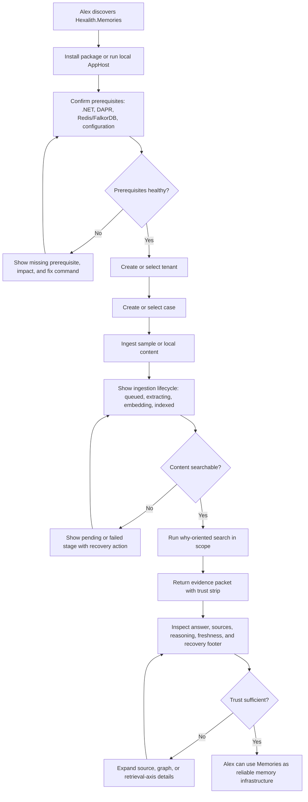
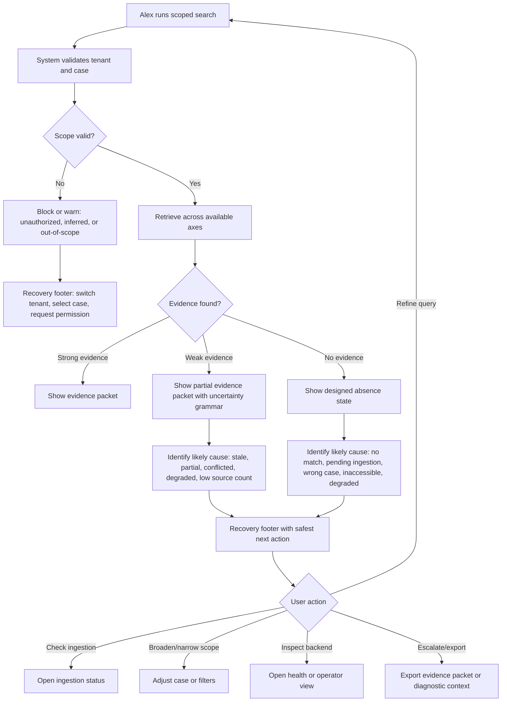
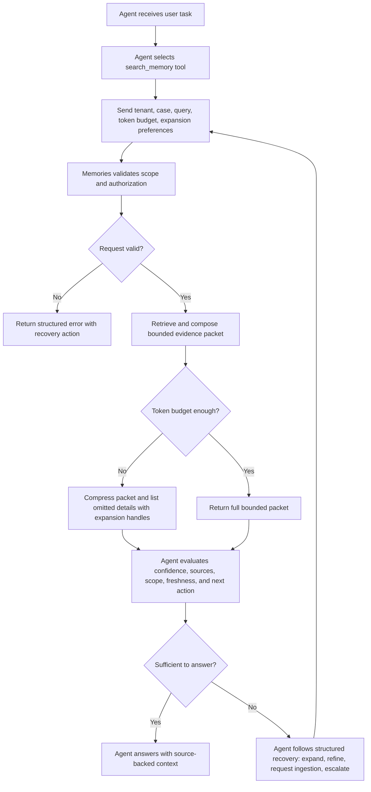
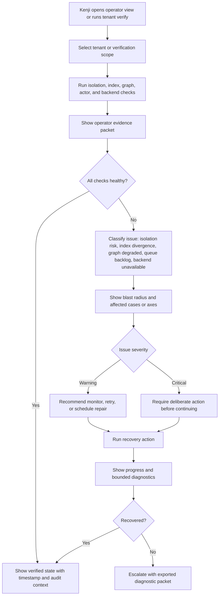
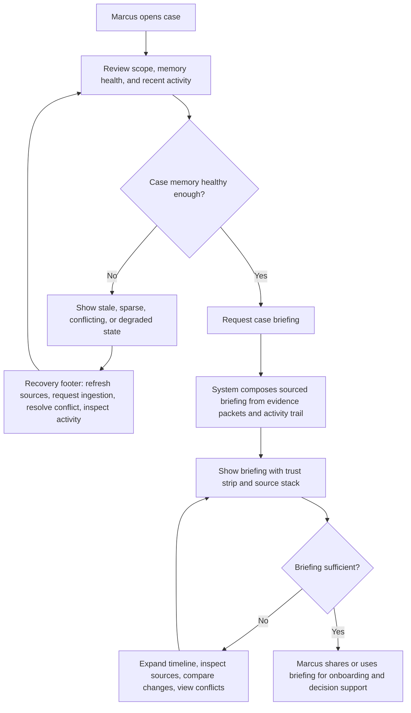

# UX Design Specification Hexalith.Memories

**Author:** JeromePiquot
**Date:** 2026-05-15

---

<!-- UX design content will be appended sequentially through collaborative workflow steps -->

## Executive Summary

### Project Vision

Hexalith.Memories is an open-source relational memory server for AI-enabled .NET/DAPR systems. Its UX promise is recoverable trust: users can discover what knowledge exists, understand how it is connected, see why a result appeared, verify the tenant and case boundary, and know what to do when something is missing, stale, or degraded.

The product should make organizational and event-sourced knowledge feel searchable, explainable, and causally connected. Its signature experience is answering questions like "why did this happen?" or "what led to this decision?" with sourced, tenant-scoped, token-aware narratives that expose the evidence path behind the answer.

The first memorable journey should be simple: ingest a small case, ask a why-oriented question, receive a sourced answer with visible retrieval evidence, and understand the next step if the answer is incomplete.

This is not simply a search UX. It is a state-and-trust UX for memory infrastructure: the user must always be able to tell which tenant and case they are operating in, whether isolation is physically enforced, what has been ingested or is still pending, which retrieval axes contributed, what sources support the answer, and which next action will recover from an empty result, stale memory, degraded backend, permission boundary, or evidence gap.

Trustworthy means the user can verify scope, source, freshness, retrieval path, confidence, and recovery action without leaving the current workflow.

### Target Users

The primary user is Alex, a senior .NET/DAPR developer who wants reliable memory infrastructure without weeks of custom RAG plumbing. Alex's first trust moment is not installation alone; it is ingesting real or sample case data, seeing a first sourced result, understanding why it ranked, and feeling confident enough to remove fragile custom infrastructure. His adoption decision depends on whether Memories can replace custom RAG plumbing without becoming another opaque dependency.

The non-human user is the LLM agent, which needs predictable MCP tools, typed schemas, bounded responses, source attribution, confidence signals, token-budget discipline, and structured errors it can act on. For the agent, UX is response shape: stable contracts, bounded payloads, source-backed answers, and failures that explain whether to retry, narrow scope, request ingestion, or escalate. MCP responses should behave like decision-ready packets: typed, bounded, attributed, confidence-aware, and useful even when token budget forces compression.

Marcus, the team lead, needs case-level continuity: briefings, activity, memory health, and eventually change-over-time views that help new team members become productive faster. Marcus should not need retrieval theory to understand whether a case has useful memory.

Kenji, the operator, needs tenant provisioning, isolation verification, health, rate limits, failure visibility, and backend degradation surfaced as clear operational states. Kenji's trust comes from knowing the system can prove isolation and expose risk before it becomes an incident.

Priya, the end beneficiary, experiences the value indirectly through applications built on top of Memories. For her, the winning UX is not technical explain output; it is being able to find, understand, and trust case context without knowing the infrastructure exists.

### Key Design Challenges

The central UX challenge is making a technically dense system feel trustworthy quickly. Three-axis retrieval, causal graph traversal, tenant isolation, asynchronous ingestion, MCP/CLI surfaces, and backend degradation must be visible enough to build confidence without overwhelming the user.

Trust also depends on failure design. Empty states, stale memory warnings, partial retrieval, degraded graph/vector backends, and tenant or permission boundaries must be expressed as understandable states with recovery paths, not as generic errors.

Onboarding has a hard success gate: under 30 minutes from package install to first trustworthy search result. The experience must therefore reduce setup ambiguity, surface prerequisites, show ingestion progress, provide strong empty states, and make the next action obvious when something fails.

Memory lifecycle visibility is another core challenge. Users need to distinguish absent knowledge from pending ingestion, stale memory from conflicting memory, and degraded retrieval from a true no-result state. These states must be surfaced consistently so users and agents can recover without guessing.

Another challenge is designing for multiple surfaces with different mental models and maturity horizons. CLI and MCP experiences must be reliable first-class surfaces from the start, while future application experiences should compose the same evidence model into case briefings, narratives, and activity views.

The product also needs consistent trust signals across surfaces. Tenant, case, isolation status, ingestion status, source attribution, confidence, retrieval axes, graph relationships, freshness, and token budget should feel like one coherent evidence model rather than unrelated implementation details.

### Design Opportunities

The strongest UX opportunity is explainability as a product feature. Every result can show syntactic, semantic, and graph-based reasons in a way that helps users trust, debug, and tune the system.

A second opportunity is debug-first developer and operator experience. Commands such as search, status, handlers, tenant verify, quickstart, and explain can form a developer/operator cockpit where every degraded state includes cause, impact, and next action.

A third opportunity is case-centered memory. Case briefings, memory diffing, causal chain narratives, and activity views can make Memories feel distinct from ordinary vector search by helping teams understand the story of a case, not just retrieve matching fragments.

A fourth opportunity is progressive disclosure across audiences. Alex and Kenji can inspect scores, tenant boundaries, pipeline stages, and structured errors, while Marcus and Priya can receive higher-level narratives with sources and confidence indicators. The UX should preserve one shared evidence model underneath while adapting the level of detail shown by surface and audience.

A fifth opportunity is trustworthy absence. Memories can distinguish between "nothing found," "not ingested yet," "not accessible in this tenant," "retrieval degraded," and "answerable only with low confidence," giving users and agents a safer way to proceed when memory is incomplete.

The executive design goal is therefore measurable: within 30 minutes, a new developer should be able to install Memories, ingest sample or local knowledge, run a first tenant-scoped search, inspect why the result appeared, and understand the next recovery action if the result is empty, stale, or degraded.

The design north star is simple: every answer should make the system more inspectable, not more mysterious.

## Core User Experience

### Defining Experience

The core experience is the trust loop: search, verify the result, and inspect where the result came from. Users should be able to ask once and receive an evidence packet: ranked results, synthesized answer, or both; source attribution; evidence strength scoring; explain breakdown; tenant and case context; freshness signals; and graph relationships.

At minimum, every evidence packet should identify the result or answer, tenant and case scope, top source references, evidence strength, freshness status, retrieval axes used, explain summary, graph relationship summary when relevant, and the next recovery action when evidence is weak, incomplete, absent, or out of scope. If details are omitted for compactness or token budget, the response must say what was omitted and how to expand it.

Confidence should represent evidence strength and retrieval quality, not an unsupported claim of factual certainty.

The primary user action is not merely submitting a query. Search is the input; verified understanding is the outcome. A successful search should answer three questions immediately: what did Memories find, why should I trust it, and where did it come from?

Verification means the user or agent can identify the selected tenant and case, inspect the cited source, see the reason the result ranked, understand confidence limits, and choose a next action without leaving the current surface.

The simplest product promise is: search returns evidence. Follow-up commands, tool calls, or UI exploration may deepen that evidence, but they should not be required for first trust.

The evidence packet must be compact by default and expandable by design. Users should see enough to proceed safely without being forced through every score, graph edge, or diagnostic detail.

### Platform Strategy

CLI, MCP, and web UI are all first-class surfaces. None should be treated as a secondary wrapper around another experience. Each surface must support the same core trust loop and expose the same evidence model, while adapting density, formatting, and interaction controls to its audience and context.

This is full-horizon UX guidance, not an MVP scope declaration. MVP implementation is CLI-first with the shared Evidence Packet/state grammar established early; MCP/EventStore follow in Phase 1.5, and FrontComposer/Fluent UI web composition remains future web-surface work unless a later sprint change explicitly pulls it into MVP.

The CLI should be optimized for keyboard-driven developer and operator workflows, including compact explain output, actionable diagnostics, tenant/case visibility, and scriptable formats.

The MCP surface should be optimized for LLM agents, with typed schemas, bounded payloads, deterministic expansion handles, source attribution, evidence strength signals, token-budget awareness, and structured failure semantics. MCP responses must treat evidence as structured data, not prose-only explanation, so agents can inspect confidence, source references, omitted fields, recovery actions, and structured errors without parsing natural language.

The web UI should support human verification and exploration, especially result inspection, source review, causal chain browsing, case context, and confidence cues.

All three surfaces should use the same underlying evidence model and error semantics. Differences should be presentational: terminal density, MCP schema shape, and browser exploration depth.

Verification must work in both terminal and browser contexts. There is no offline requirement.

### Effortless Interactions

After a search, Memories should automatically perform source lookup, evidence strength scoring, explain breakdown, and relevant graph traversal. The user should not need separate commands or manual correlation to understand why a result appeared.

The effortless promise is: ask once, receive the evidence needed to trust, challenge, or continue. Memories should eliminate the common RAG burden of manually stitching together vector matches, source documents, graph context, tenant scope, and confidence judgment.

Automatic explanation should be bounded and predictable. Memories should not hide retrieval work, but it also should not flood the user with every candidate, score, or graph edge unless the user expands the evidence.

The UX must answer recurring support questions directly: why did I get this result, why did I get nothing, can I use this answer safely, and is this from the right tenant and case?

Deeper inspection should remain available through commands, MCP fields, or UI panels, but the initial response should already contain enough evidence for a user or agent to decide whether to trust, refine, or recover.

The system should also make absence effortless to interpret. Empty or weak results should distinguish between no match, pending ingestion, stale memory, inaccessible tenant or case, degraded backend, and genuinely low evidence strength.

Every empty, weak, or degraded result should include the most likely cause, the diagnostic signal behind that cause, and the next safest action. Recovery actions should be specific, such as refine query, correct tenant or case selection, broaden case scope, inspect ingestion status, inspect degraded services, refresh stale memory, request more sources, or traverse related graph nodes.

When evidence conflicts, Memories should show the conflict instead of smoothing it away: competing sources, stale versus fresh memory, high lexical match with weak graph support, or strong graph context with weak source confidence.

Wrong-scope evidence is a critical failure state. If tenant or case scope is ambiguous, unavailable, or inconsistent with the result, Memories should degrade to a warning or refusal rather than present the answer as verified.

### Testable Experience Criteria

A core search experience is successful when a user or agent can determine, from the first response, the answer or result found, the tenant and case scope used, the primary sources, the evidence strength, the freshness of the evidence, why the result ranked or appeared, and the next action if trust is incomplete.

A no-result experience is successful when the response distinguishes between no match, low evidence strength, missing or delayed ingestion, stale memory, inaccessible tenant or case, and backend degradation.

A cross-surface experience is successful when the same query in CLI, MCP, and web UI exposes equivalent evidence fields, even when each surface presents them at different density.

### Critical Success Moments

The first major success moment is a developer running a search and seeing not just relevant output, but a traceable evidence path back to source material and graph relationships.

A second critical success moment is a weak or empty search that still feels useful because Memories explains what failed, what evidence was checked, and what recovery action is safest.

The make-or-break onboarding moment happens within 30 minutes: install or run Memories, ingest sample or local content, execute a tenant-scoped search, inspect why the result appeared, and understand the next action if the result is incomplete.

The strongest differentiation moment is when a why-oriented question returns a sourced, tenant-safe, token-aware narrative with visible retrieval evidence and causal context.

The fastest failure mode is opacity: a confident-looking answer with unclear source, hidden tenant/case scope, missing freshness signals, no explanation of confidence, or no recovery path.

### Experience Principles

1. Search Must Return Evidence
Every search should produce enough source, evidence strength, explain, freshness, and graph context for the user or agent to verify the result.

2. Evidence Should Be Progressive
The first response should be compact enough to scan, but expandable into scores, source details, graph paths, freshness, and diagnostics.

3. Trust State Must Be Visible
Tenant, case, source, freshness, evidence strength rationale, retrieval axes, and backend degradation should be visible as part of the experience, not hidden in logs.

4. Tenant Safety Is Non-Negotiable
Tenant and case scope must be enforced before retrieval and visible after retrieval. UX should expose scope clearly, but never rely on user inspection as the safety mechanism.

5. One Query Should Start the Full Trust Loop
Users should not have to manually run separate commands to discover why a result appeared or where it came from.

6. Deeper Inspection Should Be Optional, Not Required
Follow-up commands, MCP fields, and UI panels should enrich evidence, not compensate for an opaque first response.

7. Absence Must Be Actionable
No-result and low-confidence states should explain the likely cause and provide the next recovery action.

8. Conflicts Must Be Exposed
When sources, scores, freshness, or graph context disagree, the experience should reveal the disagreement clearly enough for the user or agent to make a safe judgment.

9. Scope Errors Are Safety Errors
Tenant and case ambiguity, mismatch, or inaccessible evidence should be treated as trust-blocking conditions, not minor diagnostics.

10. Same Evidence, Different Density
CLI, MCP, and web UI should share the same evidence model while presenting it at the right level of detail for developers, operators, agents, and application users.

## Desired Emotional Response

### Primary Emotional Goals

Hexalith.Memories should make users feel confident, oriented, and in control of organizational memory. The primary emotional response is recoverable trust: users should feel that every answer can be inspected, challenged, traced, and repaired when incomplete.

For Alex, the strongest emotional moment should be relief followed by confidence: the feeling that fragile custom RAG plumbing can be replaced by infrastructure that behaves predictably, exposes its reasoning, and respects tenant and case boundaries. The first successful search should feel like "this is finally understandable," not merely "this returned results."

For LLM agents, the emotional equivalent is operational certainty: responses are bounded, typed, attributed, and actionable even when evidence is weak or missing.

For Marcus and Kenji, the desired feeling is situational awareness. Marcus should feel that case knowledge is no longer scattered or fragile. Kenji should feel that tenant isolation, backend health, and degradation states are visible before they become incidents.

### Emotional Journey Mapping

When users first discover Hexalith.Memories, they should feel cautious curiosity: the promise is ambitious, but the product should quickly show concrete evidence through a short path to first search.

During onboarding, users should feel momentum and reduced anxiety. Each setup step should confirm progress, surface missing prerequisites clearly, and avoid making users wonder whether the system is working.

During the core search experience, users should feel grounded. Results should show tenant, case, sources, evidence strength, freshness, retrieval axes, and explain summaries in a way that makes the system inspectable without requiring a separate debugging session.

After completing a successful task, users should feel confident enough to act. The product should leave them with a clear answer, a visible evidence path, and an understanding of any limits.

When something goes wrong, users should feel guided rather than blocked. Empty results, stale memory, backend degradation, permission boundaries, and weak evidence should explain the likely cause and offer a safe next action.

When returning to the product, users should feel familiarity and continuity. Repeated use should reinforce that Memories is a dependable memory layer, not a one-off search box.

### Micro-Emotions

The most critical micro-emotion is confidence over confusion. Users should always know what scope they are operating in, what evidence was used, and what action to take next.

Trust should be earned over assumed. The interface should avoid unsupported certainty and instead expose source attribution, freshness, confidence rationale, and retrieval path.

Relief matters during onboarding and debugging. Developers should feel that the product removes tedious infrastructure work and turns opaque failures into understandable states.

Productive skepticism should be supported. Users should be able to challenge results, inspect evidence, spot conflicts, and expand details without feeling that the system is hiding complexity.

Accomplishment should appear in the first successful journey: ingest a case, ask a why-oriented question, inspect sources, and understand the result. That moment should feel like crossing from scattered knowledge into usable memory.

### Design Implications

Confidence requires persistent scope visibility. Tenant, case, isolation status, and freshness should be visible wherever retrieval or ingestion results are shown.

Trust requires evidence-first presentation. Answers and results should include source references, evidence strength, retrieval axes, confidence limits, and expansion paths by default.

Relief requires strong recovery states. Empty, weak, stale, degraded, and wrong-scope results should be treated as designed states with cause, impact, and next action.

Control requires progressive disclosure. The first response should be compact and scannable, while deeper scores, graph paths, diagnostics, and source details should be easy to expand.

Continuity requires consistent evidence semantics across CLI, MCP, and web UI. The same underlying trust model should appear at different densities across surfaces.

Safety requires restrained certainty. The product should prefer honest partial answers, warnings, or refusals over confident output when tenant scope, evidence, or backend health is uncertain.

### Emotional Design Principles

1. Make trust inspectable.
2. Treat absence as a meaningful state.
3. Show scope before users have to ask.
4. Replace opaque failure with guided recovery.
5. Let users challenge the answer without leaving the workflow.
6. Keep first responses compact, but never context-free.
7. Use confidence to describe evidence strength, not unsupported truth.
8. Preserve calm under degraded conditions.
9. Make every successful answer increase understanding of the system.
10. Design for relief: less glue code, less guessing, fewer hidden traps.

## UX Pattern Analysis & Inspiration

### Inspiring Products Analysis

GitHub is the strongest inspiration for developer trust workflows. It makes complex technical state navigable through clear object models, persistent context, activity history, status checks, diffs, comments, references, and audit-friendly trails. Its best UX lesson for Hexalith.Memories is that technical users trust systems when they can inspect the path from summary to source. A GitHub issue, pull request, or commit is never only a final state; it exposes history, authorship, related work, checks, discussion, and change over time.

For Hexalith.Memories, this translates into evidence packets that behave like inspectable technical objects. A search result or answer should not be a dead-end response. It should expose source references, retrieval reasons, freshness, tenant and case scope, confidence, related memory units, and expandable diagnostics. GitHub also shows the value of status language: checks pass, fail, are pending, or require attention. Memories should apply similar clarity to ingestion, backend health, tenant verification, and evidence quality.

Fluent UI is the primary inspiration for predictable enterprise interaction patterns. It offers a restrained, accessible, and composable visual language that supports productivity without demanding attention for its own sake. Its strongest UX lesson is consistency under density: users can work through forms, command bars, tables, dialogs, navigation, and status indicators without relearning interaction patterns at each step.

For Hexalith.Memories, Fluent UI suggests a calm, utilitarian interface with clear hierarchy, accessible controls, familiar command surfaces, and measured visual emphasis. Trust states should be expressed through well-known patterns such as badges, banners, inline validation, progress indicators, tables, tabs, trees, drawers, and command bars. The interface should feel like reliable infrastructure, not an experimental AI demo.

Hexalith.FrontComposer is the most important local inspiration because it represents the desired ecosystem-native application model. It emphasizes tenant-aware, schema-driven, command-oriented, and evidence-conscious UI composition. Its strongest UX lesson is that product surfaces should be generated or composed from typed contracts while preserving accessibility, tenant context, command lifecycle visibility, and bounded diagnostics.

For Hexalith.Memories, FrontComposer suggests that future web UI experiences should be contract-first and composable. Search, ingestion, tenant verification, case activity, and memory inspection should expose typed descriptors that can become UI surfaces, MCP responses, CLI output, or diagnostics without inventing separate mental models for each channel. The result should be a consistent Hexalith experience across developer tooling, generated UI, and agent-facing surfaces.

### Transferable UX Patterns

GitHub contributes the pattern of inspectable artifacts. Each answer, search result, memory unit, ingestion job, tenant verification, and case briefing should behave like an object with identity, state, history, source, related objects, and next actions.

GitHub also contributes activity-centered navigation. Case memory should be browsable through recent activity, source changes, ingestion events, searches, annotations, and causal links. This supports Marcus's need for continuity and Alex's need to debug what happened.

Fluent UI contributes command bars and contextual actions. Users should be able to act from the current state: retry ingestion, inspect source, expand evidence, verify tenant isolation, open graph context, export JSON, or refine the query without leaving the workflow.

Fluent UI contributes accessible enterprise status patterns. Badges, banners, inline messages, progress indicators, and tables should communicate trusted, weak, stale, degraded, pending, failed, or out-of-scope states consistently.

Hexalith.FrontComposer contributes contract-driven composition. The same evidence model should produce CLI output, MCP payloads, and future web UI panels from typed contracts rather than disconnected presentation logic.

Hexalith.FrontComposer also contributes command lifecycle transparency. Long-running operations such as ingestion, reindexing, tenant provisioning, consistency repair, and backend verification should show clear lifecycle states, bounded diagnostics, and safe recovery actions.

### Anti-Patterns to Avoid

Avoid chat-only answer presentation. A natural language answer without visible source, scope, freshness, retrieval path, or confidence rationale conflicts with the product's trust promise.

Avoid decorative AI mystique. Hexalith.Memories should not use vague magic-language, ornamental visuals, or overconfident generated summaries to hide retrieval complexity. The product should make complexity inspectable.

Avoid dashboard sprawl. Operational surfaces should not become walls of unrelated metrics. Health, ingestion, tenant isolation, search quality, and backend degradation should be organized around user decisions and recovery actions.

Avoid generic enterprise heaviness. Fluent UI patterns should provide consistency and accessibility, but the product should not bury developer workflows under excessive forms, dialogs, or navigation depth.

Avoid separate mental models per surface. CLI, MCP, and web UI should not present different definitions of confidence, source, scope, or degraded state. Differences should be density and interaction style, not semantics.

Avoid silent partial failure. If graph, vector, syntactic, ingestion, tenant verification, or source lookup behavior is degraded, the result should say what is missing and what the user or agent can safely do next.

### Design Inspiration Strategy

Adopt GitHub's inspectable-object model for memory units, evidence packets, case activity, ingestion jobs, tenant checks, and causal relationships. Every important product object should have a visible state, source, history, related context, and action path.

Adopt Fluent UI's restrained enterprise interaction language for future web surfaces: command bars, tables, tabs, trees, badges, inline validation, banners, dialogs, and progress states. Use these patterns to make dense technical information calm and navigable.

Adopt Hexalith.FrontComposer's contract-first composition strategy. Design the evidence model so it can drive CLI, MCP, and web UI consistently, with tenant and case context carried through every interaction.

Adapt GitHub-style activity and history to the case-memory domain. Instead of commits and pull requests, the primary history objects are ingestions, searches, source updates, annotations, graph links, tenant checks, and memory health changes.

Adapt Fluent UI density to developer and operator workflows. The product should feel efficient and professional, with compact layouts and progressive disclosure rather than large marketing-style panels.

Adapt FrontComposer command lifecycle patterns to Memories operations. Ingestion, provisioning, verification, repair, and search expansion should expose state, diagnostics, and next actions in a consistent way.

Avoid treating inspiration as visual mimicry. The goal is not for Hexalith.Memories to look like GitHub, Fluent UI, or FrontComposer; the goal is to inherit their strongest interaction principles: inspectability, consistency, accessibility, composability, and trust through visible state.

## Design System Foundation

### 1.1 Design System Choice

Hexalith.Memories should use Fluent UI as the primary design system foundation for future web surfaces, combined with Hexalith.FrontComposer composition patterns for tenant-aware, command-driven, contract-first application experiences.

This is a themeable established-system approach rather than a custom design system. The goal is not visual novelty; the goal is a dependable, accessible, professional interface for technical users who need to inspect evidence, operate infrastructure, and move quickly through dense information.

Fluent UI should provide the component vocabulary: command bars, buttons, menus, tabs, tables, trees, dialogs, drawers, badges, banners, progress indicators, forms, tooltips, and accessible layout primitives.

Hexalith.FrontComposer should provide the application composition model: typed descriptors, command lifecycle visibility, tenant-aware context propagation, schema-driven views, bounded diagnostics, accessibility contracts, and consistency across generated or composed surfaces.

### Rationale for Selection

Fluent UI aligns with the emotional goals of calm confidence, operational clarity, and enterprise-grade reliability. It supports dense workflows without forcing the product into a custom visual language that would increase maintenance cost.

The target users are developers, operators, agents, and technical team leads. They benefit more from recognizable controls, clear hierarchy, keyboard-friendly commands, accessible status indicators, and predictable navigation than from a highly branded or experimental interface.

Hexalith.Memories also needs cross-surface consistency between CLI, MCP, and future web UI. Hexalith.FrontComposer patterns help preserve a shared evidence model and command lifecycle across surfaces instead of creating separate UI-specific semantics.

The project is part of a .NET/DAPR/Hexalith ecosystem where Fluent UI and FrontComposer are already technically and culturally aligned. Reusing these foundations reduces implementation risk and strengthens ecosystem coherence.

A custom design system would not currently justify its cost. The product's differentiation comes from inspectable evidence, tenant-safe memory, causal search, recovery states, and agent-ready contracts, not from bespoke component styling.

### Implementation Approach

All Hexalith.Memories web UX implementation must be composed from Hexalith.FrontComposer and Microsoft Fluent UI Blazor V5 components. FrontComposer is the application composition boundary; Fluent UI Blazor V5 is the component primitive boundary.

Raw HTML controls, custom component primitives, JavaScript UI behavior, and third-party UI components are not allowed when a FrontComposer or Fluent UI Blazor V5 component exists. Hand-authored HTML or CSS is allowed only for unavoidable semantic/container structure or layout gaps that neither FrontComposer nor Fluent UI V5 owns, and each exception must be justified and covered by conformance tests.

Use Fluent UI V5 component parameters and Fluent 2 tokens for color, typography, spacing, status, and focus treatment. Do not use legacy Fluent v4/FAST tokens or recreate theme primitives in scoped CSS.

Represent core Memories objects as inspectable application entities: memory units, evidence packets, cases, ingestion jobs, tenant checks, backend health states, graph paths, annotations, and search sessions. Each entity should expose state, context, source, history, related objects, and next actions.

Use Hexalith.FrontComposer-style typed descriptors to drive UI composition. Search results, ingestion status, tenant verification, case activity, and diagnostics should be describable as contracts that can also inform CLI and MCP output.

Design command lifecycle states consistently across long-running and recoverable operations. Ingestion, reindexing, tenant provisioning, verification, consistency repair, and search expansion should show pending, running, succeeded, failed, degraded, and recoverable states with bounded diagnostics.

Preserve accessibility as a foundation rather than a later pass. Keyboard access, visible focus, labels, live-region behavior, reduced-motion support, forced-colors behavior, and readable status semantics should be treated as part of the product contract.

### Customization Strategy

Customize Fluent UI through restrained theming, tokens, density choices, and domain-specific composition rather than heavily restyling base components.

The visual tone should be calm, technical, and work-focused. Use measured color, compact spacing, clear typographic hierarchy, and status-driven emphasis. Avoid decorative AI styling, oversized marketing layouts, or visual treatments that make the product feel less inspectable.

Create domain-specific components only where the evidence model requires them. Likely custom components include evidence packets, retrieval-axis score breakdowns, source citation lists, tenant and case scope headers, graph path summaries, freshness indicators, backend degradation banners, and recovery-action panels.

Keep custom components contract-aware. A visual evidence packet should map cleanly to MCP payloads and CLI JSON output so that confidence, sources, scope, freshness, omitted details, and recovery actions remain semantically consistent.

Use Fluent UI status and feedback patterns consistently. Weak evidence, stale memory, degraded backend, pending ingestion, wrong scope, and tenant verification failure should each have recognizable visual treatment and clear next actions.

Design for compact professional density. Hexalith.Memories should feel like a cockpit for memory infrastructure: efficient, scannable, and calm under pressure.

## 2. Core User Experience

### 2.1 Defining Experience

The defining experience of Hexalith.Memories is asking a why-oriented question and receiving an inspectable evidence packet.

A user should be able to ask, "What led to this decision?", "Why was this claim denied?", "What changed before this incident?", or "How are these pieces connected?" and receive a response that combines answer, source, scope, retrieval explanation, confidence, freshness, graph context, and next action.

The product-defining interaction is not simply search. Search is the entry point; verified understanding is the outcome. A successful response should tell the user what was found, why it appeared, where it came from, whether it belongs to the selected tenant and case, how strong the evidence is, and what to do if the evidence is incomplete.

This evidence packet should become the shared object model across CLI, MCP, and future web UI. In CLI it may appear as compact structured output. In MCP it should appear as typed, bounded schema fields. In web UI it should appear as an inspectable object with expandable evidence, related memory, source details, graph context, and recovery actions.

If Hexalith.Memories gets this one interaction right, the rest of the experience follows: onboarding proves value quickly, debugging becomes clearer, LLM agents receive safer context, operators understand degraded states, and case owners can trust memory as a living system rather than a black-box answer generator.

### 2.2 User Mental Model

Users currently solve this problem through fragmented and fragile workflows. Developers wire together vector databases, search indexes, event stores, documents, logs, and prompt templates. Operators inspect dashboards and logs separately from search behavior. Team leads rely on people, chat history, and documents to reconstruct what happened.

The mental model users bring is a mixture of search, debugging, source control, incident review, and knowledge-base navigation. They expect to enter a question or command, but they also expect technical evidence behind the answer. They do not want a confident prose answer that cannot be inspected.

Alex expects something closer to GitHub plus diagnostics than consumer chat. He wants to see which sources matched, which retrieval axes contributed, how graph relationships affected the result, and whether tenant and case scope are safe. His confusion point is opacity: if a result appears without explanation or fails without recovery guidance, the product feels like another fragile RAG layer.

The LLM agent's mental model is schema-first. It needs bounded fields, source identifiers, confidence, omitted-detail indicators, and structured errors. It cannot safely rely on prose alone.

Marcus thinks in cases and continuity. He wants memory to behave like case context: what happened, what changed, what evidence supports the story, and what is missing.

Kenji thinks in operational state. He wants tenant isolation, health, rate limits, indexing, and backend degradation to be explicit and verifiable.

The shared mental model should therefore be: every answer is an evidence object, not a message.

### 2.3 Success Criteria

The defining experience succeeds when a user can determine from the first response what was found, why it appeared, where it came from, which tenant and case scope was used, how strong and fresh the evidence is, what graph relationships matter, and what action to take next.

The response should feel fast enough for interactive use: compact evidence should return quickly, while deeper graph paths, source previews, or diagnostics can be expanded progressively.

Users should feel smart and in control when they can challenge the answer, inspect the evidence, refine the query, expand details, or recover from weak results without switching tools.

The system should automatically perform source lookup, retrieval-axis explanation, confidence scoring, freshness assessment, and relevant graph context generation when the user asks a core question. These should not require separate manual steps for the first trust moment.

A weak or empty result should still be successful if it explains the likely cause and next safe action. "No result" is only a failure when the user cannot tell whether knowledge is absent, pending, stale, inaccessible, degraded, or out of scope.

The strongest success indicator is that a developer or LLM agent can safely use the result without guessing about source, scope, confidence, or recovery path.

### 2.4 Novel UX Patterns

The defining experience combines established patterns in a novel way rather than requiring a wholly unfamiliar interaction.

The established patterns are search results, command output, source citations, status checks, diagnostic explanations, activity history, and expandable detail panels. Users already understand these from GitHub, CLI tools, observability systems, and enterprise applications.

The novel pattern is the evidence packet as the primary response object. It is part answer, part search result, part diagnostic trace, part graph summary, and part recovery guide. This differs from generic RAG interfaces that present an answer with citations, because Hexalith.Memories also exposes tenant scope, case scope, retrieval axes, graph context, freshness, degraded backends, token budget effects, and actionable absence states.

The product should teach this pattern through repetition and consistent structure. Every core response should have recognizable fields: scope, result or answer, sources, evidence strength, explain summary, freshness, related memory, omitted details, and next action. Users should learn that if something matters for trust, it has a place in the packet.

The unique twist is that inspectability is not a debug mode. It is the default product experience, compact first and expandable when needed.

### 2.5 Experience Mechanics

The user initiates the defining experience by asking a question or running a search against a visible tenant and case scope. In CLI this may be a command such as `memories search "why was claim 4821 denied?" --case claims-q1 --explain`. In MCP it is a `search_memory` call with tenant, case, query, budget, and expansion preferences. In future web UI it is a case-scoped search or question input with visible scope controls.

The system responds by validating tenant and case context before retrieval. If scope is missing, ambiguous, or unauthorized, the system should block or warn before presenting results as trustworthy.

The system then retrieves across available axes: syntactic, semantic, and graph. It normalizes and fuses results, performs source lookup, computes evidence strength, identifies freshness and confidence limits, and records which axes or details were omitted because of degradation or token budget.

The first response should be compact but complete enough to trust. It should include the answer or top result, tenant and case scope, primary sources, evidence strength, retrieval-axis explanation, graph summary when relevant, freshness status, and next action.

The user can then expand or continue. Available actions include inspect source, expand scores, traverse graph, show related memory, refine query, broaden or narrow case scope, check ingestion status, retry failed ingestion, verify tenant isolation, export JSON, or request a more detailed narrative.

Feedback should make state visible throughout the flow. Pending ingestion, stale source, degraded graph backend, weak semantic evidence, high lexical match with low graph support, or token-budget truncation should each appear as understandable states.

Completion happens when the user or agent can act safely: cite the source, make a decision, refine the query, trigger recovery, or escalate with clear evidence of what is missing.

## Visual Design Foundation

### Color System

Hexalith.Memories should use Microsoft Fluent UI Blazor as the base visual system, with color expressed through Fluent design tokens and semantic state mapping rather than a separate custom palette.

The color strategy should be restrained, technical, and status-driven. Neutral surfaces should carry most of the interface, while accent and semantic colors should draw attention to scope, evidence quality, ingestion state, tenant safety, and recovery actions.

Primary color should be used sparingly for core actions such as search, inspect, continue, retry, verify, and expand. Secondary and neutral treatments should support dense workflows such as result lists, source panels, case activity, and diagnostics.

Semantic color mapping should be explicit:

- Success: verified tenant scope, completed ingestion, healthy backend, strong evidence.
- Warning: stale memory, weak evidence, partial retrieval, pending ingestion, token-budget truncation.
- Error: unauthorized scope, failed ingestion, tenant verification failure, unavailable required backend.
- Info: explain summaries, source metadata, graph context, suggested next action.
- Neutral: normal evidence, inactive axes, secondary metadata, historical activity.

The product should avoid decorative AI gradients, saturated novelty palettes, and visual treatments that imply certainty without evidence. Color should clarify state, not create mood for its own sake.

### Typography System

Typography should follow Microsoft Fluent UI Blazor defaults and design-token-driven scale wherever possible. The interface should feel professional, compact, and readable across developer, operator, and team-lead workflows.

The typography strategy should prioritize scanning over drama. Headings should identify context and hierarchy, not behave like marketing display text. Dense technical panels should use modest heading sizes, clear section labels, and readable body text.

Monospace typography should be reserved for commands, identifiers, tenant IDs, case IDs, source paths, event IDs, graph node IDs, JSON fields, and CLI/MCP examples. This helps users distinguish operational evidence from explanatory prose.

Long-form answer narratives should remain readable, but the primary experience should not become prose-heavy. Evidence packets should use structured typography: concise answer summary, source list, score labels, freshness/status indicators, and expandable details.

### Spacing & Layout Foundation

Layout should use Fluent UI Blazor layout primitives such as layout containers, stack patterns, grids, navigation components, data grids, dialogs, menus, and input components. The default layout feel should be compact, efficient, and work-focused.

Use an 8px spacing rhythm as the default mental model, with tighter spacing inside dense evidence components and more breathing room between major workflow regions. The goal is professional density: enough information to compare and act, without dashboard clutter.

Core layouts should support three recurring structures:

1. Scope-first workflow layout: tenant, case, and health context remain visible before query or action.
2. Evidence packet layout: answer/result summary, sources, confidence, freshness, explain, graph context, and next action are grouped predictably.
3. Inspection layout: list or grid on one side, expandable source/evidence/details on the other where screen size allows.

Data-heavy areas should favor FluentDataGrid-style presentation for memory units, ingestion jobs, case activity, tenant checks, and backend health. Command surfaces should favor Fluent UI command/menu patterns rather than custom button clusters.

### Accessibility Considerations

Accessibility should inherit from Microsoft Fluent UI Blazor patterns and be treated as part of the product contract. Keyboard access, visible focus, labels, contrast, screen-reader semantics, and predictable navigation are required for trust workflows.

Status must never rely on color alone. Evidence strength, backend degradation, tenant verification, stale memory, and ingestion failure should include text labels, icons or indicators, and actionable descriptions.

Dense evidence surfaces should remain navigable by keyboard. Users should be able to move from result summary to source list, explain breakdown, graph context, and recovery action without pointer-only interactions.

Dialogs and drawers should be used for focused inspection or confirmation, not as a substitute for navigable page structure. Destructive operations such as tenant deletion, case deletion, or memory removal require clear confirmation and scope visibility.

Reduced-motion and high-contrast compatibility should be preserved. Any loading, ingestion, traversal, or verification indicators should communicate progress without depending on animation alone.

The visual foundation should make Hexalith.Memories feel calm under pressure: structured, inspectable, accessible, and operationally honest.

## Design Direction Decision

### Design Directions Explored

Eight design directions were explored in the HTML showcase at `_bmad-output/planning-artifacts/ux-design-directions.html`:

1. Evidence Cockpit: a scope-first workspace centered on query, evidence packets, source inspection, retrieval axes, and recovery actions.
2. Case Activity Trail: a GitHub-inspired case history model for activity, memory changes, ingestion events, annotations, and continuity.
3. Case Briefing Workspace: a narrative-first briefing experience for onboarding and team leads, with evidence attached.
4. Operator Console: a tenant, health, isolation, backend, and ingestion status view for operators.
5. Command First: a keyboard-driven expert workflow inspired by command palettes and CLI-style interaction.
6. Graph Evidence Studio: a relationship-first workspace for causal path exploration and graph confidence.
7. Agent Packet Inspector: a schema-first MCP validation experience showing exactly what agents receive.
8. Onboarding Proof Path: a guided first-30-minutes path from setup to first evidence packet.

The directions used Microsoft Fluent UI Blazor-aligned visual patterns: neutral surfaces, compact density, semantic status indicators, command-driven actions, data grids, panels, dialogs, menus, and accessible layout behavior.

### Chosen Direction

The chosen direction is a single evidence model with task-specific Fluent UI Blazor views. Evidence Cockpit is the primary default view, enriched by Case Activity Trail and Agent Packet Inspector patterns where the task requires them.

Evidence Cockpit becomes the default interaction model for search and verification. It keeps tenant and case scope visible, places the query or command near the top of the workflow, presents evidence packets as the primary response objects, and provides immediate inspection of sources, retrieval axes, confidence, freshness, graph context, and recovery actions.

Case Activity Trail is adopted as the continuity view for understanding how case memory changes over time. It should inform case pages, activity views, memory history, ingestion timelines, annotations, and "what changed?" workflows.

Agent Packet Inspector is adopted as the schema and diagnostic view for MCP and agent-facing trust. It should inform tool response previews, token-budget visibility, omitted-field indicators, structured errors, and agent-safe expansion handles.

Operator Console remains a specialized operational view for tenant, health, isolation, ingestion, backend degradation, and repair workflows.

The design direction is therefore not a set of separate products. It is one evidence, scope, state, and recovery model expressed through task-specific views with different densities and arrangements.

### Design Rationale

Evidence Cockpit best supports the defining experience: asking a why-oriented question and receiving an inspectable evidence packet. It keeps the trust model visible without forcing the user into separate debugging tools.

The selected blend aligns with the desired emotional response. It creates calm confidence by showing scope, source, evidence strength, freshness, and next action in one workspace. It turns uncertainty into visible state rather than hidden system behavior.

The activity trail pattern is necessary because Hexalith.Memories is not only a search tool. It is a memory system. Users need to understand how cases evolve over time, what was ingested, what changed, which sources became stale, and how annotations or graph relationships emerged.

The agent packet inspector pattern is necessary because MCP is a first-class surface. LLM agents need typed, bounded, attributed, token-aware responses. Human developers need to inspect those payloads without reverse-engineering JSON or logs.

The design direction intentionally rejects chat-only UX, dashboard sprawl, and disconnected surface-specific semantics. A CLI table, MCP response, and Fluent UI Blazor panel may look different, but they should expose the same trust concepts.

### Evidence Packet Invariants

The evidence packet is the product unit. Task-specific views are camera angles over that object, not separate trust models. Every view must preserve the five trust fundamentals: scope, source, reasoning, state, and recovery.

Each evidence packet should include a mandatory trust strip in a consistent position. The trust strip should show tenant and case scope, confidence state, freshness state, source count, and evidence state before the user reads the answer.

Evidence packet anatomy should be stable across views:

1. Scope strip.
2. Claim, answer, or result summary.
3. Evidence summary.
4. Source list.
5. Reasoning trace.
6. Confidence, freshness, and health state.
7. Graph context when relevant.
8. Recovery footer.

Views may collapse, expand, or emphasize different parts of the packet, but they should not rename or omit trust-critical concepts. If a view hides a trust fundamental for density, it must show where to expand it.

Uncertainty should use explicit state grammar rather than percentages alone:

- Confidence: supported, partial, disputed, insufficient.
- Freshness: current, aging, stale, unknown.
- Evidence health: complete, degraded, missing source, schema mismatch.
- Scope: verified, inferred, cross-case, unauthorized, out-of-scope.

Scope boundaries should be visually hard to miss. Tenant, case, agent, and time boundaries should behave like a containment frame through persistent headers, boundary badges, locked context rails, or equivalent Fluent UI Blazor patterns. Cross-tenant, cross-case, inferred-scope, or unauthorized evidence should receive stronger visual treatment and require deliberate confirmation before expanding scope or acting on the result.

Recovery should be a first-class footer in every packet, especially degraded packets. The footer should answer, "What can I do now?" with contract-backed actions such as refine query, inspect source, compare versions, open graph neighborhood, refresh ingestion, verify tenant, request permission, retry agent/tool call, repair consistency, export packet, or escalate.

Each task-specific view has a primary job:

- Evidence Cockpit: Can I trust this answer and act?
- Case Activity Trail: How did this memory evolve over time?
- Agent Packet Inspector: Did the agent, schema, or tool contract behave correctly?
- Operator Console: What is unhealthy, risky, and recoverable?

Trust UX must be proven in bad paths. Missing sources, stale memories, conflicting evidence, partial graph loading, unavailable MCP schema, failed recovery action, unauthorized scope, and backend degradation should all be explicitly represented as designed states.

### Implementation Approach

Implementation should begin with the evidence packet contract before web UI composition. The same fields that power CLI and MCP should later drive the Fluent UI Blazor cockpit: scope, answer or result, sources, confidence, freshness, retrieval axes, graph summary, omitted details, degraded state, and recovery action.

MVP acceptance for this UX section is limited to CLI-visible and contract-visible evidence semantics: scope, source, confidence, axis breakdown, omitted details, degraded state, and recovery actions. Fluent UI Blazor, FrontComposer compositions, browser layouts, and visual accessibility checks become binding when web UI work enters an approved implementation phase.

The simplest interaction model is:

1. Ask in scope.
2. Receive an evidence packet.
3. Inspect trust essentials.
4. Expand details only when needed.
5. Take the next safe action.

The default view should preserve five trust fundamentals:

- Scope: tenant, case, permissions, and isolation state.
- Source: documents, events, memory units, annotations, and origin identifiers.
- Reasoning: retrieval axes, graph relationships, ranking explanation, and confidence rationale.
- State: freshness, ingestion status, backend health, token budget, and degraded behavior.
- Recovery: refine query, inspect source, broaden or narrow scope, refresh ingestion, verify tenant, repair consistency, or escalate.

The Evidence Cockpit should avoid dashboard sprawl. It should not show every metric, source, graph edge, activity item, health check, and schema field at once. The first view should answer only the trust-critical questions: what was found, why it appeared, where it came from, what scope was used, how strong and fresh the evidence is, and what action is safest next.

Use progressive disclosure throughout. Source inspection, retrieval-axis scores, graph paths, case activity, token-budget details, and backend diagnostics should be available, but secondary to the evidence packet summary.

Preserve persona-specific task views:

- Alex: Evidence Cockpit and Command First patterns for search, explain, and debugging.
- LLM Agent: Agent Packet Inspector patterns for typed response validation and omitted-detail handling.
- Marcus: Case Activity Trail and Case Briefing patterns for continuity and onboarding.
- Kenji: Operator Console patterns for tenant verification, isolation, ingestion health, and repair.
- Priya: downstream Case Briefing patterns surfaced through applications built on top of Memories.

Keep the visual system aligned with Microsoft Fluent UI Blazor and Hexalith.FrontComposer principles. The result should be contract-first, accessible, tenant-aware, command-driven, and semantically consistent across CLI, MCP, and web UI.

## User Journey Flows

### Alex: Zero to First Evidence Packet

This journey validates the adoption promise: a developer can move from setup to a trustworthy, tenant-scoped evidence packet quickly enough to believe the product can replace fragile custom memory plumbing.

Flow notes:

- The journey must keep tenant and case scope visible from the first meaningful action.
- Onboarding should prove trust, not merely return a search result.
- Failed setup or ingestion must be treated as designed recovery states.
- The first success moment is an evidence packet with source, scope, reasoning, freshness, and next action.

### Alex: Weak or Empty Result Recovery

This journey proves that absence is useful. A no-result or weak-result state should help Alex distinguish between no match, missing ingestion, stale memory, wrong scope, degraded backend, or insufficient evidence.

Flow notes:

- Empty results should never be a blank wall.
- The system should explain what was checked and what was unavailable.
- Recovery actions should be contract-backed and consistent across CLI, MCP, and web UI.
- Trust is preserved by honest partiality, not by overconfident fallback answers.

### LLM Agent: MCP Evidence Packet Consumption

This journey treats the LLM agent as a first-class user. The agent needs typed, bounded, source-backed responses with explicit omitted details and structured recovery actions.

Flow notes:

- MCP responses must be schema-first, not prose-only.
- Token-budget behavior must be visible and deterministic.
- Omitted details should not silently disappear; they should have expansion handles.
- Structured errors should tell the agent whether to retry, narrow scope, request ingestion, or escalate.

### Kenji: Tenant Verification and Degraded Backend Recovery

This journey proves operational trust. Kenji needs to know whether tenant isolation holds, whether backends are degraded, what blast radius exists, and what repair action is safest.

Flow notes:

- Operator views should preserve the evidence packet model but optimize for blast radius and recovery.
- Tenant isolation failures must be treated as safety errors, not warnings.
- Backend degradation should show which retrieval axes or operations are affected.
- Repair workflows need progress, outcome, and audit context.

### Marcus: Case Briefing and Activity Continuity

This journey shows how memory becomes useful for leadership and onboarding. Marcus needs case continuity, not retrieval internals, but the briefing must remain sourced and inspectable.

Flow notes:

- Marcus should not need retrieval theory to understand whether case memory is usable.
- The briefing should use the same trust strip and evidence packet semantics as developer workflows.
- Activity Trail should answer how memory evolved, not merely list events.
- Stale or conflicting memory should be surfaced before Marcus acts on a briefing.

### Journey Patterns

Across these journeys, Hexalith.Memories should standardize a small set of recurring interaction patterns.

Scope-first entry: tenant, case, and authorization context are established before search, ingestion, verification, or briefing.

Evidence packet response: every significant result returns an object with scope, source, reasoning, state, and recovery.

Trust strip: tenant/case, confidence, freshness, source count, and evidence state appear consistently before users interpret the answer.

Recovery footer: weak, empty, degraded, or unauthorized states end with clear next actions.

Progressive disclosure: default views show trust essentials; deeper views reveal source detail, retrieval-axis scoring, graph context, activity history, schema payloads, and diagnostics.

Designed bad paths: no result, stale memory, conflicting sources, missing ingestion, degraded backend, unauthorized scope, and token-budget truncation are first-class states.

Task-specific lenses: Evidence Cockpit, Case Activity Trail, Agent Packet Inspector, and Operator Console use the same evidence semantics with different density and emphasis.

### Flow Optimization Principles

Minimize time to first trustworthy evidence. The first successful journey should prove scope, source, reasoning, freshness, and recovery within the onboarding window.

Do not make users leave the workflow to understand trust. Inspection, recovery, and expansion should be available from the evidence packet.

Prefer honest partiality over false confidence. If evidence is weak, stale, degraded, or missing, say so clearly and provide the next safe action.

Keep recovery actions close to the moment of doubt. A user should not have to search documentation to recover from an empty or weak result.

Make state transitions visible. Ingestion, verification, repair, MCP expansion, and graph traversal should show progress, outcome, and failure reason.

Preserve semantic consistency across surfaces. CLI, MCP, and Fluent UI Blazor views may differ in layout and density, but the journey logic and trust concepts should remain the same.

## Component Strategy

### Design System Components

Hexalith.Memories should use Hexalith.FrontComposer as the UX foundation for future web surfaces. FrontComposer provides the contract-first, tenant-aware, command-driven composition model that fits the Hexalith ecosystem and keeps Memories aligned with the surrounding product architecture.

Microsoft Fluent UI Blazor remains the underlying visual and component system used through FrontComposer patterns. Fluent UI should provide the base component vocabulary: command bars, buttons, menus, tabs, navigation, data grids, trees, dialogs, drawers, badges, banners, progress indicators, forms, inputs, tooltips, layout primitives, and accessible focus behavior.

These components are sufficient for general application structure: query input, scoped navigation, tabbed detail panels, data-heavy lists, confirmation dialogs, operational forms, menu-driven actions, inline validation, and health/status feedback.

The main component gaps are not low-level UI controls. They are FrontComposer-native domain compositions around the Hexalith.Memories evidence model: scope, source, reasoning, state, and recovery.

### Custom Components

#### Evidence Packet

**Purpose:** Presents the primary result object for search, briefing, MCP inspection, and operator diagnostics.
**Usage:** Use whenever the system returns an answer, ranked result, diagnostic result, or partial/degraded evidence state.
**Anatomy:** Trust strip, answer or result summary, evidence summary, source list, reasoning trace, graph context, health and freshness state, recovery footer.
**States:** Supported, partial, disputed, insufficient, degraded, unauthorized, pending expansion.
**Variants:** Compact CLI-like summary, standard web composition, detailed inspection view, MCP schema preview.
**Accessibility:** Keyboard-expandable sections, labelled status regions, screen-reader text for confidence and freshness states, visible focus on actions.
**Content Guidelines:** Use evidence-strength language rather than unsupported certainty. Show omitted details when compressed.
**Interaction Behavior:** Expand sources, inspect reasoning, open graph context, export packet, or follow a recovery action.

#### Trust Strip

**Purpose:** Makes trust-critical context visible before the user reads the answer.
**Usage:** Required at the top of every Evidence Packet and case briefing.
**Anatomy:** Tenant, case, confidence state, freshness state, source count, evidence health, optional token-budget indicator.
**States:** Scope verified, inferred scope, cross-case, unauthorized, current, aging, stale, degraded.
**Variants:** Inline strip, compact badge row, high-risk warning strip.
**Accessibility:** Each state needs text labels, not color alone.
**Content Guidelines:** Keep labels short and concrete. Avoid percentages without state grammar.
**Interaction Behavior:** Tenant and case open scope details; warning states open explanation or recovery.

#### Scope Header

**Purpose:** Keeps tenant, case, permission, and isolation context visible across workflows.
**Usage:** Evidence Cockpit, Operator Console, Case Activity Trail, ingestion views.
**Anatomy:** Tenant selector, case selector, isolation badge, permission indicator, recent scope history.
**States:** Verified, missing case, unauthorized, cross-case requested, isolation check failed.
**Variants:** Persistent page header, locked context rail, compact mobile header.
**Accessibility:** Selector labels must announce current tenant and case.
**Content Guidelines:** Scope labels should be explicit enough to prevent mistaken tenant or case interpretation.
**Interaction Behavior:** Scope changes require deliberate confirmation when expanding beyond the current case.

#### Retrieval Axis Breakdown

**Purpose:** Explains why a result ranked by syntactic, semantic, and graph evidence.
**Usage:** Search explain mode, Evidence Packet detail, benchmark inspection.
**Anatomy:** Axis rows, normalized score, contribution, unavailable/degraded marker, explanation text.
**States:** Active, excluded, unavailable, degraded, low signal, conflicting signal.
**Variants:** Compact score stack, detailed table, benchmark comparison view.
**Accessibility:** Scores must have text equivalents and not rely on bars alone.
**Content Guidelines:** Explain axis contribution in operational language, not only scoring math.
**Interaction Behavior:** Expand an axis to inspect matched terms, embedding similarity, or graph path contribution.

#### Source Citation Stack

**Purpose:** Shows where evidence came from and lets users inspect source material.
**Usage:** Evidence packets, briefings, source review, case history.
**Anatomy:** Source title, origin type, snippet, timestamp, freshness, confidence, source action menu.
**States:** Available, missing source, stale, redacted, unauthorized, conflicting.
**Variants:** Compact citations, detailed source table, side-panel source viewer.
**Accessibility:** Source links need descriptive labels and keyboard-openable preview panels.
**Content Guidelines:** Source text should remain bounded and attributable.
**Interaction Behavior:** Open source, compare versions, copy citation, mark conflict, request permission.

#### Graph Path Summary

**Purpose:** Makes causal and relational context inspectable without overwhelming the first view.
**Usage:** Why-oriented search, EventStore causal chains, graph traversal, case briefing.
**Anatomy:** Start node, relationship chain, gap markers, confidence per edge, depth indicator.
**States:** Complete, partial, gap detected, degraded graph backend, unauthorized node.
**Variants:** Inline path summary, expandable graph detail, operator diagnostic path.
**Accessibility:** Provide linear text narration for graph paths.
**Content Guidelines:** Use relationship labels that match contract and graph semantics.
**Interaction Behavior:** Expand neighborhood, inspect node, follow edge, show missing-node recovery.

#### Recovery Action Panel

**Purpose:** Converts weak, empty, stale, degraded, or unauthorized states into next actions.
**Usage:** Every incomplete Evidence Packet, no-result state, operator warning, MCP structured error.
**Anatomy:** Cause summary, safest next action, secondary actions, diagnostic context.
**States:** Refine query, inspect ingestion, verify tenant, request permission, repair consistency, retry, export diagnostic packet.
**Variants:** Footer panel, inline empty-state panel, operator critical-action panel.
**Accessibility:** Actions must be keyboard reachable and announce risk level.
**Content Guidelines:** Recovery text should be specific and operational: say what to do next and why.
**Interaction Behavior:** Actions launch the relevant command, view, confirmation, or diagnostic export.

#### Agent Packet Inspector

**Purpose:** Lets developers inspect the MCP response shape an LLM agent receives.
**Usage:** MCP debugging, token-budget validation, omitted-detail review, schema conformance.
**Anatomy:** Request summary, response schema, token budget, omitted fields, expansion handles, structured errors.
**States:** Valid, compressed, schema mismatch, tool error, expansion available.
**Variants:** Developer inspector, compact agent preview, error-focused diagnostic view.
**Accessibility:** JSON and schema views need copy controls, keyboard navigation, and readable text alternatives.
**Content Guidelines:** Keep schema field names aligned with MCP contracts and CLI JSON concepts.
**Interaction Behavior:** Expand omitted fields, copy payload, retry with larger budget, inspect structured error.

#### Case Activity Trail

**Purpose:** Shows how memory changed over time and supports continuity workflows.
**Usage:** Case pages, onboarding briefings, memory diffing, ingestion history, annotations.
**Anatomy:** Timeline rows, event type, actor or system identity, affected memory unit, status, source link.
**States:** Ingested, annotated, failed, refreshed, stale, deleted, repaired, permission changed.
**Variants:** Timeline, grouped activity table, briefing-oriented history.
**Accessibility:** Timeline order must be understandable as a list or table.
**Content Guidelines:** Activity items should explain the change and its evidence impact.
**Interaction Behavior:** Filter, inspect item, compare changes, open related evidence packet.

### Component Implementation Strategy

Custom Memories components should be implemented as FrontComposer-aligned compositions using Microsoft Fluent UI Blazor V5 primitives, not as standalone design-system inventions. FrontComposer should provide the composition model, tenant and command patterns, contract awareness, and shell behavior. Fluent UI Blazor V5 should provide the accessible component mechanics and visual primitives.

Implementation should begin with the Evidence Packet contract and shared state grammar. CLI, MCP, and web UI should expose the same concepts even when density differs: scope, source, reasoning, state, recovery, freshness, confidence, omitted details, and degraded behavior.

Custom components should use FrontComposer and Fluent UI Blazor V5 components first. Any remaining custom CSS must be limited to layout gaps that the component systems do not own and must use Fluent 2 tokens where tokenized styling is required. Custom components must not recreate theme primitives, typography ramps, foreground roles, status color systems, controls, or focus treatment in scoped CSS. They should preserve FrontComposer expectations for tenant-aware command surfaces, typed descriptors, Fluxor-compatible state, accessible labels, keyboard reachability, and predictable lifecycle behavior across Blazor render modes.

Custom components should avoid dashboard sprawl. The default view should show trust essentials first, then allow progressive expansion into source detail, retrieval-axis scoring, graph paths, activity history, token-budget details, and backend diagnostics.

### Implementation Roadmap

**Phase 1 - Core Trust Components**

- Evidence Packet: required for the defining search and verification workflow.
- Trust Strip: required to make tenant, case, confidence, freshness, and evidence state visible.
- Scope Header: required before search, ingestion, briefing, tenant verification, and operator workflows.
- Recovery Action Panel: required for weak, empty, stale, degraded, and unauthorized states.

**Phase 2 - Inspection Components**

- Source Citation Stack: supports source review and grounded answers.
- Retrieval Axis Breakdown: supports explain mode and benchmark validation.
- Graph Path Summary: supports causal-chain and why-oriented workflows.
- Agent Packet Inspector: supports MCP debugging and token-budget trust.

**Phase 3 - Continuity and Operations Components**

- Case Activity Trail: supports Marcus-style continuity and onboarding workflows.
- Ingestion Lifecycle Tracker: supports pending, failed, retried, and indexed states.
- Operator Health Matrix: supports Kenji's tenant, backend, isolation, and repair workflows.
- Benchmark Result Comparator: supports three-axis validation and product thesis review.

## UX Consistency Patterns

### Button Hierarchy

Hexalith.Memories should use FrontComposer command patterns backed by Fluent UI Blazor buttons, menus, and command bars. Actions should be grouped by user intent, not by implementation area.

**When to Use:** Use button and command hierarchy anywhere users search, inspect evidence, change scope, ingest content, repair state, or export diagnostics.
**Visual Design:** Primary actions should be reserved for the next safe step in the current workflow, such as Search, Ingest, Verify Tenant, Retry, or Save. Secondary actions should support inspection, such as View Sources, Expand Reasoning, Open Graph, or Copy JSON. Destructive, scope-expanding, or permission-sensitive actions should use restrained warning treatment and confirmation.
**Behavior:** Every action should make scope explicit when tenant, case, permission, or backend state matters. Actions that change tenant, broaden case scope, delete memory, repair indexes, or expose diagnostics require deliberate confirmation.
**Accessibility:** Buttons need accessible labels that include the target object when the visible text is short. Icon-only commands need tooltips and screen-reader labels. Keyboard order should follow the trust workflow: scope, query, result, evidence, recovery.
**Mobile Considerations:** Primary actions remain visible. Secondary and inspection actions collapse into Fluent UI menus or command overflow patterns.
**Variants:** Primary command, secondary inspection, neutral utility, warning action, destructive action, disabled action with reason.

### Feedback Patterns

Feedback should use a consistent state grammar across FrontComposer views, Fluent UI Blazor components, CLI output, and MCP response semantics.

**When to Use:** Use feedback patterns for search results, no-result states, ingestion progress, backend degradation, tenant verification, source health, MCP tool behavior, and operator repair workflows.
**Visual Design:** Use Fluent UI status components such as badges, banners, inline messages, progress indicators, and data-grid status cells. Trust-critical feedback should appear close to the Evidence Packet or affected object, not only in global notifications.
**Behavior:** Feedback should answer four questions: what happened, what it affects, how serious it is, and what to do next.
**Accessibility:** Feedback must not rely on color alone. Status icons and badges need text labels. Dynamic updates such as ingestion progress or repair completion should use polite live-region behavior where appropriate.
**Mobile Considerations:** Feedback should remain attached to the affected object. Long diagnostic text can collapse behind Details or Inspect.
**Variants:** Success: verified, indexed, searchable, repaired, source available. Warning: stale, partial, low evidence, degraded axis, aging source. Error: failed ingestion, unauthorized scope, schema mismatch, backend unavailable. Info: compressed response, omitted details, pending ingestion, retry scheduled. Critical: tenant isolation failure, cross-tenant ambiguity, destructive operation pending.

### Form Patterns

Forms should be FrontComposer-native, contract-aware, and validation-first. They should use Fluent UI Blazor inputs, selects, checkboxes, toggles, date/time controls, and validation summaries without inventing custom form controls.

**When to Use:** Use forms for tenant and case selection, ingestion setup, metadata editing, source filters, MCP request simulation, operator repair commands, and benchmark configuration.
**Visual Design:** Keep forms compact and task-focused. Place tenant and case scope near the top. Use grouped fields for source, retrieval, graph, token budget, and recovery options.
**Behavior:** Validate tenant, case, required source, permissions, and dangerous scope changes before submission. Validation messages should be actionable and specific.
**Accessibility:** Every input requires a visible label or equivalent accessible label. Validation errors should be associated with fields and summarized when multiple errors exist.
**Mobile Considerations:** Forms should use a single-column layout. Complex filter sets should collapse into sections or drawers.
**Variants:** Simple command form, advanced filter form, operator repair form, MCP/tool request form, destructive confirmation form.

### Navigation Patterns

Navigation should reflect the task-specific lenses already chosen: Evidence Cockpit, Case Activity Trail, Agent Packet Inspector, and Operator Console. These should feel like different views over the same evidence model, not disconnected products.

**When to Use:** Use navigation patterns when moving between search, source inspection, graph context, case history, agent payloads, ingestion state, and operator diagnostics.
**Visual Design:** Use FrontComposer shell/navigation conventions with Fluent UI tabs, nav menus, breadcrumbs, panels, and command bars. Tenant and case context should remain visible during navigation.
**Behavior:** Navigation should preserve scope and search context. Moving from an Evidence Packet to a source, graph path, activity item, or agent packet should keep a clear return path.
**Accessibility:** Navigation regions need clear labels. Tabs and panels should support keyboard navigation and maintain focus predictably after view changes.
**Mobile Considerations:** Primary views can collapse into a menu. Detail panels should become full-screen overlays when space is constrained.
**Variants:** Primary workspace navigation, object-detail tabs, side-panel inspection, breadcrumb return path, command palette navigation.

### Empty, Loading, and Error States

Bad paths are product states, not leftovers. Empty, loading, and error states should preserve trust by explaining what is known, what is missing, and what the user can safely do next.

**When to Use:** Use these patterns for no search results, pending ingestion, weak evidence, failed source extraction, stale memory, inaccessible scope, backend degradation, graph gaps, MCP schema errors, and repair failures.
**Visual Design:** Use a clear state title, short explanation, diagnostic clue, and Recovery Action Panel. Avoid large decorative empty states; this is an operational product.
**Behavior:** Empty states should distinguish no match, not ingested yet, wrong case, unauthorized source, stale memory, degraded backend, and insufficient evidence. Loading states should show the stage when known: queued, extracting, embedding, indexing, traversing graph, verifying tenant, repairing consistency.
**Accessibility:** Loading indicators need text labels. Error states should be reachable and readable by screen readers. Recovery actions should be ordinary buttons or menu items, not hidden gestures.
**Mobile Considerations:** Keep the recovery action visible without requiring deep scrolling.
**Variants:** No result, weak result, pending ingestion, failed ingestion, unauthorized scope, stale source, degraded backend, graph gap, token-budget truncation.

### Search and Filtering Patterns

Search should always be scope-first. A query without tenant and case clarity is not trustworthy enough for the core experience.

**When to Use:** Use search and filtering patterns in Evidence Cockpit, case pages, source lists, activity trails, graph exploration, benchmark review, and operator diagnostics.
**Visual Design:** Place tenant and case scope before or beside the query. Filters should be compact and inspectable: axis, source type, freshness, confidence, time range, metadata, graph depth, and evidence state.
**Behavior:** Search should return an Evidence Packet or a designed absence state. Filter changes should clearly indicate when they narrow scope, broaden scope, exclude retrieval axes, or affect confidence.
**Accessibility:** Search inputs need clear labels. Filter chips or badges need removable controls with accessible names. Result counts and state changes should be announced appropriately.
**Mobile Considerations:** Advanced filters should collapse into a drawer or panel. Active filters should remain visible as compact chips.
**Variants:** Basic scoped search, explain search, axis-filtered search, graph traversal search, source search, activity search, operator health filtering.

### Modal and Overlay Patterns

Overlays should support focused inspection or confirmation. They should not replace navigable structure for core workflows.

**When to Use:** Use overlays for source preview, graph detail, MCP payload inspection, confirmation, export options, and focused repair actions.
**Visual Design:** Prefer side panels or drawers for inspection and dialogs for confirmation. Use Fluent UI overlay behavior through FrontComposer conventions.
**Behavior:** Inspection overlays should preserve the underlying Evidence Packet context. Confirmation dialogs must name the tenant, case, object, and consequence when the action is destructive or scope-sensitive.
**Accessibility:** Focus should move into the overlay and return to the invoking control when closed. Escape behavior should be predictable except when an operation cannot safely be dismissed.
**Mobile Considerations:** Drawers and panels become full-screen overlays. Confirmation actions should remain reachable at the bottom.
**Variants:** Source viewer, graph detail panel, reasoning detail panel, MCP schema inspector, destructive confirmation, export dialog, repair confirmation.

### Additional Patterns

#### Progressive Disclosure

Trust essentials should appear first: scope, source count, confidence, freshness, evidence health, and recovery. Detailed source snippets, scoring math, graph paths, token-budget behavior, and backend diagnostics should expand only when needed.

#### Scope Boundary Pattern

Tenant and case context should behave like a visible containment frame. Cross-case, inferred-scope, unauthorized, or scope-expanding actions require stronger visual treatment and confirmation.

#### Recovery Footer Pattern

Every weak, empty, stale, degraded, unauthorized, or compressed state should end with a recovery footer. The footer should provide one safest next action and optional secondary actions.

#### Evidence State Grammar

Use stable state labels across surfaces:

- Confidence: supported, partial, disputed, insufficient.
- Freshness: current, aging, stale, unknown.
- Evidence health: complete, degraded, missing source, schema mismatch.
- Scope: verified, inferred, cross-case, unauthorized, out-of-scope.

#### Command Palette Pattern

Advanced users should be able to access common actions through FrontComposer command patterns: search, ingest, inspect source, verify tenant, open graph, retry ingestion, export packet, and inspect MCP payload.

#### Data Grid Pattern

Use Fluent UI data grids for memory units, sources, ingestion jobs, case activity, tenant checks, backend health, and benchmark results. Grids should support sorting, filtering, status badges, row actions, and keyboard navigation.

#### Confirmation Pattern

Confirm destructive or trust-sensitive actions: delete tenant, delete case, delete memory unit, broaden scope, repair consistency, retry failed batch, export diagnostic packet, or reveal restricted details.

#### Cross-Surface Consistency Pattern

The same evidence state should mean the same thing in CLI, MCP, and web UI. Web components may be richer, but they should not invent trust concepts that are absent from the contracts.

## Responsive Design & Accessibility

### Responsive Strategy

Hexalith.Memories should be designed as a productivity and trust-inspection experience first. Desktop layouts should provide the richest working environment, while tablet and mobile layouts should preserve the core trust loop: scope, query, evidence, source, state, and recovery.

Desktop should use the available space for multi-panel inspection. Evidence Cockpit can show scope and query controls, evidence packet summaries, source inspection, retrieval-axis details, graph context, and recovery actions without forcing users through deep navigation. Operator Console can use data grids, health matrices, side panels, and command bars for dense operational work.

Tablet should preserve the same workflow with reduced simultaneous density. Side panels may become drawers, data grids should simplify columns, and graph/source/schema inspection should use focused panels. Touch targets need enough spacing for command-heavy workflows.

Mobile should prioritize review, inspection, and recovery over full configuration density. The mobile experience should keep tenant and case scope visible, show the trust strip before the answer, support source and recovery inspection, and move advanced filtering, graph exploration, operator repair, and schema inspection into full-screen panels or deferred workflows.

The responsive rule is: never hide trust fundamentals. Scope, confidence, freshness, source count, evidence health, and recovery must remain reachable on every screen size.

### Breakpoint Strategy

Use standard responsive ranges unless FrontComposer implementation conventions define more precise breakpoints:

- Mobile: 320px-767px.
- Tablet: 768px-1023px.
- Desktop: 1024px and above.
- Wide desktop: 1440px and above.

The design should be desktop-capable but responsive from the start. Components should not assume fixed desktop width. Evidence Packet, Trust Strip, Scope Header, Recovery Action Panel, Source Citation Stack, and Feedback Patterns should all have compact variants.

At mobile widths, layouts should collapse in this order:

1. Multi-column workspace becomes single-column.
2. Secondary inspection panels become drawers or full-screen overlays.
3. Data grids reduce visible columns and move row details into expandable rows.
4. Command bars keep the primary action visible and move secondary actions to overflow.
5. Trust Strip wraps or stacks but remains before the answer.
6. Recovery Action Panel stays close to the affected state.

At wide desktop widths, additional space should increase inspection capacity, not decorative whitespace. Wide views can show source preview, reasoning detail, graph summary, and activity context beside the Evidence Packet.

### Accessibility Strategy

Hexalith.Memories should target WCAG 2.2 AA for web surfaces, with stricter practical care for trust-critical states. Because the product deals with evidence, tenant boundaries, degraded systems, and recovery decisions, accessibility is part of correctness, not polish.

Trust states must never rely on color alone. Confidence, freshness, evidence health, scope status, degraded backends, and destructive actions require text labels, icons with accessible names, and consistent state grammar.

Keyboard support is required for the full trust loop: select tenant, select case, enter query, submit search, inspect evidence, expand sources, inspect reasoning, open graph context, follow recovery action, and return to the previous view.

Screen reader support should prioritize semantic structure. Evidence Packets need labelled regions. Trust Strip states need understandable text. Data grids need proper headers and row actions. Dynamic ingestion, search, and repair updates should use live-region behavior carefully so users are informed without being overwhelmed.

Focus management must be predictable. Drawers, dialogs, source previews, graph detail panels, MCP inspectors, and confirmations should move focus into the overlay and return focus to the invoking control when closed.

Reduced-motion support is required. Loading, ingestion progress, graph traversal, and repair progress may use motion, but the same information must be conveyed through text and status state.

High-contrast and forced-colors modes should be supported through Fluent UI Blazor and FrontComposer conventions. Custom Memories components must preserve visible borders, focus outlines, status labels, and selected states in forced-colors environments.

### Testing Strategy

Responsive testing should cover desktop, tablet, mobile, and wide desktop layouts for the Evidence Cockpit, Evidence Packet, Source Citation Stack, Retrieval Axis Breakdown, Recovery Action Panel, Case Activity Trail, Agent Packet Inspector, and Operator Console.

Test viewports should include at minimum:

- 360px mobile.
- 768px tablet.
- 1024px desktop.
- 1440px wide desktop.

Accessibility testing should include automated checks and human interaction passes. Automated checks should verify color contrast, accessible names, form labels, ARIA validity, heading order, and focusable controls. Human checks should verify keyboard-only navigation, focus order, screen-reader readability, no-color-only state comprehension, reduced-motion behavior, and high-contrast mode.

Assistive technology testing should include at least NVDA with Edge or Chrome on Windows. VoiceOver on iOS or macOS should be used for mobile/tablet confidence when practical.

Critical journeys to test:

- Alex runs a scoped search and inspects an Evidence Packet.
- Alex recovers from weak or empty evidence.
- An agent response is inspected in Agent Packet Inspector.
- Kenji verifies tenant isolation and handles degraded backend state.
- Marcus reviews a case briefing and opens source evidence.
- A destructive or scope-expanding action is confirmed safely.

### Implementation Guidelines

Use FrontComposer as the UX composition foundation and Microsoft Fluent UI Blazor as the accessible component primitive layer. Prefer existing FrontComposer and Fluent UI behavior before creating custom mechanics.

Use semantic HTML and Fluent UI components for controls, navigation, forms, grids, dialogs, drawers, tabs, and menus. Custom Memories components should compose these primitives and expose clear labelled regions.

Use responsive layout primitives instead of fixed widths. Prefer flexible grids, stack layouts, container constraints, and component variants. Avoid layouts that require horizontal scrolling for trust-critical content.

Use compact variants intentionally. Compact does not mean hiding state; it means reducing simultaneous detail while keeping trust fundamentals available.

Use accessible state grammar consistently. Every custom component should expose confidence, freshness, evidence health, scope, and degradation in text as well as visual style.

Make touch targets large enough for command-heavy tablet and mobile use. Use at least 44px target size for primary touch interactions where practical.

Keep focus visible. Do not remove default Fluent UI focus behavior unless replacing it with an equally visible, accessible focus treatment.

Avoid hover-only interactions. Every source preview, graph detail, recovery action, tooltip, and command must be accessible by keyboard and touch.

Use live regions sparingly for async state changes. Announce meaningful transitions such as ingestion failed, indexing complete, tenant verification failed, or repair completed.

Preserve security and privacy in accessible text. Do not expose secrets, raw payloads, bearer tokens, tenant-sensitive diagnostics, or restricted source details in labels, tooltips, announcements, or copied text.
