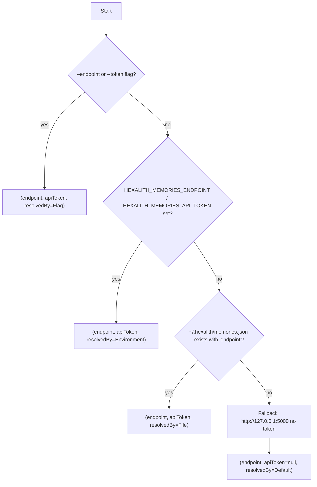

# Memories CLI configuration (Story 7.1)

The `memories` CLI is a .NET global tool that talks to the Hexalith.Memories Server over HTTP.
Story 7.1 ships the foundation: installation, the endpoint resolver, `tenant list`, and `config show`.
Stories 7.2–7.5 add output formats, rich error messages, a quickstart wizard, and telemetry.

## Install

```bash
dotnet pack src/Hexalith.Memories.Cli -c Release -o ./artifacts
dotnet tool install -g --add-source ./artifacts Hexalith.Memories.Cli
memories --version
```

If `memories` is not found after install, see [PATH troubleshooting](#path-troubleshooting).

## Endpoint resolution — 4 tiers

The CLI resolves the Memories Server endpoint (and optional API token) from four sources, highest
priority first:



Token resolution walks the same list independently of the endpoint: if `--endpoint` provides the
endpoint but has no token, the environment variable `HEXALITH_MEMORIES_API_TOKEN` (if set) still
supplies the token.

The built-in default is `http://127.0.0.1:5000/` — a token is **never** sent over plain HTTP to a
non-localhost host. If the resolver sees that combination it fails fast with
`Refusing to send API token over http:// to non-localhost host '<host>'. Use https:// or unset the
token.`

Malformed endpoint values do not fall through to lower-priority tiers; the CLI treats them as an
invalid configuration and stops.

Deferred tiers (to be added as extra `IConfigurationSource` registrations in Phase 1.5 or later):

- DAPR Secrets API
- .NET User Secrets
- DAPR configuration component

No caller in Epics 7-11 needed them, so 7.1 keeps the resolver lean.

## Environment variables

- `HEXALITH_MEMORIES_ENDPOINT` — base URL of the Memories Server (for example `https://memories.example.com/`).
- `HEXALITH_MEMORIES_API_TOKEN` — API token used for authenticated calls. Prefer this over `--token`.

Empty-string values are treated as unset and fall through to the next tier.

## Config file schema

Location: `~/.hexalith/memories.json` (Windows: `%USERPROFILE%\.hexalith\memories.json`).

```json
{
    "endpoint": "https://memories.example.com/",
    "apiToken": "optional-token",
    "timeoutSeconds": 30
}
```

Unknown properties are ignored (forward-compat). Malformed JSON fails fast with
`InvalidConfigurationException`.

## Connecting to three environment shapes

**Local AppHost:**

```bash
memories tenant list
# or explicitly
memories --endpoint http://127.0.0.1:5000 tenant list
```

**Docker service name (inside a docker network):**

```bash
memories --endpoint http://memories-server:5000 tenant list
```

Use this shape for token-free in-network development only. If an API token is configured, the CLI
refuses to send it over plain HTTP to a non-localhost host; use HTTPS ingress or unset the token.

**HTTPS ingress:**

```bash
memories --endpoint https://memories.example.com tenant list
```

SSL certificate validation is **not** disabled — use a trusted certificate or install a dev root CA
if you terminate TLS locally.

## Token handling — no redaction, ever

`memories config show` prints three lines, in this order:

```text
endpoint=<resolved URI>
resolvedBy=<source class short name>
tokenConfigured=<true|false>
```

The token value is **never** printed, not even partially masked. Tests (Task 6.5) assert the absence
of the configured token across combined stdout + stderr of `memories config show`,
`memories tenant list`, and `memories --help`.

Prefer the `HEXALITH_MEMORIES_API_TOKEN` environment variable over `--token` on the command line —
argv is visible in shell history, `/proc/<pid>/cmdline` on Linux, and process listings on Windows.

## PATH troubleshooting

On some machines `~/.dotnet/tools` (Unix) or `%USERPROFILE%\.dotnet\tools` (Windows) is not on
`PATH` after `dotnet tool install -g`. Remediation per shell:

**bash / zsh:**

```bash
echo 'export PATH="$PATH:$HOME/.dotnet/tools"' >> ~/.bashrc
# or ~/.zshrc on zsh
```

**PowerShell (Windows):**

```powershell
$env:PATH += ";$env:USERPROFILE\.dotnet\tools"
# Persist via Control Panel → Environment Variables or:
[Environment]::SetEnvironmentVariable('PATH', "$env:PATH;$env:USERPROFILE\.dotnet\tools", 'User')
```

**cmd (Windows):**

```cmd
setx PATH "%PATH%;%USERPROFILE%\.dotnet\tools"
```

The bundled `tools/verify-cli-pack.ps1` / `.sh` prints this remediation automatically when the
install succeeds but `memories` is not on `PATH`.

## Verbose mode

`--verbose` prints the underlying exception type + message (never the stack trace, never the token
value) to stderr under the one-line plumbing error. This is a debugging aid during 7.1; Story 7.3
extends the error surface with recovery suggestions.

## See also

- [`cli-output-formats.md`](cli-output-formats.md) — `--format human|json|table` contract, envelope schema, and per-command examples (Story 7.2).
